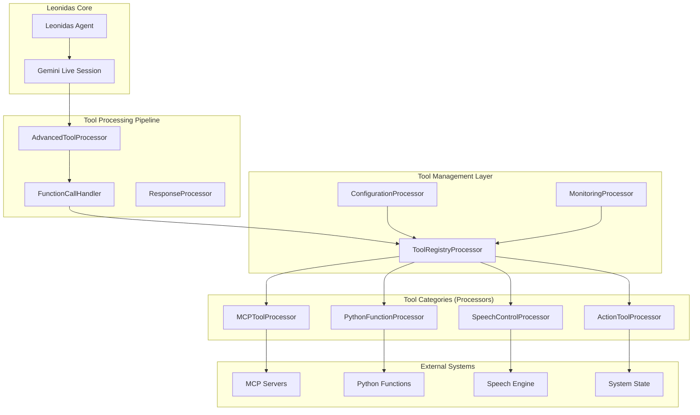

# Sistema Avançado de Tools do Leonidas - Design Arquitetural

## Overview

O sistema avançado de tools do Leonidas implementa uma arquitetura modular e extensível que suporta diferentes tipos de ferramentas com controles granulares, monitoramento avançado e configuração dinâmica. O design segue princípios de responsabilidade única, inversão de dependência e extensibilidade.

## Architecture

### Arquitetura Baseada em GenAI Processors

O sistema avançado de tools do Leonidas segue a arquitetura de stream processing assíncrono da biblioteca genai-processors, com processadores especializados organizados em camadas funcionais.



### Princípios Arquiteturais

O sistema de tools segue os princípios fundamentais da biblioteca genai-processors:

1. **Stream Processing Assíncrono**: Todo o processamento é baseado em `AsyncIterable[ProcessorPart]`, permitindo operações não-bloqueantes e processamento em tempo real.

2. **Composição Modular**: Processadores podem ser encadeados (`+`), paralelizados (`//`) ou compostos em pipelines complexos, seguindo o padrão de composição da biblioteca.

3. **Processamento Baseado em Eventos**: O sistema responde a function calls do modelo Gemini como eventos, processando-os através de processadores especializados.

4. **Extensibilidade via Protocolos**: Novas categorias de tools podem ser adicionadas implementando a interface `processor.Processor` ou `processor.PartProcessor`.

5. **Context Management**: Uso consistente de context managers para gerenciamento de recursos e cancelamento apropriado.

### Fluxo de Processamento

```
Function Call → AdvancedToolProcessor → ToolRegistryProcessor → CategoryProcessor → Execução → Resposta
```

1. O modelo Gemini gera um function call
2. O `AdvancedToolProcessor` intercepta e processa o call
3. O `ToolRegistryProcessor` valida e roteia para o processador de categoria apropriado
4. O processador de categoria executa a tool específica
5. O resultado é retornado ao modelo como function response

### Taxonomia de Tools

```python
from enum import Enum
from typing import Protocol, Dict, Any, Optional, List
from dataclasses import dataclass
from abc import ABC, abstractmethod

class ToolCategory(Enum):
    """Categorias principais de tools."""
    ACTION = "action"           # Ações diretas no sistema
    SPEECH_CONTROL = "speech"   # Controle de fala
    PYTHON_FUNCTION = "python"  # Funções Python reais
    MCP_EXTERNAL = "mcp"        # Tools de servidores MCP
    SYSTEM_CONTROL = "system"   # Controle do sistema
    DATA_PROCESSING = "data"    # Processamento de dados
    INTEGRATION = "integration" # Integrações externas

class ToolPriority(Enum):
    """Níveis de prioridade para execução."""
    CRITICAL = 1    # Execução imediata, pode interromper outras
    HIGH = 2        # Alta prioridade
    NORMAL = 3      # Prioridade padrão
    LOW = 4         # Baixa prioridade
    BACKGROUND = 5  # Execução em background

class ToolStatus(Enum):
    """Status de uma tool."""
    ACTIVE = "active"
    INACTIVE = "inactive"
    DISABLED = "disabled"
    ERROR = "error"
    MAINTENANCE = "maintenance"
```

## Components and Interfaces

### Visão Geral dos Componentes

O sistema de tools avançado é composto por processadores especializados que seguem o padrão da biblioteca genai-processors. Cada componente implementa a interface `processor.Processor` ou `processor.PartProcessor`, processando streams assíncronos de `ProcessorPart`.

#### Hierarquia de Componentes

1. **Core Processors**
   - `AdvancedToolProcessor`: Processador principal que gerencia o fluxo de function calls
   - `ToolRegistryProcessor`: Registro central de tools disponíveis
   - `ConfigurationProcessor`: Gerenciamento de configurações
   - `MonitoringProcessor`: Monitoramento e métricas

2. **Category Processors**
   - `ActionToolProcessor`: Tools de ação direta no sistema
   - `SpeechControlProcessor`: Tools de controle de fala
   - `PythonFunctionProcessor`: Tools para execução de funções Python
   - `MCPToolProcessor`: Tools de servidores MCP externos

3. **Support Components**
   - `ToolMetadata`: Estrutura de dados para metadados de tools
   - `ToolConfiguration`: Configurações específicas por tool
   - `ToolAnalytics`: Métricas e analytics de uso

### Estruturas de Dados Principais

```python
from genai_processors import processor, content_api, streams
from collections.abc import AsyncIterable
from typing import Dict, Any, Optional, List
import asyncio
import time
import json
import functools
import collections

@dataclass
class ToolMetadata:
    """Metadados de uma tool seguindo padrões genai-processors."""
    name: str
    category: ToolCategory
    priority: ToolPriority
    description: str
    parameters_schema: Dict[str, Any]
    dependencies: List[str] = None
    timeout_seconds: float = 30.0
    retry_attempts: int = 3
    fallback_tools: List[str] = None
    tags: List[str] = None

class AdvancedToolProcessor(processor.Processor):
    """Processor principal para gerenciamento avançado de tools."""
    
    def __init__(self):
        self.tool_registry = ToolRegistryProcessor()
        self.config_processor = ConfigurationProcessor()
        self.monitor_processor = MonitoringProcessor()
        self.execution_metrics = collections.defaultdict(list)
        
    async def call(self, content: AsyncIterable[content_api.ProcessorPart]) -> AsyncIterable[content_api.ProcessorPartTypes]:
        """Processa stream de function calls e executa tools apropriadas."""
        
        async for part in content:
            # Passa através parts que não são function calls
            if not part.function_call:
                yield part
                continue
            
            # Processa function call
            function_call = part.function_call
            tool_name = function_call.name
            parameters = function_call.args if hasattr(function_call, 'args') else {}
            
            # Cria contexto de execução
            execution_context = content_api.ProcessorPart(
                json.dumps({
                    'tool_name': tool_name,
                    'parameters': parameters,
                    'call_id': function_call.id,
                    'timestamp': time.time()
                }),
                role='system',
                metadata={
                    'tool_execution': True,
                    'tool_name': tool_name,
                    'call_id': function_call.id
                }
            )
            
            # Executa através do pipeline de tools
            tool_pipeline = (
                self.tool_registry +
                self._get_tool_processor(tool_name) +
                self.monitor_processor
            )
            
            async for result in tool_pipeline(streams.stream_content([execution_context])):
                yield result
    
    def _get_tool_processor(self, tool_name: str) -> processor.Processor:
        """Obtém o processor apropriado para a tool."""
        tool_metadata = self.tool_registry.get_tool_metadata(tool_name)
        
        if not tool_metadata:
            return ErrorProcessor(f"Tool '{tool_name}' não encontrada")
        
        category = tool_metadata.category
        
        if category == ToolCategory.ACTION:
            return ActionToolProcessor()
        elif category == ToolCategory.SPEECH_CONTROL:
            return SpeechControlProcessor()
        elif category == ToolCategory.PYTHON_FUNCTION:
            return PythonFunctionProcessor()
        elif category == ToolCategory.MCP_EXTERNAL:
            return MCPToolProcessor()
        else:
            return GenericToolProcessor()
    
    @functools.cached_property
    def key_prefix(self) -> str:
        return f'{self.__class__.__qualname__}:advanced_tools'
```

### 2. Tool Registry Processor

```python
class ToolRegistryProcessor(processor.Processor):
    """Processor para registro e descoberta de tools."""
    
    def __init__(self):
        self._registered_tools: Dict[str, ToolMetadata] = {}
        self._tool_processors: Dict[str, processor.Processor] = {}
        self._categories: Dict[ToolCategory, List[str]] = {}
        self._status: Dict[str, ToolStatus] = {}
        
        # Registrar tools padrão do Leonidas
        self._register_default_tools()
    
    async def call(self, content: AsyncIterable[content_api.ProcessorPart]) -> AsyncIterable[content_api.ProcessorPartTypes]:
        """Processa requisições de registro e descoberta de tools."""
        
        async for part in content:
            # Verifica se é uma requisição de tool registry
            if part.metadata.get('tool_registry_request'):
                request_type = part.metadata.get('request_type')
                
                if request_type == 'list_tools':
                    yield self._create_tools_list_response()
                elif request_type == 'get_tool_metadata':
                    tool_name = part.metadata.get('tool_name')
                    yield self._create_tool_metadata_response(tool_name)
                elif request_type == 'register_tool':
                    tool_data = json.loads(part.text)
                    yield await self._register_tool_from_data(tool_data)
                else:
                    yield part
            else:
                yield part
    
    def _register_default_tools(self):
        """Registra tools padrão do Leonidas."""
        default_tools = [
            ToolMetadata(
                name="think",
                category=ToolCategory.ACTION,
                priority=ToolPriority.HIGH,
                description="Executa raciocínio obrigatório e verboso",
                parameters_schema={
                    "type": "object",
                    "properties": {
                        "analysis": {"type": "string", "description": "Análise detalhada"},
                        "reasoning": {"type": "string", "description": "Processo de raciocínio"},
                        "plan": {"type": "string", "description": "Plano de ação"}
                    },
                    "required": ["analysis", "reasoning", "plan"]
                }
            ),
            ToolMetadata(
                name="change_state",
                category=ToolCategory.ACTION,
                priority=ToolPriority.HIGH,
                description="Muda estado interno do agente",
                parameters_schema={
                    "type": "object",
                    "properties": {
                        "new_state": {"type": "string", "description": "Novo estado"},
                        "reason": {"type": "string", "description": "Razão da mudança"}
                    },
                    "required": ["new_state"]
                }
            ),
            ToolMetadata(
                name="set_speech_rate",
                category=ToolCategory.SPEECH_CONTROL,
                priority=ToolPriority.NORMAL,
                description="Ajusta velocidade da fala",
                parameters_schema={
                    "type": "object",
                    "properties": {
                        "rate": {"type": "number", "minimum": 0.5, "maximum": 2.0, "description": "Taxa de velocidade"}
                    },
                    "required": ["rate"]
                }
            ),
            ToolMetadata(
                name="change_voice",
                category=ToolCategory.SPEECH_CONTROL,
                priority=ToolPriority.NORMAL,
                description="Troca voz do agente",
                parameters_schema={
                    "type": "object",
                    "properties": {
                        "voice_name": {"type": "string", "enum": ["Kore", "Puck", "Charon", "Fenrir"], "description": "Nome da voz"}
                    },
                    "required": ["voice_name"]
                }
            )
        ]
        
        for tool_metadata in default_tools:
            self._registered_tools[tool_metadata.name] = tool_metadata
            self._add_to_category(tool_metadata)
    
    def get_tool_metadata(self, tool_name: str) -> Optional[ToolMetadata]:
        """Obtém metadados de uma tool."""
        return self._registered_tools.get(tool_name)
    
    def get_available_tools(self) -> List[str]:
        """Obtém lista de tools ativas."""
        return [
            name for name, metadata in self._registered_tools.items()
            if self._status.get(name, ToolStatus.ACTIVE) == ToolStatus.ACTIVE
        ]
    
    def _create_tools_list_response(self) -> content_api.ProcessorPart:
        """Cria resposta com lista de tools."""
        tools_data = {
            'available_tools': self.get_available_tools(),
            'tools_by_category': {
                category.value: tools for category, tools in self._categories.items()
            },
            'total_tools': len(self._registered_tools)
        }
        
        return content_api.ProcessorPart(
            json.dumps(tools_data),
            role='system',
            metadata={'tool_registry_response': True, 'response_type': 'tools_list'}
        )
    
    @functools.cached_property
    def key_prefix(self) -> str:
        return f'{self.__class__.__qualname__}:tool_registry'
```

### 3. Category-Specific Tool Processors

```python
class ActionToolProcessor(processor.Processor):
    """Processor para tools de ação direta (think, change_state, etc.)."""
    
    def __init__(self):
        self.state_manager = None  # Será injetado pelo Leonidas
        
    async def call(self, content: AsyncIterable[content_api.ProcessorPart]) -> AsyncIterable[content_api.ProcessorPartTypes]:
        """Processa tools de ação."""
        
        async for part in content:
            if not part.metadata.get('tool_execution'):
                yield part
                continue
                
            tool_data = json.loads(part.text)
            tool_name = tool_data['tool_name']
            parameters = tool_data['parameters']
            call_id = tool_data['call_id']
            
            if tool_name == 'think':
                result = await self._handle_think(parameters)
            elif tool_name == 'change_state':
                result = await self._handle_change_state(parameters)
            elif tool_name == 'wait_in_silence':
                result = await self._handle_wait_in_silence(parameters)
            elif tool_name == 'shutdown_system':
                result = await self._handle_shutdown_system(parameters)
            else:
                result = {'error': f'Tool de ação desconhecida: {tool_name}', 'success': False}
            
            # Criar response part
            response_part = content_api.ProcessorPart(
                json.dumps(result),
                role='system',
                metadata={
                    'tool_response': True,
                    'tool_name': tool_name,
                    'call_id': call_id,
                    'category': 'action'
                }
            )
            yield response_part
    
    async def _handle_think(self, parameters: Dict[str, Any]) -> Dict[str, Any]:
        """Executa raciocínio obrigatório."""
        analysis = parameters.get('analysis', '')
        reasoning = parameters.get('reasoning', '')
        plan = parameters.get('plan', '')
        
        # Validação obrigatória
        if not all([analysis, reasoning, plan]):
            return {
                'error': 'Think requer analysis, reasoning e plan',
                'success': False
            }
        
        return {
            'thought_process': {
                'analysis': analysis,
                'reasoning': reasoning,
                'plan': plan,
                'timestamp': time.time()
            },
            'success': True,
            'message': 'Raciocínio executado com sucesso'
        }
    
    async def _handle_change_state(self, parameters: Dict[str, Any]) -> Dict[str, Any]:
        """Muda estado interno do agente."""
        new_state = parameters.get('new_state')
        reason = parameters.get('reason', 'Mudança solicitada')
        
        if not new_state:
            return {'error': 'new_state é obrigatório', 'success': False}
        
        # Aqui integraria com o state manager do Leonidas
        return {
            'previous_state': 'current_state',  # Seria obtido do state manager
            'new_state': new_state,
            'reason': reason,
            'timestamp': time.time(),
            'success': True
        }
    
    @functools.cached_property
    def key_prefix(self) -> str:
        return f'{self.__class__.__qualname__}:action_tools'

class SpeechControlProcessor(processor.Processor):
    """Processor para controle de fala em tempo real."""
    
    def __init__(self):
        self.current_speech_config = {
            'rate': 1.0,
            'voice': 'Kore',
            'volume': 1.0
        }
        
    async def call(self, content: AsyncIterable[content_api.ProcessorPart]) -> AsyncIterable[content_api.ProcessorPartTypes]:
        """Processa controles de fala."""
        
        async for part in content:
            if not part.metadata.get('tool_execution'):
                yield part
                continue
                
            tool_data = json.loads(part.text)
            tool_name = tool_data['tool_name']
            parameters = tool_data['parameters']
            call_id = tool_data['call_id']
            
            if tool_name == 'set_speech_rate':
                result = await self._handle_set_speech_rate(parameters)
            elif tool_name == 'change_voice':
                result = await self._handle_change_voice(parameters)
            elif tool_name == 'pause_speech':
                result = await self._handle_pause_speech(parameters)
            elif tool_name == 'emphasize_text':
                result = await self._handle_emphasize_text(parameters)
            else:
                result = {'error': f'Tool de fala desconhecida: {tool_name}', 'success': False}
            
            response_part = content_api.ProcessorPart(
                json.dumps(result),
                role='system',
                metadata={
                    'tool_response': True,
                    'tool_name': tool_name,
                    'call_id': call_id,
                    'category': 'speech_control'
                }
            )
            yield response_part
    
    async def _handle_set_speech_rate(self, parameters: Dict[str, Any]) -> Dict[str, Any]:
        """Ajusta velocidade da fala."""
        rate = parameters.get('rate')
        
        if not rate or not (0.5 <= rate <= 2.0):
            return {'error': 'Rate deve estar entre 0.5 e 2.0', 'success': False}
        
        previous_rate = self.current_speech_config['rate']
        self.current_speech_config['rate'] = rate
        
        return {
            'previous_rate': previous_rate,
            'new_rate': rate,
            'success': True,
            'message': f'Velocidade da fala ajustada para {rate}x'
        }
    
    async def _handle_change_voice(self, parameters: Dict[str, Any]) -> Dict[str, Any]:
        """Troca voz do agente."""
        voice_name = parameters.get('voice_name')
        available_voices = ['Kore', 'Puck', 'Charon', 'Fenrir', 'Aoede', 'Leda']
        
        if voice_name not in available_voices:
            return {
                'error': f'Voz deve ser uma de: {", ".join(available_voices)}',
                'success': False
            }
        
        previous_voice = self.current_speech_config['voice']
        self.current_speech_config['voice'] = voice_name
        
        return {
            'previous_voice': previous_voice,
            'new_voice': voice_name,
            'success': True,
            'message': f'Voz alterada para {voice_name}'
        }
    
    @functools.cached_property
    def key_prefix(self) -> str:
        return f'{self.__class__.__qualname__}:speech_control'

class PythonFunctionProcessor(processor.Processor):
    """Processor para execução de funções Python reais."""
    
    def __init__(self):
        self.registered_functions: Dict[str, Callable] = {}
        self.execution_timeout = 30.0
        
    async def call(self, content: AsyncIterable[content_api.ProcessorPart]) -> AsyncIterable[content_api.ProcessorPartTypes]:
        """Executa funções Python registradas."""
        
        async for part in content:
            if not part.metadata.get('tool_execution'):
                yield part
                continue
                
            tool_data = json.loads(part.text)
            tool_name = tool_data['tool_name']
            parameters = tool_data['parameters']
            call_id = tool_data['call_id']
            
            if tool_name not in self.registered_functions:
                result = {'error': f'Função Python não registrada: {tool_name}', 'success': False}
            else:
                result = await self._execute_python_function(tool_name, parameters)
            
            response_part = content_api.ProcessorPart(
                json.dumps(result),
                role='system',
                metadata={
                    'tool_response': True,
                    'tool_name': tool_name,
                    'call_id': call_id,
                    'category': 'python_function'
                }
            )
            yield response_part
    
    async def _execute_python_function(self, function_name: str, parameters: Dict[str, Any]) -> Dict[str, Any]:
        """Executa função Python com timeout e tratamento de erro."""
        function = self.registered_functions[function_name]
        
        try:
            # Executa com timeout
            if asyncio.iscoroutinefunction(function):
                result = await asyncio.wait_for(
                    function(**parameters),
                    timeout=self.execution_timeout
                )
            else:
                # Executa função síncrona em thread pool
                result = await asyncio.get_event_loop().run_in_executor(
                    None, lambda: function(**parameters)
                )
            
            return {
                'result': result,
                'success': True,
                'execution_time': time.time()
            }
            
        except asyncio.TimeoutError:
            return {
                'error': f'Timeout na execução da função {function_name}',
                'success': False
            }
        except Exception as e:
            return {
                'error': f'Erro na execução: {str(e)}',
                'success': False,
                'exception_type': type(e).__name__
            }
    
    def register_function(self, name: str, function: Callable) -> None:
        """Registra uma função Python para execução."""
        self.registered_functions[name] = function
    
    @functools.cached_property
    def key_prefix(self) -> str:
        return f'{self.__class__.__qualname__}:python_functions'

class MCPToolProcessor(processor.Processor):
    """Processor para tools de servidores MCP externos."""
    
    def __init__(self):
        self.mcp_clients: Dict[str, Any] = {}  # server_name -> client
        self.available_tools: Dict[str, str] = {}  # tool_name -> server_name
        
    async def call(self, content: AsyncIterable[content_api.ProcessorPart]) -> AsyncIterable[content_api.ProcessorPartTypes]:
        """Executa tools de servidores MCP."""
        
        async for part in content:
            if not part.metadata.get('tool_execution'):
                yield part
                continue
                
            tool_data = json.loads(part.text)
            tool_name = tool_data['tool_name']
            parameters = tool_data['parameters']
            call_id = tool_data['call_id']
            
            if tool_name not in self.available_tools:
                result = {'error': f'Tool MCP não disponível: {tool_name}', 'success': False}
            else:
                result = await self._execute_mcp_tool(tool_name, parameters)
            
            response_part = content_api.ProcessorPart(
                json.dumps(result),
                role='system',
                metadata={
                    'tool_response': True,
                    'tool_name': tool_name,
                    'call_id': call_id,
                    'category': 'mcp_external'
                }
            )
            yield response_part
    
    async def _execute_mcp_tool(self, tool_name: str, parameters: Dict[str, Any]) -> Dict[str, Any]:
        """Executa tool em servidor MCP."""
        server_name = self.available_tools[tool_name]
        client = self.mcp_clients.get(server_name)
        
        if not client:
            return {
                'error': f'Cliente MCP não disponível para servidor: {server_name}',
                'success': False
            }
        
        try:
            # Chama tool no servidor MCP
            result = await client.call_tool(tool_name, parameters)
            
            return {
                'result': result,
                'server': server_name,
                'success': True
            }
            
        except Exception as e:
            return {
                'error': f'Erro na execução MCP: {str(e)}',
                'server': server_name,
                'success': False
            }
    
    async def register_mcp_server(self, server_name: str, client: Any) -> None:
        """Registra cliente de servidor MCP."""
        self.mcp_clients[server_name] = client
        
        # Descobre tools disponíveis no servidor
        try:
            tools = await client.list_tools()
            for tool in tools:
                self.available_tools[tool['name']] = server_name
        except Exception as e:
            logging.error(f"Erro ao descobrir tools do servidor {server_name}: {e}")
    
    @functools.cached_property
    def key_prefix(self) -> str:
        return f'{self.__class__.__qualname__}:mcp_tools'
```

### 4. Configuration Processor

```python
class ConfigurationProcessor(processor.Processor):
    """Processor para gerenciamento de configurações das tools."""
    
    def __init__(self, config_file: str = "leonidas/tools_config.yaml"):
        self.config_file = config_file
        self._configurations: Dict[str, ToolConfiguration] = {}
        self._file_watcher = None
        self._last_modified = 0
        
        # Carregar configurações iniciais
        asyncio.create_task(self._load_initial_configuration())
    
    async def call(self, content: AsyncIterable[content_api.ProcessorPart]) -> AsyncIterable[content_api.ProcessorPartTypes]:
        """Processa requisições de configuração."""
        
        async for part in content:
            # Verifica se é requisição de configuração
            if part.metadata.get('config_request'):
                request_type = part.metadata.get('request_type')
                
                if request_type == 'get_config':
                    tool_name = part.metadata.get('tool_name')
                    yield self._create_config_response(tool_name)
                elif request_type == 'update_config':
                    config_data = json.loads(part.text)
                    yield await self._update_configuration(config_data)
                elif request_type == 'reload_config':
                    yield await self._reload_configuration()
                else:
                    yield part
            else:
                # Aplicar configurações às tools
                if part.metadata.get('tool_execution'):
                    tool_name = part.metadata.get('tool_name')
                    config = self.get_tool_config(tool_name)
                    
                    # Adicionar configuração aos metadados
                    part.metadata['tool_config'] = {
                        'enabled': config.enabled,
                        'timeout': config.timeout,
                        'priority': config.priority.value,
                        'retry_attempts': config.retry_attempts
                    }
                
                yield part
    
    async def _load_initial_configuration(self):
        """Carrega configuração inicial do arquivo."""
        try:
            import yaml
            import os
            
            if os.path.exists(self.config_file):
                with open(self.config_file, 'r', encoding='utf-8') as f:
                    config_data = yaml.safe_load(f)
                
                for tool_name, tool_config in config_data.get('tools', {}).items():
                    self._configurations[tool_name] = ToolConfiguration(
                        enabled=tool_config.get('enabled', True),
                        priority=ToolPriority(tool_config.get('priority', 3)),
                        timeout=tool_config.get('timeout', 30.0),
                        retry_attempts=tool_config.get('retry_attempts', 3),
                        custom_parameters=tool_config.get('custom_parameters', {}),
                        environment_specific=tool_config.get('environment_specific', {})
                    )
                
                self._last_modified = os.path.getmtime(self.config_file)
                
        except Exception as e:
            logging.error(f"Erro ao carregar configuração: {e}")
            # Usar configurações padrão
            self._load_default_configuration()
    
    def _load_default_configuration(self):
        """Carrega configurações padrão."""
        default_tools = ['think', 'change_state', 'set_speech_rate', 'change_voice', 'wait_in_silence', 'shutdown_system']
        
        for tool_name in default_tools:
            self._configurations[tool_name] = ToolConfiguration(
                enabled=True,
                priority=ToolPriority.HIGH if tool_name in ['think', 'change_state'] else ToolPriority.NORMAL,
                timeout=30.0,
                retry_attempts=3
            )
    
    def get_tool_config(self, tool_name: str) -> ToolConfiguration:
        """Obtém configuração de uma tool."""
        return self._configurations.get(tool_name, ToolConfiguration())
    
    async def _update_configuration(self, config_data: Dict[str, Any]) -> content_api.ProcessorPart:
        """Atualiza configuração de uma tool."""
        tool_name = config_data.get('tool_name')
        new_config = config_data.get('config')
        
        if tool_name and new_config:
            self._configurations[tool_name] = ToolConfiguration(**new_config)
            await self._save_configuration()
            
            return content_api.ProcessorPart(
                json.dumps({'success': True, 'message': f'Configuração de {tool_name} atualizada'}),
                role='system',
                metadata={'config_response': True}
            )
        
        return content_api.ProcessorPart(
            json.dumps({'success': False, 'error': 'Dados de configuração inválidos'}),
            role='system',
            metadata={'config_response': True}
        )
    
    async def _save_configuration(self):
        """Salva configurações no arquivo."""
        try:
            import yaml
            
            config_data = {
                'tools': {
                    tool_name: {
                        'enabled': config.enabled,
                        'priority': config.priority.value,
                        'timeout': config.timeout,
                        'retry_attempts': config.retry_attempts,
                        'custom_parameters': config.custom_parameters or {},
                        'environment_specific': config.environment_specific or {}
                    }
                    for tool_name, config in self._configurations.items()
                }
            }
            
            with open(self.config_file, 'w', encoding='utf-8') as f:
                yaml.dump(config_data, f, default_flow_style=False, allow_unicode=True)
                
        except Exception as e:
            logging.error(f"Erro ao salvar configuração: {e}")
    
    @functools.cached_property
    def key_prefix(self) -> str:
        return f'{self.__class__.__qualname__}:configuration'
```

### 5. Monitoring System

```python
@dataclass
class ToolMetrics:
    """Métricas de uma tool."""
    total_executions: int = 0
    successful_executions: int = 0
    failed_executions: int = 0
    average_execution_time: float = 0.0
    last_execution: Optional[datetime] = None
    error_rate: float = 0.0
    
class MonitoringSystem:
    """Sistema de monitoramento das tools."""
    
    def __init__(self):
        self._metrics: Dict[str, ToolMetrics] = {}
        self._execution_history: List[ExecutionRecord] = []
        self._alerts: List[Alert] = []
        
    async def record_execution(self, tool_name: str, result: ExecutionResult) -> None:
        """Registra uma execução para métricas."""
        
    async def get_tool_metrics(self, tool_name: str) -> ToolMetrics:
        """Obtém métricas de uma tool específica."""
        
    async def get_system_metrics(self) -> Dict[str, Any]:
        """Obtém métricas gerais do sistema."""
        
    async def generate_health_report(self) -> Dict[str, Any]:
        """Gera relatório de saúde do sistema."""
        
    async def check_alerts(self) -> List[Alert]:
        """Verifica e retorna alertas ativos."""
```

## Data Models

### Modelos de Dados Principais

O sistema utiliza modelos de dados que seguem os padrões da biblioteca genai-processors, com foco em serialização eficiente e compatibilidade com o fluxo de processamento assíncrono.

```python
from genai_processors import processor, content_api, streams
from dataclasses import dataclass, field
from enum import Enum
from typing import Dict, List, Any, Optional, Callable
import asyncio
import time
import json

# Enumerações para categorização e controle
class ToolCategory(Enum):
    """Categorias de tools suportadas pelo sistema."""
    ACTION = "action"
    SPEECH_CONTROL = "speech"
    PYTHON_FUNCTION = "python"
    MCP_EXTERNAL = "mcp"
    SYSTEM_CONTROL = "system"
    DATA_PROCESSING = "data"
    INTEGRATION = "integration"

class ToolPriority(Enum):
    """Níveis de prioridade para execução de tools."""
    CRITICAL = 1
    HIGH = 2
    NORMAL = 3
    LOW = 4
    BACKGROUND = 5

class ToolStatus(Enum):
    """Status possíveis de uma tool."""
    ACTIVE = "active"
    INACTIVE = "inactive"
    DISABLED = "disabled"
    ERROR = "error"
    MAINTENANCE = "maintenance"

# Estruturas de dados principais
@dataclass
class ToolMetadata:
    """Metadados de uma tool."""
    name: str
    category: ToolCategory
    priority: ToolPriority
    description: str
    parameters_schema: Dict[str, Any]
    dependencies: List[str] = None
    timeout_seconds: float = 30.0
    retry_attempts: int = 3
    fallback_tools: List[str] = None
    tags: List[str] = None

@dataclass
class ToolConfiguration:
    """Configuração de uma tool."""
    enabled: bool = True
    priority: ToolPriority = ToolPriority.NORMAL
    timeout: float = 30.0
    retry_attempts: int = 3
    custom_parameters: Dict[str, Any] = None
    environment_specific: Dict[str, Dict[str, Any]] = None

@dataclass
class ExecutionContext:
    """Contexto de execução de uma tool."""
    tool_name: str
    parameters: Dict[str, Any]
    call_id: str = None
    session_id: str = None
    timestamp: float = field(default_factory=time.time)
    timeout: float = 30.0
    priority: ToolPriority = ToolPriority.NORMAL
    metadata: Dict[str, Any] = field(default_factory=dict)

@dataclass
class ExecutionResult:
    """Resultado da execução de uma tool."""
    success: bool
    result: Dict[str, Any]
    execution_time: float
    tool_name: str
    call_id: str
    error: Optional[str] = None
    warnings: List[str] = field(default_factory=list)
    metadata: Dict[str, Any] = field(default_factory=dict)

@dataclass
class ToolMetrics:
    """Métricas de uso e performance de uma tool."""
    total_executions: int = 0
    successful_executions: int = 0
    failed_executions: int = 0
    average_execution_time: float = 0.0
    last_execution_time: Optional[float] = None
    error_rate: float = 0.0
    execution_times: List[float] = field(default_factory=list)
```

### Integração com ProcessorPart

O sistema utiliza `ProcessorPart` como unidade fundamental de comunicação, seguindo o padrão da biblioteca genai-processors:

```python
# Exemplo de criação de ProcessorPart para execução de tool
execution_part = content_api.ProcessorPart(
    json.dumps({
        'tool_name': 'think',
        'parameters': {
            'analysis': 'Análise detalhada',
            'reasoning': 'Processo de raciocínio',
            'plan': 'Plano de ação'
        },
        'call_id': 'call_123456',
        'timestamp': time.time()
    }),
    role='system',
    metadata={
        'tool_execution': True,
        'tool_name': 'think',
        'call_id': 'call_123456',
        'category': 'action'
    }
)

# Exemplo de resposta de tool como ProcessorPart
response_part = content_api.ProcessorPart(
    json.dumps({
        'thought_process': {
            'analysis': 'Análise detalhada',
            'reasoning': 'Processo de raciocínio',
            'plan': 'Plano de ação'
        },
        'success': True,
        'message': 'Raciocínio executado com sucesso'
    }),
    role='system',
    metadata={
        'tool_response': True,
        'tool_name': 'think',
        'call_id': 'call_123456',
        'category': 'action'
    }
)
```

## Error Handling

### Estratégia de Tratamento de Erros

O sistema implementa uma estratégia robusta de tratamento de erros seguindo os padrões da biblioteca genai-processors, com foco em resiliência, recuperação automática e observabilidade.

#### Hierarquia de Exceções

```python
from genai_processors import processor
import asyncio
import logging
from typing import Dict, Any, Optional, Type, Callable

class ToolError(Exception):
    """Base exception para erros de tools."""
    def __init__(self, message: str, tool_name: str = None, call_id: str = None):
        self.tool_name = tool_name
        self.call_id = call_id
        self.timestamp = time.time()
        super().__init__(message)

class ToolNotFoundError(ToolError):
    """Tool não encontrada no registro."""
    pass

class ToolDisabledError(ToolError):
    """Tool desabilitada por configuração."""
    pass

class ToolExecutionError(ToolError):
    """Erro durante execução da tool."""
    def __init__(self, message: str, tool_name: str = None, call_id: str = None, 
                 original_error: Exception = None):
        self.original_error = original_error
        super().__init__(message, tool_name, call_id)

class ToolTimeoutError(ToolError):
    """Timeout na execução da tool."""
    def __init__(self, message: str, tool_name: str = None, call_id: str = None, 
                 timeout_seconds: float = None):
        self.timeout_seconds = timeout_seconds
        super().__init__(message, tool_name, call_id)

class ToolConfigurationError(ToolError):
    """Erro de configuração da tool."""
    pass

class ToolDependencyError(ToolError):
    """Dependência da tool não satisfeita."""
    def __init__(self, message: str, tool_name: str = None, call_id: str = None, 
                 missing_dependencies: list = None):
        self.missing_dependencies = missing_dependencies or []
        super().__init__(message, tool_name, call_id)
```

#### Padrão de Tratamento de Erros

O sistema segue o padrão de tratamento de erros da biblioteca genai-processors, com três níveis de tratamento:

1. **Nível de Processador**: Cada processador implementa tratamento de erros específico
2. **Nível de Pipeline**: Erros são propagados através do pipeline com informações de contexto
3. **Nível de Sistema**: Um gerenciador central de erros implementa estratégias de recuperação

```python
class ErrorHandlingProcessor(processor.Processor):
    """Processor com tratamento de erros robusto."""
    
    async def call(self, content: AsyncIterable[content_api.ProcessorPart]) -> AsyncIterable[content_api.ProcessorPartTypes]:
        """Implementa padrão try-except-finally com logging estruturado."""
        async for part in content:
            try:
                # Verifica se é uma requisição de execução de tool
                if part.metadata.get('tool_execution'):
                    tool_data = json.loads(part.text)
                    tool_name = tool_data.get('tool_name')
                    call_id = tool_data.get('call_id')
                    
                    # Executa com timeout
                    try:
                        result = await asyncio.wait_for(
                            self._execute_tool(tool_name, tool_data.get('parameters', {}), call_id),
                            timeout=self._get_tool_timeout(tool_name)
                        )
                        yield self._create_success_response(result, tool_name, call_id)
                        
                    except asyncio.TimeoutError:
                        error = ToolTimeoutError(
                            f"Timeout na execução da tool {tool_name}",
                            tool_name=tool_name,
                            call_id=call_id,
                            timeout_seconds=self._get_tool_timeout(tool_name)
                        )
                        yield self._create_error_response(error, tool_name, call_id)
                        
                        # Emite debug info para observabilidade
                        yield processor.debug(f"Tool timeout: {tool_name} (call_id: {call_id})")
                        
                    except ToolError as e:
                        # Erros específicos de tools
                        yield self._create_error_response(e, tool_name, call_id)
                        yield processor.debug(f"Tool error: {e}")
                        
                else:
                    # Passa através parts que não são execuções de tools
                    yield part
                    
            except Exception as e:
                # Erros inesperados - log detalhado e propagação
                logging.error(f"Erro inesperado: {e}", exc_info=True)
                yield processor.debug(f"Unexpected error: {type(e).__name__}: {e}")
                
                # Propaga erro para tratamento em nível superior
                raise
```

#### Gerenciador de Recuperação de Erros

```python
class ErrorRecoveryManager:
    """Gerenciador de recuperação de erros com estratégias específicas por tipo."""
    
    def __init__(self, registry):
        self.registry = registry
        self.recovery_strategies = {
            ToolNotFoundError: self._handle_tool_not_found,
            ToolExecutionError: self._handle_execution_error,
            ToolTimeoutError: self._handle_timeout_error,
            ToolConfigurationError: self._handle_config_error,
            ToolDependencyError: self._handle_dependency_error
        }
        
        # Métricas de recuperação
        self.recovery_metrics = {
            'attempts': 0,
            'successes': 0,
            'failures': 0,
            'by_error_type': collections.defaultdict(int)
        }
    
    async def handle_error(self, error: Exception, context: ExecutionContext) -> ExecutionResult:
        """Trata erro e tenta recuperação com estratégia apropriada."""
        self.recovery_metrics['attempts'] += 1
        self.recovery_metrics['by_error_type'][type(error).__name__] += 1
        
        # Seleciona estratégia de recuperação
        error_type = type(error)
        if error_type in self.recovery_strategies:
            try:
                result = await self.recovery_strategies[error_type](error, context)
                self.recovery_metrics['successes'] += 1
                return result
            except Exception as recovery_error:
                logging.error(f"Falha na recuperação: {recovery_error}", exc_info=True)
                self.recovery_metrics['failures'] += 1
        
        # Fallback genérico para erros sem estratégia específica
        return await self._generic_fallback(error, context)
    async def _handle_tool_not_found(self, error: ToolNotFoundError, context: ExecutionContext) -> ExecutionResult:
        """Trata tool não encontrada."""
        # Buscar tools alternativas
        similar_tools = await self._find_similar_tools(context.tool_name)
        if similar_tools:
            # Tentar primeira alternativa
            context.tool_name = similar_tools[0]
            return await self._retry_execution(context)
        
        return ExecutionResult(
            success=False,
            result={},
            error=f"Tool '{context.tool_name}' não encontrada e nenhuma alternativa disponível"
        )
```

## Testing Strategy

### Unit Testing

```python
import pytest
from unittest.mock import AsyncMock, MagicMock

class TestToolRegistry:
    """Testes para o Tool Registry."""
    
    @pytest.fixture
    def registry(self):
        return ToolRegistry()
    
    @pytest.fixture
    def mock_tool(self):
        tool = MagicMock(spec=ToolProtocol)
        tool.metadata = ToolMetadata(
            name="test_tool",
            category=ToolCategory.ACTION,
            priority=ToolPriority.NORMAL,
            description="Tool de teste",
            parameters_schema={}
        )
        return tool
    
    async def test_register_tool(self, registry, mock_tool):
        """Testa registro de tool."""
        result = await registry.register_tool(mock_tool)
        assert result is True
        assert registry.get_tool("test_tool") == mock_tool
    
    async def test_get_tools_by_category(self, registry, mock_tool):
        """Testa busca por categoria."""
        await registry.register_tool(mock_tool)
        tools = registry.get_tools_by_category(ToolCategory.ACTION)
        assert len(tools) == 1
        assert tools[0] == mock_tool

class TestToolExecutor:
    """Testes para o Tool Executor."""
    
    @pytest.fixture
    def executor(self):
        registry = MagicMock(spec=ToolRegistry)
        monitor = MagicMock(spec=MonitoringSystem)
        return ToolExecutor(registry, monitor)
    
    async def test_execute_tool_success(self, executor):
        """Testa execução bem-sucedida de tool."""
        # Setup
        mock_tool = AsyncMock(spec=ToolProtocol)
        mock_tool.execute.return_value = {"result": "success"}
        executor.registry.get_tool.return_value = mock_tool
        
        context = ExecutionContext(
            tool_name="test_tool",
            parameters={"param": "value"},
            session_id="test_session"
        )
        
        # Execute
        result = await executor.execute_tool(context)
        
        # Assert
        assert result.success is True
        assert result.result == {"result": "success"}
```

### Integration Testing

```python
class TestToolSystemIntegration:
    """Testes de integração do sistema completo."""
    
    @pytest.fixture
    async def tool_system(self):
        """Setup completo do sistema de tools."""
        registry = ToolRegistry()
        monitor = MonitoringSystem()
        executor = ToolExecutor(registry, monitor)
        config_manager = ConfigurationManager()
        
        # Registrar tools de teste
        think_tool = ThinkTool()
        await registry.register_tool(think_tool)
        
        return {
            'registry': registry,
            'executor': executor,
            'monitor': monitor,
            'config_manager': config_manager
        }
    
    async def test_end_to_end_tool_execution(self, tool_system):
        """Testa execução end-to-end de uma tool."""
        executor = tool_system['executor']
        
        context = ExecutionContext(
            tool_name="think",
            parameters={
                "analysis": "Analisando problema X",
                "reasoning": "Baseado em Y, concluo Z",
                "plan": "Próximo passo é W"
            },
            session_id="integration_test"
        )
        
        result = await executor.execute_tool(context)
        
        assert result.success is True
        assert "thought_process" in result.result
        assert result.execution_time > 0
    
    async def test_configuration_hot_reload(self, tool_system):
        """Testa hot-reload de configurações."""
        config_manager = tool_system['config_manager']
        registry = tool_system['registry']
        
        # Desabilitar tool
        new_config = ToolConfiguration(enabled=False)
        await config_manager.update_tool_config("think", new_config)
        
        # Verificar se tool foi desabilitada
        available_tools = registry.get_available_tools()
        assert "think" not in available_tools
```

### Performance Testing

```python
class TestToolPerformance:
    """Testes de performance do sistema de tools."""
    
    async def test_concurrent_tool_execution(self):
        """Testa execução concorrente de múltiplas tools."""
        # Setup
        executor = ToolExecutor(registry, monitor)
        
        # Criar múltiplos contextos
        contexts = [
            ExecutionContext(
                tool_name="think",
                parameters={"analysis": f"Test {i}", "reasoning": f"Reason {i}", "plan": f"Plan {i}"},
                session_id=f"perf_test_{i}"
            )
            for i in range(100)
        ]
        
        # Executar concorrentemente
        start_time = time.time()
        tasks = [executor.execute_tool(context) for context in contexts]
        results = await asyncio.gather(*tasks)
        end_time = time.time()
        
        # Verificar resultados
        assert len(results) == 100
        assert all(result.success for result in results)
        assert end_time - start_time < 10  # Deve completar em menos de 10 segundos
    
    async def test_memory_usage_under_load(self):
        """Testa uso de memória sob carga."""
        import psutil
        import gc
        
        process = psutil.Process()
        initial_memory = process.memory_info().rss
        
        # Executar muitas tools
        for i in range(1000):
            context = ExecutionContext(
                tool_name="think",
                parameters={"analysis": f"Load test {i}", "reasoning": "Testing", "plan": "Continue"},
                session_id=f"memory_test_{i}"
            )
            await executor.execute_tool(context)
            
            if i % 100 == 0:
                gc.collect()  # Force garbage collection
        
        final_memory = process.memory_info().rss
        memory_increase = final_memory - initial_memory
        
        # Verificar que o aumento de memória é razoável (< 100MB)
        assert memory_increase < 100 * 1024 * 1024
```

Este design arquitetural fornece uma base sólida e extensível para o sistema avançado de tools do Leonidas, com foco em modularidade, configurabilidade e robustez.