# Leonidas System - Cognitive Reasoning Agent Specification v1.4

## Overview

O **Cognitive Reasoning Agent** implementa o "Sistema 2" de pensamento do Leonidas, fornecendo análise cognitiva profunda, síntese de contexto e geração de insights valiosos. Opera de forma assíncrona com maior latência, analisando o contexto completo das interações para fornecer correções, insights e melhorias na qualidade das respostas.

## Architecture Overview

### Core Components

```mermaid
graph TD
    subgraph "Cognitive Reasoning Agent Architecture"
        subgraph "Input Aggregation"
            UA[User Audio/Transcription]
            LA[Leonidas Audio/Transcription]
            VC[Visual Context]
            WM[World Model Data]
            MH[Memory History]
        end
        
        subgraph "Context Processing"
            CA[Context Aggregator]
            CS[Context Synthesizer]
            CR[Context Ranker]
        end
        
        subgraph "Cognitive Analysis Engine"
            AA[Accuracy Analyzer]
            CA2[Coherence Analyzer]
            SA[Strategy Analyzer]
            IA[Insight Generator]
            CC[Correction Detector]
        end
        
        subgraph "Decision Making"
            VA[Value Assessor]
            TA[Timing Analyzer]
            PA[Priority Assessor]
            IG[Intervention Generator]
        end
        
        subgraph "Memory Integration"
            MS[Memory Store]
            MR[Memory Retrieval]
            MU[Memory Update]
        end
        
        subgraph "Output Generation"
            SG[Signal Generator]
            SV[Signal Validator]
            SP[Signal Prioritizer]
        end
        
        UA --> CA
        LA --> CA
        VC --> CA
        WM --> CA
        MH --> CA
        
        CA --> CS
        CS --> CR
        CR --> AA
        CR --> CA2
        CR --> SA
        
        AA --> IA
        CA2 --> CC
        SA --> IA
        
        IA --> VA
        CC --> VA
        VA --> TA
        TA --> PA
        PA --> IG
        
        MS --> MR
        MR --> CA
        IG --> MU
        MU --> MS
        
        IG --> SG
        SG --> SV
        SV --> SP
    end
```



## Technical Specifications

### Context Aggregation System

```python
@dataclass
class CognitiveContext:
    """Comprehensive context for cognitive analysis."""
    
    # Input Sources
    user_transcription: str
    leonidas_transcription: str
    visual_context: Dict[str, Any]
    world_model_state: Dict[str, Any]
    memory_context: List[Dict[str, Any]]
    
    # Metadata
    timestamp: datetime
    session_id: str
    interaction_id: str
    context_quality_score: float
    
    # Analysis State
    processed: bool = False
    analysis_results: Optional[Dict[str, Any]] = None
    intervention_generated: bool = False

class ContextAggregator:
    """Aggregates context from multiple sources for cognitive analysis."""
    
    def __init__(self, config: CognitiveConfig):
        self.config = config
        self.context_buffer = collections.deque(maxlen=config.max_context_items)
        self.context_synthesizer = ContextSynthesizer()
        self.relevance_scorer = RelevanceScorer()
        
    async def aggregate_context(self, 
                              user_input: str,
                              leonidas_output: str,
                              visual_context: dict,
                              world_model: dict) -> CognitiveContext:
        """Aggregate context from all available sources."""
        
        # Retrieve relevant memory
        memory_context = await self._retrieve_relevant_memory(user_input, leonidas_output)
        
        # Create comprehensive context
        context = CognitiveContext(
            user_transcription=user_input,
            leonidas_transcription=leonidas_output,
            visual_context=visual_context,
            world_model_state=world_model,
            memory_context=memory_context,
            timestamp=datetime.now(),
            session_id=self._get_current_session_id(),
            interaction_id=self._generate_interaction_id(),
            context_quality_score=await self._assess_context_quality(user_input, leonidas_output, visual_context)
        )
        
        # Add to buffer for temporal context
        self.context_buffer.append(context)
        
        return context
    
    async def _retrieve_relevant_memory(self, user_input: str, leonidas_output: str) -> List[Dict]:
        """Retrieve relevant memory entries for context."""
        
        # Combine inputs for memory search
        search_query = f"{user_input} {leonidas_output}"
        
        # Retrieve from memory store
        relevant_memories = await self.memory_store.retrieve_relevant(
            query=search_query,
            max_results=self.config.max_memory_context,
            relevance_threshold=self.config.memory_relevance_threshold
        )
        
        return relevant_memories
    
    async def _assess_context_quality(self, user_input: str, leonidas_output: str, visual_context: dict) -> float:
        """Assess the quality and completeness of available context."""
        
        quality_factors = {
            'user_input_clarity': self._assess_input_clarity(user_input),
            'leonidas_output_completeness': self._assess_output_completeness(leonidas_output),
            'visual_context_richness': self._assess_visual_richness(visual_context),
            'temporal_continuity': self._assess_temporal_continuity()
        }
        
        # Weighted average
        weights = {
            'user_input_clarity': 0.3,
            'leonidas_output_completeness': 0.4,
            'visual_context_richness': 0.2,
            'temporal_continuity': 0.1
        }
        
        quality_score = sum(
            quality_factors[factor] * weights[factor]
            for factor in quality_factors
        )
        
        return min(1.0, max(0.0, quality_score))
```

### Cognitive Analysis Engine

```python
class CognitiveAnalysisEngine:
    """Core cognitive analysis engine with multiple analysis dimensions."""
    
    def __init__(self, config: CognitiveConfig):
        self.config = config
        self.gemini_model = self._initialize_gemini_model()
        self.analysis_cache = CognitiveAnalysisCache()
        
        # Analysis components
        self.accuracy_analyzer = AccuracyAnalyzer()
        self.coherence_analyzer = CoherenceAnalyzer()
        self.strategy_analyzer = StrategyAnalyzer()
        self.insight_generator = InsightGenerator()
        self.correction_detector = CorrectionDetector()
        
    async def analyze_context(self, context: CognitiveContext) -> CognitiveAnalysisResult:
        """Perform comprehensive cognitive analysis of context."""
        
        # Check cache first
        cache_key = self._generate_cache_key(context)
        cached_result = await self.analysis_cache.get(cache_key)
        if cached_result:
            return cached_result
        
        # Parallel analysis across multiple dimensions
        analysis_tasks = [
            self.accuracy_analyzer.analyze_accuracy(context),
            self.coherence_analyzer.analyze_coherence(context),
            self.strategy_analyzer.analyze_strategy(context),
            self.insight_generator.generate_insights(context),
            self.correction_detector.detect_corrections(context)
        ]
        
        analysis_results = await asyncio.gather(*analysis_tasks, return_exceptions=True)
        
        # Combine results
        combined_result = CognitiveAnalysisResult(
            context_id=context.interaction_id,
            accuracy_analysis=analysis_results[0] if not isinstance(analysis_results[0], Exception) else None,
            coherence_analysis=analysis_results[1] if not isinstance(analysis_results[1], Exception) else None,
            strategy_analysis=analysis_results[2] if not isinstance(analysis_results[2], Exception) else None,
            insights=analysis_results[3] if not isinstance(analysis_results[3], Exception) else [],
            corrections=analysis_results[4] if not isinstance(analysis_results[4], Exception) else [],
            timestamp=datetime.now(),
            confidence_score=await self._calculate_overall_confidence(analysis_results)
        )
        
        # Cache result
        await self.analysis_cache.put(cache_key, combined_result)
        
        return combined_result
    
    def _initialize_gemini_model(self):
        """Initialize Gemini model for cognitive analysis."""
        
        return genai_model.GenaiModel(
            model="gemini-2.5-flash-preview",  # Higher capability model for analysis
            api_key=self.config.api_key,
            system_instruction=self._get_cognitive_analysis_prompt(),
            generation_config={
                'max_output_tokens': 1000,
                'temperature': 0.3,  # Lower temperature for analytical tasks
                'response_mime_type': 'application/json'
            }
        )
    
    def _get_cognitive_analysis_prompt(self) -> str:
        """Get system prompt for cognitive analysis."""
        
        return """
        Você é um sistema de análise cognitiva avançado para o assistente Leonidas.
        
        Sua função é analisar interações entre usuários e Leonidas para identificar:
        
        1. PRECISÃO: A resposta do Leonidas está factualmente correta?
        2. COERÊNCIA: A resposta é logicamente consistente e bem estruturada?
        3. ESTRATÉGIA: A abordagem utilizada é a mais eficaz para o contexto?
        4. INSIGHTS: Há oportunidades de fornecer informações adicionais valiosas?
        5. CORREÇÕES: Há erros ou imprecisões que precisam ser corrigidos?
        
        Analise o contexto fornecido e retorne uma análise estruturada em JSON com:
        - accuracy_score (0-1): Quão precisa é a resposta
        - coherence_score (0-1): Quão coerente é a resposta
        - strategy_effectiveness (0-1): Quão eficaz é a estratégia utilizada
        - insights: Lista de insights valiosos identificados
        - corrections: Lista de correções necessárias
        - intervention_recommended (boolean): Se uma intervenção é recomendada
        - intervention_priority (0-1): Prioridade da intervenção se recomendada
        - reasoning: Explicação detalhada da análise
        
        Seja preciso, objetivo e focado em melhorar a qualidade das interações.
        """

@dataclass
class CognitiveAnalysisResult:
    """Result of cognitive analysis."""
    
    context_id: str
    accuracy_analysis: Optional[Dict[str, Any]]
    coherence_analysis: Optional[Dict[str, Any]]
    strategy_analysis: Optional[Dict[str, Any]]
    insights: List[Dict[str, Any]]
    corrections: List[Dict[str, Any]]
    timestamp: datetime
    confidence_score: float
    
    # Intervention decision
    intervention_recommended: bool = False
    intervention_priority: float = 0.0
    intervention_message: Optional[str] = None
```

### Insight Generation System

```python
class InsightGenerator:
    """Generates valuable insights from context analysis."""
    
    INSIGHT_TYPES = {
        'ADDITIONAL_CONTEXT': 'Contexto adicional relevante disponível',
        'ALTERNATIVE_APPROACH': 'Abordagem alternativa mais eficaz identificada',
        'MISSING_INFORMATION': 'Informação importante omitida na resposta',
        'OPTIMIZATION_OPPORTUNITY': 'Oportunidade de otimização identificada',
        'LEARNING_OPPORTUNITY': 'Oportunidade de aprendizado para o usuário',
        'CLARIFICATION_NEEDED': 'Necessidade de esclarecimento identificada',
        'FOLLOW_UP_SUGGESTION': 'Sugestão de acompanhamento relevante'
    }
    
    def __init__(self):
        self.insight_patterns = self._initialize_insight_patterns()
        self.context_analyzer = ContextualInsightAnalyzer()
        
    async def generate_insights(self, context: CognitiveContext) -> List[Dict[str, Any]]:
        """Generate valuable insights from cognitive context."""
        
        insights = []
        
        # Pattern-based insight generation
        pattern_insights = await self._generate_pattern_based_insights(context)
        insights.extend(pattern_insights)
        
        # Contextual insight generation
        contextual_insights = await self._generate_contextual_insights(context)
        insights.extend(contextual_insights)
        
        # Memory-based insight generation
        memory_insights = await self._generate_memory_based_insights(context)
        insights.extend(memory_insights)
        
        # Filter and rank insights
        filtered_insights = await self._filter_and_rank_insights(insights, context)
        
        return filtered_insights
    
    async def _generate_pattern_based_insights(self, context: CognitiveContext) -> List[Dict]:
        """Generate insights based on recognized patterns."""
        
        insights = []
        
        # Analyze user input patterns
        user_patterns = await self._analyze_user_patterns(context.user_transcription)
        
        # Analyze Leonidas response patterns
        response_patterns = await self._analyze_response_patterns(context.leonidas_transcription)
        
        # Generate insights from pattern analysis
        for pattern in user_patterns:
            if pattern['type'] == 'INCOMPLETE_QUESTION':
                insights.append({
                    'type': 'CLARIFICATION_NEEDED',
                    'message': 'A pergunta do usuário parece incompleta. Considere solicitar esclarecimentos.',
                    'confidence': pattern['confidence'],
                    'context': pattern['details']
                })
        
        for pattern in response_patterns:
            if pattern['type'] == 'GENERIC_RESPONSE':
                insights.append({
                    'type': 'OPTIMIZATION_OPPORTUNITY',
                    'message': 'A resposta pode ser mais específica e personalizada para o contexto.',
                    'confidence': pattern['confidence'],
                    'context': pattern['details']
                })
        
        return insights
    
    async def _generate_contextual_insights(self, context: CognitiveContext) -> List[Dict]:
        """Generate insights based on contextual analysis."""
        
        insights = []
        
        # Analyze visual context for additional opportunities
        if context.visual_context:
            visual_insights = await self._analyze_visual_context_insights(context.visual_context)
            insights.extend(visual_insights)
        
        # Analyze world model for relevant information
        if context.world_model_state:
            world_model_insights = await self._analyze_world_model_insights(context.world_model_state)
            insights.extend(world_model_insights)
        
        return insights
    
    async def _generate_memory_based_insights(self, context: CognitiveContext) -> List[Dict]:
        """Generate insights based on memory and historical context."""
        
        insights = []
        
        # Analyze memory context for patterns
        if context.memory_context:
            for memory_entry in context.memory_context:
                # Look for recurring themes or issues
                if await self._is_recurring_issue(memory_entry, context):
                    insights.append({
                        'type': 'LEARNING_OPPORTUNITY',
                        'message': f'Este tópico foi discutido anteriormente. Considere referenciar a discussão anterior.',
                        'confidence': 0.8,
                        'context': memory_entry
                    })
        
        return insights
```

### Correction Detection System

```python
class CorrectionDetector:
    """Detects errors and inaccuracies requiring correction."""
    
    CORRECTION_TYPES = {
        'FACTUAL_ERROR': 'Erro factual identificado',
        'LOGICAL_INCONSISTENCY': 'Inconsistência lógica detectada',
        'INCOMPLETE_ANSWER': 'Resposta incompleta para a pergunta',
        'MISLEADING_INFORMATION': 'Informação potencialmente enganosa',
        'OUTDATED_INFORMATION': 'Informação desatualizada',
        'CONTEXT_MISMATCH': 'Resposta não adequada ao contexto'
    }
    
    def __init__(self):
        self.fact_checker = FactChecker()
        self.logic_analyzer = LogicAnalyzer()
        self.completeness_analyzer = CompletenessAnalyzer()
        
    async def detect_corrections(self, context: CognitiveContext) -> List[Dict[str, Any]]:
        """Detect corrections needed in Leonidas response."""
        
        corrections = []
        
        # Factual accuracy check
        factual_corrections = await self._check_factual_accuracy(context)
        corrections.extend(factual_corrections)
        
        # Logical consistency check
        logical_corrections = await self._check_logical_consistency(context)
        corrections.extend(logical_corrections)
        
        # Completeness check
        completeness_corrections = await self._check_response_completeness(context)
        corrections.extend(completeness_corrections)
        
        # Context appropriateness check
        context_corrections = await self._check_context_appropriateness(context)
        corrections.extend(context_corrections)
        
        return corrections
    
    async def _check_factual_accuracy(self, context: CognitiveContext) -> List[Dict]:
        """Check factual accuracy of Leonidas response."""
        
        corrections = []
        
        # Extract factual claims from response
        factual_claims = await self._extract_factual_claims(context.leonidas_transcription)
        
        # Verify each claim
        for claim in factual_claims:
            verification_result = await self.fact_checker.verify_claim(claim, context)
            
            if verification_result['accuracy'] < 0.7:  # Low accuracy threshold
                corrections.append({
                    'type': 'FACTUAL_ERROR',
                    'claim': claim,
                    'issue': verification_result['issue'],
                    'suggested_correction': verification_result['correction'],
                    'confidence': verification_result['confidence']
                })
        
        return corrections
```

## Signal Bus Integration

### Signal Types Generated

#### 1. Cognitive Insight Signal
```json
{
    "signal_type": "cognitive_insight",
    "timestamp": "2024-01-15T10:30:45.123Z",
    "priority": "medium",
    "source": "cognitive_reasoning_agent",
    "data": {
        "insight_type": "ADDITIONAL_CONTEXT",
        "insight_message": "Há informações relevantes no contexto visual que podem enriquecer a resposta sobre arquitetura de software.",
        "confidence": 0.87,
        "context_reference": "visual_context_analysis",
        "suggested_action": "incorporate_visual_context",
        "value_assessment": 0.75,
        "timing_recommendation": "immediate"
    }
}
```

#### 2. Cognitive Correction Signal
```json
{
    "signal_type": "cognitive_correction",
    "timestamp": "2024-01-15T10:30:45.123Z",
    "priority": "high",
    "source": "cognitive_reasoning_agent",
    "data": {
        "correction_type": "FACTUAL_ERROR",
        "error_description": "A versão mencionada do framework está desatualizada",
        "current_statement": "React 17 é a versão mais recente",
        "corrected_statement": "React 18 é a versão atual, lançada em março de 2022",
        "confidence": 0.95,
        "urgency": "high",
        "source_verification": "official_documentation"
    }
}
```

#### 3. Cognitive Analysis Summary Signal
```json
{
    "signal_type": "cognitive_analysis_summary",
    "timestamp": "2024-01-15T10:30:45.123Z",
    "priority": "low",
    "source": "cognitive_reasoning_agent",
    "data": {
        "analysis_id": "analysis_12345",
        "overall_quality_score": 0.82,
        "accuracy_score": 0.90,
        "coherence_score": 0.85,
        "strategy_effectiveness": 0.75,
        "insights_generated": 3,
        "corrections_identified": 1,
        "intervention_recommended": true,
        "processing_time_ms": 1250
    }
}
```

## Implementation Architecture

### Core Classes

```python
class CognitiveReasoningAgent(SpecializedAgent):
    """Advanced cognitive reasoning agent implementing System 2 thinking."""
    
    def __init__(self, config: CognitiveConfig):
        super().__init__("cognitive_reasoning_agent")
        self.config = config
        
        # Core components
        self.context_aggregator = ContextAggregator(config)
        self.analysis_engine = CognitiveAnalysisEngine(config)
        self.insight_generator = InsightGenerator()
        self.correction_detector = CorrectionDetector()
        self.intervention_manager = InterventionManager()
        
        # Memory integration
        self.memory_store = MemoryStore(config.memory_config)
        
        # Processing queue for asynchronous analysis
        self.analysis_queue = asyncio.Queue(maxsize=config.max_queue_size)
        self.processing_tasks = []
        
        # Performance tracking
        self.performance_metrics = CognitivePerformanceMetrics()
        
    async def start_processing(self):
        """Start cognitive processing tasks."""
        
        # Start background processing tasks
        for i in range(self.config.num_processing_workers):
            task = asyncio.create_task(self._cognitive_processing_worker(f"worker_{i}"))
            self.processing_tasks.append(task)
        
        logging.info(f"Started {len(self.processing_tasks)} cognitive processing workers")
    
    async def stop_processing(self):
        """Stop cognitive processing tasks."""
        
        # Cancel all processing tasks
        for task in self.processing_tasks:
            task.cancel()
        
        # Wait for tasks to complete
        await asyncio.gather(*self.processing_tasks, return_exceptions=True)
        
        self.processing_tasks.clear()
        logging.info("Stopped cognitive processing workers")
    
    async def analyze_interaction(self, 
                                user_input: str,
                                leonidas_output: str,
                                visual_context: dict,
                                world_model: dict) -> None:
        """Queue interaction for cognitive analysis."""
        
        analysis_request = CognitiveAnalysisRequest(
            user_input=user_input,
            leonidas_output=leonidas_output,
            visual_context=visual_context,
            world_model=world_model,
            timestamp=datetime.now(),
            request_id=self._generate_request_id()
        )
        
        try:
            await self.analysis_queue.put(analysis_request)
            self.performance_metrics.record_analysis_queued()
        except asyncio.QueueFull:
            logging.warning("Cognitive analysis queue full, dropping request")
            self.performance_metrics.record_analysis_dropped()
    
    async def _cognitive_processing_worker(self, worker_id: str):
        """Background worker for cognitive analysis."""
        
        logging.info(f"Cognitive processing worker {worker_id} started")
        
        while True:
            try:
                # Get analysis request
                request = await self.analysis_queue.get()
                
                # Process request
                await self._process_analysis_request(request, worker_id)
                
                # Mark task as done
                self.analysis_queue.task_done()
                
            except asyncio.CancelledError:
                logging.info(f"Cognitive processing worker {worker_id} cancelled")
                break
            except Exception as e:
                logging.error(f"Cognitive processing worker {worker_id} error: {e}")
                self.performance_metrics.record_processing_error()
    
    async def _process_analysis_request(self, request: CognitiveAnalysisRequest, worker_id: str):
        """Process a single cognitive analysis request."""
        
        start_time = time.time()
        
        try:
            # Aggregate context
            context = await self.context_aggregator.aggregate_context(
                request.user_input,
                request.leonidas_output,
                request.visual_context,
                request.world_model
            )
            
            # Perform cognitive analysis
            analysis_result = await self.analysis_engine.analyze_context(context)
            
            # Generate interventions if needed
            interventions = await self.intervention_manager.generate_interventions(analysis_result)
            
            # Emit signals for interventions
            for intervention in interventions:
                await self._emit_intervention_signal(intervention)
            
            # Update memory with analysis results
            await self._update_memory_with_analysis(context, analysis_result)
            
            # Record performance metrics
            processing_time = time.time() - start_time
            self.performance_metrics.record_analysis_completed(processing_time)
            
            logging.debug(f"Cognitive analysis completed by {worker_id} in {processing_time:.3f}s")
            
        except Exception as e:
            processing_time = time.time() - start_time
            self.performance_metrics.record_analysis_failed(processing_time)
            logging.error(f"Cognitive analysis failed in {worker_id}: {e}")
    
    async def _emit_intervention_signal(self, intervention: CognitiveIntervention):
        """Emit intervention signal to signal bus."""
        
        if intervention.intervention_type == 'INSIGHT':
            signal = self._create_insight_signal(intervention)
        elif intervention.intervention_type == 'CORRECTION':
            signal = self._create_correction_signal(intervention)
        else:
            signal = self._create_generic_cognitive_signal(intervention)
        
        await self.signal_bus.emit_signal(signal)
    
    async def _update_memory_with_analysis(self, context: CognitiveContext, analysis: CognitiveAnalysisResult):
        """Update memory store with analysis results."""
        
        memory_entry = {
            'type': 'cognitive_analysis',
            'context_id': context.interaction_id,
            'user_input': context.user_transcription,
            'leonidas_output': context.leonidas_transcription,
            'analysis_summary': {
                'accuracy_score': analysis.accuracy_analysis.get('score', 0) if analysis.accuracy_analysis else 0,
                'coherence_score': analysis.coherence_analysis.get('score', 0) if analysis.coherence_analysis else 0,
                'insights_count': len(analysis.insights),
                'corrections_count': len(analysis.corrections)
            },
            'timestamp': analysis.timestamp,
            'importance_score': self._calculate_memory_importance(analysis)
        }
        
        await self.memory_store.store_entry(memory_entry)
```

## Configuration

```python
@dataclass
class CognitiveConfig:
    # Processing Configuration
    num_processing_workers: int = 2
    max_queue_size: int = 100
    max_processing_latency: float = 5.0  # seconds
    
    # Analysis Configuration
    min_confidence_threshold: float = 0.7
    intervention_threshold: float = 0.8
    max_memory_context: int = 10
    memory_relevance_threshold: float = 0.6
    
    # Model Configuration
    api_key: str
    model_name: str = "gemini-2.5-flash-preview"
    max_tokens: int = 1000
    temperature: float = 0.3
    
    # Memory Configuration
    memory_config: MemoryConfig = field(default_factory=MemoryConfig)
    
    # Performance Configuration
    cache_size: int = 1000
    cache_ttl: int = 3600  # seconds
    max_context_items: int = 50
```

## Performance Requirements

### Latency Targets
- **Context Aggregation**: <500ms
- **Cognitive Analysis**: <3000ms
- **Insight Generation**: <1000ms
- **Correction Detection**: <1000ms
- **Total Processing Time**: <5000ms (acceptable for System 2)

### Quality Targets
- **Analysis Accuracy**: >85%
- **Insight Relevance**: >80%
- **Correction Accuracy**: >90%
- **Intervention Value**: >75% user satisfaction

### Resource Requirements
- **Memory Usage**: <200MB per worker
- **CPU Usage**: <25% per worker
- **Queue Processing**: >95% completion rate
- **Cache Hit Rate**: >70%

## Integration Points

### Memory Store Integration
```python
class CognitiveMemoryIntegration:
    def __init__(self, memory_store: MemoryStore):
        self.memory_store = memory_store
        
    async def store_cognitive_analysis(self, analysis: CognitiveAnalysisResult):
        """Store cognitive analysis results in memory"""
        
    async def retrieve_relevant_context(self, query: str) -> List[Dict]:
        """Retrieve relevant context from memory"""
        
    async def update_learning_patterns(self, patterns: Dict):
        """Update learning patterns based on analysis"""
```

### World Model Integration
```python
class CognitiveWorldModelIntegration:
    def __init__(self, world_model: WorldModel):
        self.world_model = world_model
        
    async def get_contextual_information(self, context_type: str) -> Dict:
        """Get contextual information from world model"""
        
    async def update_cognitive_insights(self, insights: List[Dict]):
        """Update world model with cognitive insights"""
```

## Testing Strategy

### Unit Tests
- Context aggregation accuracy
- Analysis engine component testing
- Insight generation quality
- Correction detection accuracy
- Signal generation validation

### Integration Tests
- End-to-end cognitive analysis pipeline
- Memory store integration
- Signal bus integration
- Performance under load
- Multi-worker coordination

### Performance Tests
- Processing latency measurement
- Memory usage profiling
- Queue throughput testing
- Cache effectiveness analysis
- Concurrent processing validation

## Monitoring and Observability

### Key Metrics
- Analysis processing times
- Insight generation rates
- Correction detection accuracy
- Intervention effectiveness
- Memory usage patterns

### Health Checks
- Worker process status
- Queue size monitoring
- Memory store connectivity
- Analysis quality validation
- Resource usage tracking

### Alerting
- High processing latency
- Queue overflow conditions
- Analysis failure rates
- Memory usage anomalies
- Worker process failures