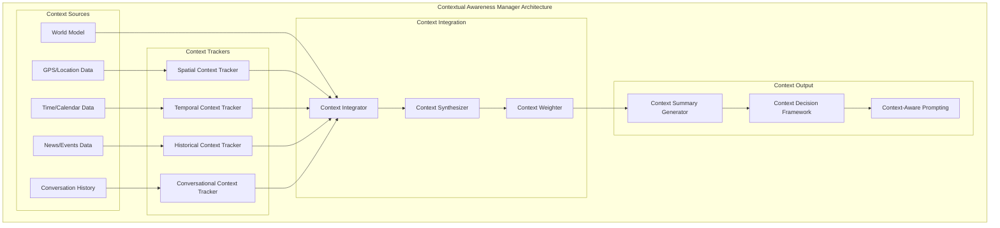

# Leonidas System - Contextual Awareness Manager Specification v1.4

## Overview

O **Contextual Awareness Manager** é responsável por manter consciência contextual multi-dimensional do Leonidas, integrando contexto espacial, temporal, histórico e conversacional para fornecer respostas mais precisas e contextualmente apropriadas.

## Architecture Overview

### Core Components



## Technical Specifications

### Spatial Context Tracking

```python
@dataclass
class SpatialContext:
    """Spatial context information."""
    
    # Location Information
    city: Optional[str]
    region: Optional[str]
    country: Optional[str]
    specific_address: Optional[str]
    coordinates: Optional[Tuple[float, float]]
    
    # Environmental Context
    timezone: str
    weather_conditions: Optional[Dict[str, Any]]
    local_time: datetime
    
    # Contextual Relevance
    location_confidence: float
    last_updated: datetime
    source: str  # gps, ip_geolocation, user_provided, etc.

class SpatialContextTracker:
    """Tracks and manages spatial context."""
    
    def __init__(self, config: SpatialConfig):
        self.config = config
        self.current_context = SpatialContext()
        self.location_history = collections.deque(maxlen=100)
        self.weather_service = WeatherService(config.weather_api_key)
        self.geocoding_service = GeocodingService(config.geocoding_api_key)
        
    async def update_location_context(self, location_data: Dict[str, Any]) -> SpatialContext:
        """Update spatial context with new location data."""
        
        # Process location data
        if 'coordinates' in location_data:
            coordinates = location_data['coordinates']
            location_info = await self.geocoding_service.reverse_geocode(coordinates)
            
            self.current_context.coordinates = coordinates
            self.current_context.city = location_info.get('city')
            self.current_context.region = location_info.get('region')
            self.current_context.country = location_info.get('country')
            self.current_context.location_confidence = location_data.get('accuracy', 0.8)
        
        # Update environmental context
        if self.current_context.coordinates:
            weather_data = await self.weather_service.get_current_weather(
                self.current_context.coordinates
            )
            self.current_context.weather_conditions = weather_data
        
        # Update timezone and local time
        self.current_context.timezone = await self._get_timezone_for_location()
        self.current_context.local_time = datetime.now(tz=pytz.timezone(self.current_context.timezone))
        
        # Update metadata
        self.current_context.last_updated = datetime.now()
        self.current_context.source = location_data.get('source', 'unknown')
        
        # Add to history
        self.location_history.append(self.current_context)
        
        return self.current_context
```### Tem
poral Context Tracking

```python
@dataclass
class TemporalContext:
    """Temporal context information."""
    
    # Current Time Information
    current_time: datetime
    local_time: datetime
    timezone: str
    
    # Calendar Context
    day_of_week: str
    time_of_day: str  # morning, afternoon, evening, night
    season: str
    is_weekend: bool
    is_holiday: bool
    
    # Historical Awareness
    significant_dates: List[Dict[str, Any]]
    recurring_patterns: List[Dict[str, Any]]
    
    # Contextual Relevance
    temporal_confidence: float
    last_updated: datetime

class TemporalContextTracker:
    """Tracks and manages temporal context."""
    
    def __init__(self, config: TemporalConfig):
        self.config = config
        self.current_context = TemporalContext()
        self.calendar_service = CalendarService(config.calendar_config)
        self.holiday_service = HolidayService(config.holiday_config)
        
    async def update_temporal_context(self) -> TemporalContext:
        """Update temporal context with current time information."""
        
        now = datetime.now()
        
        # Basic time information
        self.current_context.current_time = now
        self.current_context.timezone = str(now.astimezone().tzinfo)
        self.current_context.local_time = now
        
        # Calendar context
        self.current_context.day_of_week = now.strftime('%A')
        self.current_context.time_of_day = self._determine_time_of_day(now.hour)
        self.current_context.season = self._determine_season(now.month)
        self.current_context.is_weekend = now.weekday() >= 5
        
        # Holiday information
        self.current_context.is_holiday = await self.holiday_service.is_holiday(now.date())
        
        # Significant dates
        self.current_context.significant_dates = await self._get_significant_dates(now)
        
        # Update metadata
        self.current_context.temporal_confidence = 1.0  # Time is always accurate
        self.current_context.last_updated = now
        
        return self.current_context
    
    def _determine_time_of_day(self, hour: int) -> str:
        """Determine time of day category."""
        if 5 <= hour < 12:
            return 'morning'
        elif 12 <= hour < 17:
            return 'afternoon'
        elif 17 <= hour < 21:
            return 'evening'
        else:
            return 'night'
    
    def _determine_season(self, month: int) -> str:
        """Determine season based on month."""
        if month in [12, 1, 2]:
            return 'winter'
        elif month in [3, 4, 5]:
            return 'spring'
        elif month in [6, 7, 8]:
            return 'summer'
        else:
            return 'autumn'

### Historical Context Tracking

```python
@dataclass
class HistoricalContext:
    """Historical context information."""
    
    # World Events
    current_events: List[Dict[str, Any]]
    significant_events: List[Dict[str, Any]]
    geopolitical_context: Dict[str, Any]
    
    # Technology Context
    current_tech_trends: List[str]
    relevant_updates: List[Dict[str, Any]]
    
    # Cultural Context
    cultural_events: List[Dict[str, Any]]
    local_context: Dict[str, Any]
    
    # Contextual Relevance
    historical_confidence: float
    last_updated: datetime
    data_sources: List[str]

class HistoricalContextTracker:
    """Tracks and manages historical context."""
    
    def __init__(self, config: HistoricalConfig):
        self.config = config
        self.current_context = HistoricalContext()
        self.news_service = NewsService(config.news_api_key)
        self.events_service = EventsService(config.events_config)
        self.tech_tracker = TechTrendsTracker(config.tech_config)
        
    async def update_historical_context(self, location_context: SpatialContext) -> HistoricalContext:
        """Update historical context with current events and trends."""
        
        # Get current events
        current_events = await self.news_service.get_current_events(
            location=location_context.city,
            categories=['technology', 'politics', 'business', 'science'],
            max_results=10
        )
        self.current_context.current_events = current_events
        
        # Get significant events
        significant_events = await self.events_service.get_significant_events(
            timeframe='recent',
            relevance_threshold=0.8
        )
        self.current_context.significant_events = significant_events
        
        # Get geopolitical context
        geopolitical_context = await self._get_geopolitical_context(location_context)
        self.current_context.geopolitical_context = geopolitical_context
        
        # Get technology trends
        tech_trends = await self.tech_tracker.get_current_trends()
        self.current_context.current_tech_trends = tech_trends
        
        # Get cultural context
        cultural_events = await self._get_cultural_context(location_context)
        self.current_context.cultural_events = cultural_events
        
        # Update metadata
        self.current_context.historical_confidence = 0.85  # News data confidence
        self.current_context.last_updated = datetime.now()
        self.current_context.data_sources = ['news_api', 'events_service', 'tech_tracker']
        
        return self.current_context

### Conversational Context Tracking

```python
@dataclass
class ConversationalContext:
    """Conversational context information."""
    
    # Current Session
    session_id: str
    session_start: datetime
    session_duration: timedelta
    
    # Interaction History
    interaction_count: int
    recent_topics: List[str]
    conversation_flow: List[Dict[str, Any]]
    
    # User Context
    user_preferences: Dict[str, Any]
    user_expertise_level: str
    communication_style: str
    
    # Conversation Patterns
    question_types: List[str]
    response_patterns: List[str]
    interruption_patterns: List[Dict[str, Any]]
    
    # Contextual Relevance
    conversational_confidence: float
    last_updated: datetime

class ConversationalContextTracker:
    """Tracks and manages conversational context."""
    
    def __init__(self, config: ConversationalConfig):
        self.config = config
        self.current_context = ConversationalContext()
        self.topic_extractor = TopicExtractor()
        self.pattern_analyzer = ConversationPatternAnalyzer()
        
    async def update_conversational_context(self, 
                                         interaction_data: Dict[str, Any],
                                         memory_context: List[Dict[str, Any]]) -> ConversationalContext:
        """Update conversational context with new interaction."""
        
        # Update session information
        if not self.current_context.session_id:
            self.current_context.session_id = interaction_data.get('session_id', str(uuid.uuid4()))
            self.current_context.session_start = datetime.now()
        
        self.current_context.session_duration = datetime.now() - self.current_context.session_start
        self.current_context.interaction_count += 1
        
        # Extract topics from interaction
        if 'user_input' in interaction_data:
            topics = await self.topic_extractor.extract_topics(interaction_data['user_input'])
            self.current_context.recent_topics.extend(topics)
            
            # Keep only recent topics (last 10)
            self.current_context.recent_topics = self.current_context.recent_topics[-10:]
        
        # Update conversation flow
        flow_entry = {
            'timestamp': datetime.now(),
            'user_input': interaction_data.get('user_input', ''),
            'leonidas_response': interaction_data.get('leonidas_response', ''),
            'topics': topics if 'user_input' in interaction_data else []
        }
        self.current_context.conversation_flow.append(flow_entry)
        
        # Keep only recent conversation flow (last 20 interactions)
        self.current_context.conversation_flow = self.current_context.conversation_flow[-20:]
        
        # Analyze patterns
        patterns = await self.pattern_analyzer.analyze_patterns(self.current_context.conversation_flow)
        self.current_context.question_types = patterns.get('question_types', [])
        self.current_context.response_patterns = patterns.get('response_patterns', [])
        
        # Update user context from memory
        if memory_context:
            user_prefs = await self._extract_user_preferences(memory_context)
            self.current_context.user_preferences.update(user_prefs)
        
        # Update metadata
        self.current_context.conversational_confidence = 0.9
        self.current_context.last_updated = datetime.now()
        
        return self.current_context
```### Context 
Integration and Synthesis

```python
class ContextualAwarenessManager:
    """Main manager for comprehensive contextual awareness."""
    
    def __init__(self, config: ContextualAwarenessConfig):
        self.config = config
        
        # Context trackers
        self.spatial_tracker = SpatialContextTracker(config.spatial_config)
        self.temporal_tracker = TemporalContextTracker(config.temporal_config)
        self.historical_tracker = HistoricalContextTracker(config.historical_config)
        self.conversational_tracker = ConversationalContextTracker(config.conversational_config)
        
        # Integration components
        self.context_integrator = ContextIntegrator()
        self.context_synthesizer = ContextSynthesizer()
        self.context_weighter = ContextWeighter()
        
        # Output generation
        self.summary_generator = ContextSummaryGenerator()
        self.decision_framework = ContextDecisionFramework()
        
        # Performance optimization
        self.context_cache = ContextCache(max_size=100)
        self.update_scheduler = ContextUpdateScheduler()
        
    async def get_comprehensive_context(self, 
                                     interaction_data: Dict[str, Any],
                                     memory_context: List[Dict[str, Any]],
                                     world_model_data: Dict[str, Any]) -> ComprehensiveContext:
        """Get comprehensive contextual awareness for decision making."""
        
        # Check cache first
        cache_key = self._generate_context_cache_key(interaction_data)
        cached_context = await self.context_cache.get(cache_key)
        if cached_context and self._is_context_fresh(cached_context):
            return cached_context
        
        # Update all context trackers
        update_tasks = [
            self.spatial_tracker.update_location_context(world_model_data.get('location', {})),
            self.temporal_tracker.update_temporal_context(),
            self.historical_tracker.update_historical_context(self.spatial_tracker.current_context),
            self.conversational_tracker.update_conversational_context(interaction_data, memory_context)
        ]
        
        contexts = await asyncio.gather(*update_tasks, return_exceptions=True)
        
        # Extract successful contexts
        spatial_context = contexts[0] if not isinstance(contexts[0], Exception) else None
        temporal_context = contexts[1] if not isinstance(contexts[1], Exception) else None
        historical_context = contexts[2] if not isinstance(contexts[2], Exception) else None
        conversational_context = contexts[3] if not isinstance(contexts[3], Exception) else None
        
        # Integrate contexts
        integrated_context = await self.context_integrator.integrate_contexts(
            spatial_context,
            temporal_context,
            historical_context,
            conversational_context
        )
        
        # Synthesize comprehensive context
        comprehensive_context = await self.context_synthesizer.synthesize_context(
            integrated_context,
            interaction_data,
            world_model_data
        )
        
        # Apply context weighting
        weighted_context = await self.context_weighter.apply_weights(
            comprehensive_context,
            interaction_data.get('context_preferences', {})
        )
        
        # Cache result
        await self.context_cache.put(cache_key, weighted_context)
        
        return weighted_context
    
    async def generate_context_summary(self, context: ComprehensiveContext) -> str:
        """Generate human-readable context summary."""
        
        return await self.summary_generator.generate_summary(context)
    
    async def get_context_aware_prompt_enhancement(self, 
                                                 base_prompt: str,
                                                 context: ComprehensiveContext) -> str:
        """Enhance prompt with contextual awareness."""
        
        return await self.decision_framework.enhance_prompt_with_context(base_prompt, context)

@dataclass
class ComprehensiveContext:
    """Comprehensive contextual awareness data."""
    
    # Individual contexts
    spatial_context: Optional[SpatialContext]
    temporal_context: Optional[TemporalContext]
    historical_context: Optional[HistoricalContext]
    conversational_context: Optional[ConversationalContext]
    
    # Integrated information
    context_summary: str
    key_contextual_factors: List[str]
    contextual_priorities: Dict[str, float]
    
    # Decision support
    recommended_approach: str
    contextual_constraints: List[str]
    contextual_opportunities: List[str]
    
    # Metadata
    context_confidence: float
    last_updated: datetime
    context_sources: List[str]
    
    # Performance data
    generation_time_ms: float
    cache_hit: bool = False

class ContextIntegrator:
    """Integrates multiple context sources into unified context."""
    
    async def integrate_contexts(self,
                               spatial: Optional[SpatialContext],
                               temporal: Optional[TemporalContext],
                               historical: Optional[HistoricalContext],
                               conversational: Optional[ConversationalContext]) -> Dict[str, Any]:
        """Integrate multiple context sources."""
        
        integrated = {
            'spatial_factors': [],
            'temporal_factors': [],
            'historical_factors': [],
            'conversational_factors': [],
            'cross_context_insights': []
        }
        
        # Extract spatial factors
        if spatial:
            integrated['spatial_factors'] = [
                f"Location: {spatial.city}, {spatial.region}" if spatial.city else None,
                f"Weather: {spatial.weather_conditions.get('description', 'unknown')}" if spatial.weather_conditions else None,
                f"Local time: {spatial.local_time.strftime('%H:%M')}" if spatial.local_time else None
            ]
            integrated['spatial_factors'] = [f for f in integrated['spatial_factors'] if f]
        
        # Extract temporal factors
        if temporal:
            integrated['temporal_factors'] = [
                f"Day: {temporal.day_of_week}",
                f"Time of day: {temporal.time_of_day}",
                f"Season: {temporal.season}",
                "Weekend" if temporal.is_weekend else "Weekday",
                "Holiday" if temporal.is_holiday else None
            ]
            integrated['temporal_factors'] = [f for f in integrated['temporal_factors'] if f]
        
        # Extract historical factors
        if historical:
            integrated['historical_factors'] = [
                f"Current events: {len(historical.current_events)} relevant news items",
                f"Tech trends: {', '.join(historical.current_tech_trends[:3])}" if historical.current_tech_trends else None,
                f"Cultural context available" if historical.cultural_events else None
            ]
            integrated['historical_factors'] = [f for f in integrated['historical_factors'] if f]
        
        # Extract conversational factors
        if conversational:
            integrated['conversational_factors'] = [
                f"Session duration: {conversational.session_duration}",
                f"Interaction count: {conversational.interaction_count}",
                f"Recent topics: {', '.join(conversational.recent_topics[:3])}" if conversational.recent_topics else None,
                f"User expertise: {conversational.user_expertise_level}" if conversational.user_expertise_level else None
            ]
            integrated['conversational_factors'] = [f for f in integrated['conversational_factors'] if f]
        
        # Generate cross-context insights
        integrated['cross_context_insights'] = await self._generate_cross_context_insights(
            spatial, temporal, historical, conversational
        )
        
        return integrated
    
    async def _generate_cross_context_insights(self, spatial, temporal, historical, conversational) -> List[str]:
        """Generate insights from cross-context analysis."""
        
        insights = []
        
        # Time-location insights
        if spatial and temporal:
            if temporal.time_of_day == 'morning' and spatial.city:
                insights.append(f"Morning context in {spatial.city} - consider local business hours")
            
            if temporal.is_weekend and spatial.weather_conditions:
                weather = spatial.weather_conditions.get('description', '')
                insights.append(f"Weekend with {weather} weather - leisure context likely")
        
        # Historical-conversational insights
        if historical and conversational:
            if len(conversational.recent_topics) > 0 and len(historical.current_events) > 0:
                insights.append("Current events may be relevant to ongoing conversation topics")
        
        # Temporal-conversational insights
        if temporal and conversational:
            if temporal.time_of_day == 'night' and conversational.interaction_count > 10:
                insights.append("Extended evening session - user may be working late or in different timezone")
        
        return insights

class ContextSynthesizer:
    """Synthesizes integrated context into actionable insights."""
    
    async def synthesize_context(self,
                               integrated_context: Dict[str, Any],
                               interaction_data: Dict[str, Any],
                               world_model_data: Dict[str, Any]) -> ComprehensiveContext:
        """Synthesize comprehensive context from integrated data."""
        
        # Generate context summary
        summary_parts = []
        
        if integrated_context['spatial_factors']:
            summary_parts.append(f"Location context: {'; '.join(integrated_context['spatial_factors'])}")
        
        if integrated_context['temporal_factors']:
            summary_parts.append(f"Time context: {'; '.join(integrated_context['temporal_factors'])}")
        
        if integrated_context['conversational_factors']:
            summary_parts.append(f"Conversation context: {'; '.join(integrated_context['conversational_factors'])}")
        
        context_summary = ". ".join(summary_parts)
        
        # Identify key contextual factors
        key_factors = []
        key_factors.extend(integrated_context['spatial_factors'][:2])
        key_factors.extend(integrated_context['temporal_factors'][:2])
        key_factors.extend(integrated_context['conversational_factors'][:2])
        
        # Determine contextual priorities
        priorities = await self._calculate_contextual_priorities(integrated_context, interaction_data)
        
        # Generate recommendations
        approach = await self._recommend_approach(integrated_context, interaction_data)
        constraints = await self._identify_constraints(integrated_context)
        opportunities = await self._identify_opportunities(integrated_context)
        
        # Calculate overall confidence
        confidence = await self._calculate_context_confidence(integrated_context)
        
        return ComprehensiveContext(
            spatial_context=None,  # Individual contexts available separately
            temporal_context=None,
            historical_context=None,
            conversational_context=None,
            context_summary=context_summary,
            key_contextual_factors=key_factors,
            contextual_priorities=priorities,
            recommended_approach=approach,
            contextual_constraints=constraints,
            contextual_opportunities=opportunities,
            context_confidence=confidence,
            last_updated=datetime.now(),
            context_sources=['spatial', 'temporal', 'historical', 'conversational'],
            generation_time_ms=0.0  # Will be set by caller
        )

## Configuration

```python
@dataclass
class ContextualAwarenessConfig:
    # Component configurations
    spatial_config: SpatialConfig = field(default_factory=SpatialConfig)
    temporal_config: TemporalConfig = field(default_factory=TemporalConfig)
    historical_config: HistoricalConfig = field(default_factory=HistoricalConfig)
    conversational_config: ConversationalConfig = field(default_factory=ConversationalConfig)
    
    # Integration settings
    context_cache_size: int = 100
    context_cache_ttl: int = 300  # seconds
    update_frequency: int = 60    # seconds
    
    # Performance settings
    max_context_generation_time: float = 2.0  # seconds
    context_confidence_threshold: float = 0.7
    
    # Feature flags
    enable_spatial_context: bool = True
    enable_temporal_context: bool = True
    enable_historical_context: bool = True
    enable_conversational_context: bool = True

@dataclass
class SpatialConfig:
    weather_api_key: Optional[str] = None
    geocoding_api_key: Optional[str] = None
    location_accuracy_threshold: float = 0.8
    weather_update_interval: int = 1800  # 30 minutes

@dataclass
class HistoricalConfig:
    news_api_key: Optional[str] = None
    events_config: Dict[str, Any] = field(default_factory=dict)
    tech_config: Dict[str, Any] = field(default_factory=dict)
    update_interval: int = 3600  # 1 hour
```