# Leonidas System - Dialogue Analysis Agent Specification v1.4

## Overview

O **Dialogue Analysis Agent** é o sistema de análise de diálogo do Leonidas, responsável por processar transcrições de áudio em tempo real, realizar diarização de múltiplos falantes, autenticação de voz, análise de intenção e determinação de alvo da fala. Opera com alta precisão para garantir interações naturais e contextualmente apropriadas.

## Architecture Overview

### Core Components

```mermaid
graph TD
    subgraph "Dialogue Analysis Agent Architecture"
        subgraph "Audio Input Processing"
            AI[Audio Input Stream]
            VAD[Voice Activity Detection]
            SS[Speaker Separation]
        end
        
        subgraph "Speaker Management"
            SI[Speaker Identification]
            VA[Voice Authentication]
            SP[Speaker Profiles]
            SD[Speaker Database]
        end
        
        subgraph "Transcription Pipeline"
            STT[Speech-to-Text]
            TC[Transcription Cleanup]
            TQ[Transcription Quality Check]
        end
        
        subgraph "Analysis Engine"
            IA[Intent Analysis]
            TA[Target Detection]
            CA[Context Analysis]
            GA[Gemini Analysis]
        end
        
        subgraph "Signal Generation"
            SG[Signal Generator]
            SV[Signal Validator]
            SP2[Signal Prioritizer]
        end
        
        AI --> VAD
        VAD --> SS
        SS --> SI
        SI --> VA
        VA --> SP
        
        SS --> STT
        STT --> TC
        TC --> TQ
        TQ --> IA
        IA --> TA
        TA --> CA
        CA --> GA
        GA --> SG
        SG --> SV
        SV --> SP2
        
        SP --> SI
        SD --> VA
    end
```



### Technical Specifications

#### Audio Processing Pipeline
- **Input Format**: PCM 16-bit, 16kHz mono audio stream
- **VAD Sensitivity**: Configurable (high/medium/low) with 50ms minimum detection window
- **Speaker Separation**: Real-time diarization with up to 4 concurrent speakers
- **Processing Latency**: Target <200ms from audio input to signal emission

#### Speaker Management System

```python
@dataclass
class SpeakerProfile:
    speaker_id: str
    voice_characteristics: Dict[str, float]  # Pitch, tone, cadence features
    authentication_confidence: float
    last_seen: datetime
    interaction_count: int
    preferred_name: Optional[str]
    trust_level: float  # 0.0 to 1.0

class SpeakerDatabase:
    def __init__(self):
        self.profiles: Dict[str, SpeakerProfile] = {}
        self.voice_embeddings: Dict[str, np.ndarray] = {}
    
    def register_speaker(self, audio_sample: bytes) -> str:
        """Register new speaker from audio sample"""
        
    def authenticate_speaker(self, audio_sample: bytes) -> Tuple[str, float]:
        """Authenticate speaker and return ID with confidence"""
        
    def update_speaker_profile(self, speaker_id: str, interaction_data: dict):
        """Update speaker profile with new interaction data"""
```

#### Intent Classification System

```python
class IntentClassifier:
    INTENT_TYPES = {
        'QUERY': 'User is asking a question',
        'COMMAND': 'User is giving a direct command',
        'STATEMENT': 'User is making a statement or sharing information',
        'GREETING': 'User is greeting or starting conversation',
        'FAREWELL': 'User is ending conversation',
        'INTERRUPTION': 'User is interrupting ongoing speech',
        'CLARIFICATION': 'User is asking for clarification',
        'CONFIRMATION': 'User is confirming or agreeing',
        'NEGATION': 'User is disagreeing or denying',
        'EMOTIONAL': 'User is expressing strong emotion'
    }
    
    def classify_intent(self, transcription: str, context: dict) -> Tuple[str, float]:
        """Classify user intent with confidence score"""
```

#### Target Detection System

```python
class TargetDetector:
    TARGET_TYPES = {
        'LEONIDAS': 'Speech directed at Leonidas',
        'OTHER_HUMAN': 'Speech directed at another human',
        'UNDETERMINED': 'Target unclear or ambiguous'
    }
    
    def detect_target(self, transcription: str, speaker_id: str, context: dict) -> Tuple[str, float]:
        """Detect speech target with confidence"""
```

## Signal Bus Integration

### Signal Types Generated

#### 1. User Query Detected Signal
```json
{
    "signal_type": "user_query_detected",
    "timestamp": "2024-01-15T10:30:45.123Z",
    "priority": "high",
    "source": "dialogue_analysis_agent",
    "data": {
        "speaker_id": "speaker_001",
        "speaker_name": "João",
        "transcription": "Leonidas, como posso otimizar este código?",
        "intent": "QUERY",
        "intent_confidence": 0.92,
        "target": "LEONIDAS",
        "target_confidence": 0.95,
        "is_interrupt": false,
        "audio_duration": 2.3,
        "language": "pt-BR",
        "emotion": "neutral",
        "urgency": "medium"
    }
}
```

#### 2. Multi-Speaker Conversation Signal
```json
{
    "signal_type": "multi_speaker_conversation",
    "timestamp": "2024-01-15T10:30:45.123Z",
    "priority": "medium",
    "source": "dialogue_analysis_agent",
    "data": {
        "active_speakers": [
            {
                "speaker_id": "speaker_001",
                "speaker_name": "João",
                "is_speaking": true,
                "speech_duration": 1.5
            },
            {
                "speaker_id": "speaker_002", 
                "speaker_name": "Maria",
                "is_speaking": false,
                "last_spoke": "2024-01-15T10:30:40.000Z"
            }
        ],
        "conversation_context": "technical_discussion",
        "leonidas_involvement": "observer"
    }
}
```

#### 3. Speaker Authentication Signal
```json
{
    "signal_type": "speaker_authentication",
    "timestamp": "2024-01-15T10:30:45.123Z",
    "priority": "high",
    "source": "dialogue_analysis_agent",
    "data": {
        "speaker_id": "speaker_001",
        "authentication_status": "authenticated",
        "confidence": 0.89,
        "speaker_name": "João",
        "trust_level": 0.95,
        "new_speaker": false,
        "voice_characteristics_match": true
    }
}
```

## Implementation Architecture

### Core Classes

```python
class MultiSpeakerDialogueAgent(SpecializedAgent):
    def __init__(self, config: DialogueConfig):
        super().__init__("dialogue_analysis_agent")
        self.config = config
        self.speaker_db = SpeakerDatabase()
        self.intent_classifier = IntentClassifier()
        self.target_detector = TargetDetector()
        self.vad_processor = VoiceActivityDetector()
        self.speaker_separator = SpeakerSeparator()
        self.transcription_engine = TranscriptionEngine()
        
    async def process_audio_stream(self, audio_stream: AsyncIterable[bytes]) -> AsyncIterable[Signal]:
        """Main processing pipeline for audio stream"""
        
    async def _perform_speaker_diarization(self, audio_chunk: bytes) -> List[SpeakerSegment]:
        """Separate speakers in audio chunk"""
        
    async def _authenticate_speakers(self, speaker_segments: List[SpeakerSegment]) -> List[AuthenticatedSpeaker]:
        """Authenticate identified speakers"""
        
    async def _transcribe_speech(self, speaker_segments: List[SpeakerSegment]) -> List[TranscriptionResult]:
        """Transcribe speech for each speaker"""
        
    async def _analyze_intent_and_target(self, transcriptions: List[TranscriptionResult]) -> List[AnalysisResult]:
        """Analyze intent and target for each transcription"""
        
    async def _generate_signals(self, analysis_results: List[AnalysisResult]) -> List[Signal]:
        """Generate appropriate signals based on analysis"""
```

### Configuration

```python
@dataclass
class DialogueConfig:
    # Audio Processing
    sample_rate: int = 16000
    chunk_size: int = 1024
    vad_sensitivity: str = "medium"  # high, medium, low
    
    # Speaker Management
    max_speakers: int = 4
    speaker_timeout: int = 300  # seconds
    authentication_threshold: float = 0.8
    new_speaker_threshold: float = 0.7
    
    # Intent Classification
    intent_confidence_threshold: float = 0.7
    target_confidence_threshold: float = 0.8
    
    # Language Processing
    primary_language: str = "pt-BR"
    fallback_languages: List[str] = ["en-US"]
    
    # Performance
    max_processing_latency: float = 0.2  # seconds
    transcription_quality_threshold: float = 0.8
```

## Performance Requirements

### Latency Targets
- **Voice Activity Detection**: <50ms
- **Speaker Separation**: <100ms  
- **Speaker Authentication**: <150ms
- **Speech Transcription**: <200ms
- **Intent Analysis**: <100ms
- **Signal Generation**: <50ms
- **Total Pipeline Latency**: <500ms

### Accuracy Targets
- **Speaker Identification**: >90% accuracy
- **Intent Classification**: >85% accuracy
- **Target Detection**: >90% accuracy
- **Transcription Quality**: >95% word accuracy
- **Authentication**: <5% false positive rate

### Scalability Requirements
- Support up to 4 concurrent speakers
- Handle 8+ hours of continuous operation
- Process audio streams up to 48kHz (with downsampling)
- Maintain <100MB memory footprint per session

## Integration Points

### Signal Bus Connection
```python
class DialogueSignalBusIntegration:
    def __init__(self, signal_bus: UnifiedSignalBus):
        self.signal_bus = signal_bus
        
    async def emit_user_query_signal(self, analysis_result: AnalysisResult):
        """Emit user query detected signal"""
        
    async def emit_speaker_auth_signal(self, auth_result: AuthenticationResult):
        """Emit speaker authentication signal"""
        
    async def emit_conversation_signal(self, conversation_state: ConversationState):
        """Emit multi-speaker conversation signal"""
```

### World Model Integration
```python
class DialogueWorldModelIntegration:
    def __init__(self, world_model: WorldModel):
        self.world_model = world_model
        
    async def update_speaker_context(self, speaker_id: str, context_data: dict):
        """Update world model with speaker context"""
        
    async def get_conversation_history(self, speaker_id: str) -> List[ConversationEntry]:
        """Retrieve conversation history for context"""
```

## Testing Strategy

### Unit Tests
- Speaker separation accuracy with known audio samples
- Intent classification with labeled datasets
- Authentication system with voice samples
- Signal generation format validation

### Integration Tests  
- End-to-end audio processing pipeline
- Signal bus integration and message flow
- Multi-speaker conversation scenarios
- Real-time performance under load

### Performance Tests
- Latency measurement under various conditions
- Memory usage profiling during long sessions
- CPU utilization optimization
- Concurrent speaker handling stress tests

## Security Considerations

### Voice Authentication Security
- Encrypted storage of voice embeddings
- Anti-spoofing measures for recorded audio
- Confidence thresholds to prevent false authentication
- Regular re-authentication for sensitive operations

### Privacy Protection
- Optional voice data anonymization
- Configurable data retention policies
- Secure deletion of voice samples
- User consent management for voice storage

## Monitoring and Observability

### Key Metrics
- Processing latency per pipeline stage
- Speaker identification accuracy rates
- Intent classification confidence distributions
- Authentication success/failure rates
- Signal emission frequency and types

### Logging Strategy
- Structured logging with correlation IDs
- Performance metrics collection
- Error tracking and alerting
- Audio quality metrics logging

### Health Checks
- Pipeline component status monitoring
- Audio input quality validation
- Speaker database integrity checks
- Signal bus connectivity verification
        SP <--> SD
        
        SS --> STT
        STT --> TC
        TC --> TQ
        
        TQ --> IA
        TQ --> TA
        TQ --> CA
        IA --> GA
        TA --> GA
        CA --> GA
        
        GA --> SG
        SG --> SV
        SV --> SP2
    end
```## Multi
-Speaker Diarization System

### Speaker Separation Architecture

```python
class MultiSpeakerDiarization:
    """Advanced multi-speaker diarization with voice authentication."""
    
    def __init__(self):
        self.speaker_profiles = {}
        self.voice_authenticator = VoiceAuthenticator()
        self.speaker_embeddings = SpeakerEmbeddingExtractor()
        self.clustering_algorithm = SpeakerClustering()
        
        # Configuration
        self.min_speaker_duration = 0.5  # seconds
        self.speaker_change_threshold = 0.7
        self.authentication_threshold = 0.8
        
    async def separate_speakers(self, audio_data: bytes) -> list:
        """Separate audio into speaker segments with identification."""
        
        # Step 1: Voice Activity Detection
        vad_segments = await self._detect_voice_activity(audio_data)
        
        # Step 2: Extract speaker embeddings
        speaker_segments = []
        for segment in vad_segments:
            if segment['duration'] >= self.min_speaker_duration:
                embedding = await self.speaker_embeddings.extract(segment['audio'])
                speaker_segments.append({
                    **segment,
                    'embedding': embedding
                })
        
        # Step 3: Speaker clustering and identification
        identified_segments = await self._identify_speakers(speaker_segments)
        
        # Step 4: Voice authentication
        authenticated_segments = await self._authenticate_speakers(identified_segments)
        
        return authenticated_segments
    
    async def _detect_voice_activity(self, audio_data: bytes) -> list:
        """Detect voice activity segments in audio."""
        # Implementation would use WebRTC VAD or similar
        segments = []
        
        # Placeholder implementation
        # Real implementation would analyze audio for voice activity
        segments.append({
            'start_time': 0.0,
            'end_time': 2.5,
            'duration': 2.5,
            'audio': audio_data,
            'confidence': 0.95
        })
        
        return segments
    
    async def _identify_speakers(self, segments: list) -> list:
        """Identify speakers using clustering and existing profiles."""
        identified_segments = []
        
        for segment in segments:
            # Compare with existing speaker profiles
            best_match = await self._find_best_speaker_match(segment['embedding'])
            
            if best_match and best_match['similarity'] > self.speaker_change_threshold:
                # Existing speaker
                speaker_id = best_match['speaker_id']
                self.speaker_profiles[speaker_id]['interaction_count'] += 1
            else:
                # New speaker
                speaker_id = await self._create_new_speaker_profile(segment['embedding'])
            
            identified_segments.append({
                **segment,
                'speaker_id': speaker_id,
                'speaker_confidence': best_match['similarity'] if best_match else 1.0
            })
        
        return identified_segments
    
    async def _find_best_speaker_match(self, embedding: np.ndarray) -> dict:
        """Find best matching speaker from existing profiles."""
        if not self.speaker_profiles:
            return None
        
        best_match = None
        best_similarity = 0.0
        
        for speaker_id, profile in self.speaker_profiles.items():
            similarity = await self._calculate_embedding_similarity(
                embedding, profile['voice_embedding']
            )
            
            if similarity > best_similarity:
                best_similarity = similarity
                best_match = {
                    'speaker_id': speaker_id,
                    'similarity': similarity
                }
        
        return best_match if best_similarity > self.speaker_change_threshold else None
    
    async def _create_new_speaker_profile(self, embedding: np.ndarray) -> str:
        """Create new speaker profile."""
        speaker_id = f"SPEAKER_{len(self.speaker_profiles) + 1}"
        
        self.speaker_profiles[speaker_id] = {
            'speaker_id': speaker_id,
            'voice_embedding': embedding,
            'first_detected': time.time(),
            'interaction_count': 1,
            'authentication_status': 'pending',
            'voice_characteristics': await self._analyze_voice_characteristics(embedding)
        }
        
        return speaker_id
    
    async def _authenticate_speakers(self, segments: list) -> list:
        """Authenticate speakers using voice biometrics."""
        authenticated_segments = []
        
        for segment in segments:
            speaker_id = segment['speaker_id']
            profile = self.speaker_profiles.get(speaker_id)
            
            if profile:
                # Perform voice authentication
                auth_result = await self.voice_authenticator.authenticate(
                    segment['audio'], profile['voice_embedding']
                )
                
                segment['authentication'] = {
                    'authenticated': auth_result['confidence'] > self.authentication_threshold,
                    'confidence': auth_result['confidence'],
                    'method': 'voice_biometrics'
                }
                
                # Update profile authentication status
                if segment['authentication']['authenticated']:
                    profile['authentication_status'] = 'authenticated'
            
            authenticated_segments.append(segment)
        
        return authenticated_segments
```##
 Gemini Integration for Intent Analysis

### Dialogue Analysis Prompt v1.4

```python
DIALOGUE_ANALYSIS_PROMPT_V14 = '''
Você é um agente especialista em análise de diálogo em tempo real para Leonidas. Sua função é analisar transcrições de áudio e determinar a estrutura da interação, identificando o falante e sua intenção, respondendo com um objeto JSON em uma única linha no Barramento de Sinais.

Siga o formato: `{"source": "DialogueAnalysis", "speaker_id": "ID_FALANTE", "target": "TIPO_ALVO", "intent": "TIPO_INTENCAO", "is_interrupt": BOOLEAN, "transcription": "TEXTO_COMPLETO"}`.

VALORES E REGRAS DE NEGÓCIO:

1. **`speaker_id`:** Atribua um ID único para cada voz distinta detectada (ex: `"USER_1"`, `"USER_2"`). Para a própria fala de Leonidas, use `"LEONIDAS"`. Se for ruído sem fala clara, use `"NOISE"`. Reutilize IDs para o mesmo falante.

2. **`target`:** Para quem a fala se destina?
   - `"LEONIDAS"`: Se a fala contiver seu nome ("Leonidas", "Léo") ou for uma pergunta/comando direto claramente para a IA.
   - `"OTHER_HUMAN"`: Se for uma conversa entre humanos no ambiente, sem Leonidas como alvo primário.
   - `"UNDETERMINED"`: Se não for possível determinar.

3. **`intent`:** Qual o propósito principal da fala? (Mais específico para `target: "LEONIDAS"`)
   - `"QUERY"`: Uma questão clara.
   - `"COMMAND"`: Uma instrução para Leonidas agir.
   - `"STATEMENT"`: Uma declaração, observação geral.
   - `"POSITIVE_FEEDBACK"`: Elogio, confirmação (ex: "Ótimo!", "Exato!").
   - `"NEGATIVE_FEEDBACK"`: Crítica, correção (ex: "Não, isso está errado.", "Tente novamente.").
   - `"SOCIAL"`: Saudação, conversa casual para Leonidas.
   - `"CONVERSATION"`: Interação entre humanos.
   - `"SILENCE"`: Períodos de inatividade de fala prolongada.
   - `"UNDETERMINED"`.

4. **`is_interrupt`:** (`BOOLEAN`) Este sinal DEVE acionar uma interrupção no Leonidas? `true` APENAS se a fala do usuário for uma pergunta direta, um comando, feedback crítico para Leonidas, ou se for a primeira vez que um novo falante interage diretamente com Leonidas. Caso contrário, `false`.

5. **`transcription`:** A transcrição completa da fala.

REGRAS IMPORTANTES:
- Você deve gerar um sinal JSON para CADA transcrição de áudio processada.
- Este sinal será enviado para o Barramento de Sinais (`intervention_bus` se `is_interrupt=true`, caso contrário `context_bus`).
- Responda APENAS com o objeto JSON válido. Nada mais.
- Mantenha consistência nos speaker_ids ao longo da sessão.
- Seja preciso na classificação de intent - isso afeta como Leonidas responde.
'''

class DialogueAnalysisGeminiConfig:
    """Optimized Gemini configuration for dialogue analysis."""
    
    MODEL_NAME = "gemini-live-2.5-flash-preview"
    
    @staticmethod
    def create_config() -> genai_types.GenerateContentConfig:
        """Create optimized configuration for dialogue analysis."""
        return genai_types.GenerateContentConfig(
            system_instruction=DIALOGUE_ANALYSIS_PROMPT_V14,
            max_output_tokens=200,  # Sufficient for detailed JSON responses
            response_mime_type='application/json',
            temperature=0.2,  # Low temperature for consistent analysis
            candidate_count=1
        )
```

## Core Implementation

### Dialogue Analysis Agent Class

```python
class DialogueAnalysisAgent(processor.Processor):
    """Advanced dialogue analysis agent with multi-speaker support."""
    
    def __init__(self, api_key: str):
        self.api_key = api_key
        self.model = genai_model.GenaiModel(
            api_key=api_key,
            model_name=DialogueAnalysisGeminiConfig.MODEL_NAME,
            config=DialogueAnalysisGeminiConfig.create_config()
        )
        
        # Core components
        self.diarization_system = MultiSpeakerDiarization()
        self.transcription_engine = TranscriptionEngine()
        self.intent_analyzer = IntentAnalyzer()
        self.context_manager = ConversationContextManager()
        
        # State management
        self.conversation_state = ConversationState()
        self.speaker_tracker = SpeakerTracker()
        
        # Performance optimization
        self.audio_cache = AudioCache(max_size=100)
        self.transcription_cache = TranscriptionCache(max_size=200)
        
        # Metrics
        self.performance_metrics = DialogueAnalysisMetrics()
        
    async def call(self, content: AsyncIterable[ProcessorPart]) -> AsyncIterable[ProcessorPart]:
        """Process audio stream and generate dialogue analysis signals."""
        
        async for part in content:
            if not content_api.is_audio(part.mimetype):
                continue
            
            processing_start = time.time()
            
            try:
                # Process audio through complete pipeline
                analysis_result = await self._process_audio(part)
                
                # Generate dialogue signals
                signals = await self._generate_dialogue_signals(analysis_result)
                
                # Emit validated signals
                for signal in signals:
                    validated_signal = await self._validate_and_emit_signal(signal)
                    if validated_signal:
                        yield validated_signal
                
                # Update performance metrics
                processing_time = time.time() - processing_start
                await self.performance_metrics.record_audio_processed(processing_time)
                
            except Exception as e:
                await self._handle_processing_error(part, e)
    
    async def _process_audio(self, audio_part: ProcessorPart) -> dict:
        """Process audio through complete dialogue analysis pipeline."""
        
        # Check audio cache
        cache_key = await self.audio_cache.get_cache_key(audio_part.bytes)
        cached_result = await self.audio_cache.get(cache_key)
        
        if cached_result:
            return cached_result
        
        # Step 1: Multi-speaker diarization
        speaker_segments = await self.diarization_system.separate_speakers(audio_part.bytes)
        
        # Step 2: Transcription for each segment
        transcribed_segments = []
        for segment in speaker_segments:
            transcription = await self.transcription_engine.transcribe(
                segment['audio'], segment['speaker_id']
            )
            
            if transcription and transcription['text'].strip():
                transcribed_segments.append({
                    **segment,
                    'transcription': transcription
                })
        
        # Step 3: Intent and target analysis
        analyzed_segments = []
        for segment in transcribed_segments:
            analysis = await self._analyze_segment_intent(segment)
            analyzed_segments.append({
                **segment,
                'analysis': analysis
            })
        
        # Step 4: Context integration
        contextualized_result = await self.context_manager.integrate_context(analyzed_segments)
        
        # Cache result
        await self.audio_cache.put(cache_key, contextualized_result)
        
        return contextualized_result
    
    async def _analyze_segment_intent(self, segment: dict) -> dict:
        """Analyze intent and target for a transcribed segment."""
        
        transcription_text = segment['transcription']['text']
        speaker_id = segment['speaker_id']
        
        # Prepare analysis context
        analysis_context = {
            'transcription': transcription_text,
            'speaker_id': speaker_id,
            'speaker_profile': self.diarization_system.speaker_profiles.get(speaker_id, {}),
            'conversation_history': await self.context_manager.get_recent_context(),
            'timestamp': time.time()
        }
        
        # Use Gemini for intent analysis
        gemini_analysis = await self._gemini_intent_analysis(analysis_context)
        
        # Combine with rule-based analysis
        rule_based_analysis = await self._rule_based_analysis(analysis_context)
        
        # Merge analyses
        final_analysis = await self._merge_analyses(gemini_analysis, rule_based_analysis)
        
        return final_analysis
    
    async def _gemini_intent_analysis(self, context: dict) -> dict:
        """Use Gemini for intent and target analysis."""
        
        # Prepare prompt with context
        analysis_prompt = f"""
        Analise esta fala do {context['speaker_id']}: "{context['transcription']}"
        
        Contexto da conversa: {context.get('conversation_history', 'Início da conversa')}
        
        Determine:
        1. Para quem a fala se destina? (LEONIDAS/OTHER_HUMAN/UNDETERMINED)
        2. Qual a intenção? (QUERY/COMMAND/STATEMENT/POSITIVE_FEEDBACK/NEGATIVE_FEEDBACK/SOCIAL/CONVERSATION/UNDETERMINED)
        3. Deve interromper o processamento atual? (true/false)
        4. Nível de urgência? (low/medium/high/critical)
        
        Responda em JSON seguindo o formato especificado.
        """
        
        try:
            response = await self.model.generate_content(analysis_prompt)
            
            if response and response.text:
                return json.loads(response.text)
        
        except Exception as e:
            logging.error(f"Gemini intent analysis error: {e}")
        
        return self._get_default_analysis()
    
    async def _rule_based_analysis(self, context: dict) -> dict:
        """Rule-based analysis for intent and target detection."""
        
        text = context['transcription'].lower()
        speaker_id = context['speaker_id']
        
        # Target detection rules
        target = "UNDETERMINED"
        if any(name in text for name in ['leonidas', 'léo', 'leo']):
            target = "LEONIDAS"
        elif speaker_id == "LEONIDAS":
            target = "OTHER_HUMAN"  # Leonidas speaking to humans
        elif self._contains_direct_address_patterns(text):
            target = "LEONIDAS"
        
        # Intent detection rules
        intent = "UNDETERMINED"
        if self._is_question(text):
            intent = "QUERY"
        elif self._is_command(text):
            intent = "COMMAND"
        elif self._is_positive_feedback(text):
            intent = "POSITIVE_FEEDBACK"
        elif self._is_negative_feedback(text):
            intent = "NEGATIVE_FEEDBACK"
        elif self._is_social_interaction(text):
            intent = "SOCIAL"
        else:
            intent = "STATEMENT"
        
        # Interruption detection
        is_interrupt = (
            target == "LEONIDAS" and 
            intent in ["QUERY", "COMMAND", "NEGATIVE_FEEDBACK"] and
            self._is_urgent_or_direct(text)
        )
        
        return {
            'target': target,
            'intent': intent,
            'is_interrupt': is_interrupt,
            'confidence': 0.8,
            'method': 'rule_based'
        }
```