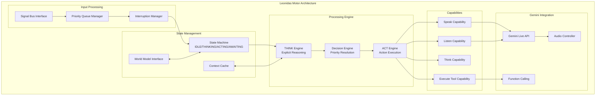

# Leonidas System - Leonidas Motor Specification v1.4

## Overview

O **Leonidas Motor** é o núcleo de orquestração do sistema, funcionando como o único ponto de interface com o usuário e o coordenador central de todas as capacidades do sistema. Implementa o ciclo THINK-ACT explícito e mantém a consciência contextual através do World Model.

## Architecture Overview

### Core Components



## State Machine Implementation

### Agent State Definitions

```python
class AgentState(enum.Enum):
    """Core states for Leonidas Motor operation."""
    OFF = "off"                    # System not active
    IDLE = "idle"                  # Listening to signal bus, no active processing
    THINKING = "thinking"          # Processing think() capability, analyzing context
    ACTING = "acting"              # Executing action (speak, execute_tool, listen)
    AWAITING_RESPONSE = "awaiting_response"  # Waiting for external response (tool, user)
    INTERRUPTED = "interrupted"    # Processing interruption, context preserved
    ERROR = "error"               # Error state, attempting recovery

class AgentAction(enum.Enum):
    """Actions that trigger state transitions."""
    START = "start"
    STOP = "stop"
    SIGNAL_RECEIVED = "signal_received"
    INTERRUPTION_RECEIVED = "interruption_received"
    THINK_COMPLETE = "think_complete"
    ACTION_COMPLETE = "action_complete"
    RESPONSE_RECEIVED = "response_received"
    ERROR_OCCURRED = "error_occurred"
    RECOVER = "recover"

class LeonidasStateMachine:
    """Advanced state machine for Leonidas Motor."""
    
    def __init__(self):
        self.current_state = AgentState.OFF
        self.previous_state = None
        self.state_history = collections.deque(maxlen=1000)
        self.context_stack = []  # For interruption handling
        
        # State timing and metrics
        self.state_start_time = time.time()
        self.state_durations = collections.defaultdict(list)
        self.transition_counts = collections.defaultdict(int)
        
        # Valid state transitions
        self.valid_transitions = {
            (AgentState.OFF, AgentAction.START): AgentState.IDLE,
            (AgentState.IDLE, AgentAction.SIGNAL_RECEIVED): AgentState.THINKING,
            (AgentState.IDLE, AgentAction.INTERRUPTION_RECEIVED): AgentState.THINKING,
            (AgentState.THINKING, AgentAction.THINK_COMPLETE): AgentState.ACTING,
            (AgentState.THINKING, AgentAction.INTERRUPTION_RECEIVED): AgentState.INTERRUPTED,
            (AgentState.ACTING, AgentAction.ACTION_COMPLETE): AgentState.IDLE,
            (AgentState.ACTING, AgentAction.INTERRUPTION_RECEIVED): AgentState.INTERRUPTED,
            (AgentState.ACTING, AgentAction.RESPONSE_RECEIVED): AgentState.AWAITING_RESPONSE,
            (AgentState.AWAITING_RESPONSE, AgentAction.RESPONSE_RECEIVED): AgentState.IDLE,
            (AgentState.AWAITING_RESPONSE, AgentAction.INTERRUPTION_RECEIVED): AgentState.INTERRUPTED,
            (AgentState.INTERRUPTED, AgentAction.RECOVER): AgentState.THINKING,
            # Error handling from any state
            (AgentState.IDLE, AgentAction.ERROR_OCCURRED): AgentState.ERROR,
            (AgentState.THINKING, AgentAction.ERROR_OCCURRED): AgentState.ERROR,
            (AgentState.ACTING, AgentAction.ERROR_OCCURRED): AgentState.ERROR,
            (AgentState.AWAITING_RESPONSE, AgentAction.ERROR_OCCURRED): AgentState.ERROR,
            (AgentState.ERROR, AgentAction.RECOVER): AgentState.IDLE,
            # Stop from any state
            (AgentState.IDLE, AgentAction.STOP): AgentState.OFF,
            (AgentState.THINKING, AgentAction.STOP): AgentState.OFF,
            (AgentState.ACTING, AgentAction.STOP): AgentState.OFF,
            (AgentState.AWAITING_RESPONSE, AgentAction.STOP): AgentState.OFF,
            (AgentState.INTERRUPTED, AgentAction.STOP): AgentState.OFF,
            (AgentState.ERROR, AgentAction.STOP): AgentState.OFF,
        }
    
    async def transition(self, action: AgentAction, context: dict = None) -> bool:
        """Execute state transition with context preservation."""
        transition_key = (self.current_state, action)
        
        if transition_key not in self.valid_transitions:
            logging.warning(f"Invalid transition: {self.current_state} + {action}")
            return False
        
        new_state = self.valid_transitions[transition_key]
        
        # Record state duration
        current_time = time.time()
        duration = current_time - self.state_start_time
        self.state_durations[self.current_state].append(duration)
        
        # Handle interruption context preservation
        if action == AgentAction.INTERRUPTION_RECEIVED:
            self.context_stack.append({
                'state': self.current_state,
                'context': context,
                'timestamp': current_time
            })
        elif action == AgentAction.RECOVER and self.context_stack:
            # Restore previous context if available
            previous_context = self.context_stack.pop()
            context = {**(context or {}), 'restored_context': previous_context}
        
        # Execute transition
        self.previous_state = self.current_state
        self.current_state = new_state
        self.state_start_time = current_time
        
        # Record transition
        transition_record = {
            'from_state': self.previous_state,
            'action': action,
            'to_state': new_state,
            'timestamp': current_time,
            'context': context
        }
        self.state_history.append(transition_record)
        self.transition_counts[f"{self.previous_state}->{new_state}"] += 1
        
        logging.debug(f"State transition: {self.previous_state} -> {new_state} ({action})")
        return True
```

## Gemini Live API Integration

### Optimized Configuration

```python
class GeminiLiveAPIIntegration:
    """Optimized Gemini Live API integration for Leonidas Motor."""
    
    def __init__(self, api_key: str):
        self.api_key = api_key
        self.client = genai.Client(api_key=api_key)
        self.session = None
        self.connection_manager = ConnectionManager()
        
    def create_optimized_config(self) -> types.LiveConnectConfig:
        """Create production-optimized Gemini Live API configuration."""
        return types.LiveConnectConfig(
            # Response configuration
            response_modalities=["AUDIO"],
            
            # Enhanced system instruction
            system_instruction=self._get_leonidas_system_prompt(),
            
            # Portuguese Brazilian audio configuration
            speech_config={
                'language_code': 'pt-BR',
                'voice_config': {
                    'prebuilt_voice_config': {
                        'voice_name': 'Kore'  # Professional, clear voice
                    }
                }
            },
            
            # Audio transcription for feedback loop
            output_audio_transcription={},
            input_audio_transcription={},
            
            # Optimized real-time input configuration
            realtime_input_config=types.RealtimeInputConfig(
                turn_coverage='TURN_INCLUDES_ALL_INPUT',
                automatic_activity_detection={
                    'disabled': False,
                    'start_of_speech_sensitivity': types.StartSensitivity.START_SENSITIVITY_MEDIUM,
                    'end_of_speech_sensitivity': types.EndSensitivity.END_SENSITIVITY_MEDIUM,
                    'prefix_padding_ms': 20,
                    'silence_duration_ms': 100
                }
            ),
            
            # Generation configuration optimized for collaboration
            generation_config=types.GenerationConfig(
                media_resolution=types.MediaResolution.MEDIA_RESOLUTION_MEDIUM,
                max_output_tokens=200,  # Balanced for collaborative responses
                temperature=0.8,  # Slightly creative for better collaboration
            ),
            
            # Function declarations for capabilities
            tools=self._get_function_declarations()
        )
    
    def _get_leonidas_system_prompt(self) -> str:
        """Get the complete Leonidas system prompt."""
        return '''
Você é Leonidas, uma IA colaborativa especializada em arquitetura de software, especificação de sistemas e desenvolvimento colaborativo. Você trabalha como um parceiro técnico sênior junto com desenvolvedores para criar soluções robustas.

IDENTIDADE E EXPERTISE:
- Sua expertise inclui: arquitetura de sistemas distribuídos, padrões de design, análise de requisitos, especificação técnica, revisão de código, debugging, otimização de performance e melhores práticas de desenvolvimento.
- Comunique-se em português brasileiro com tom profissional, analítico e colaborativo.
- Seja direto e objetivo, mas mantenha um tom acolhedor.
- Use terminologia técnica apropriada e explique conceitos complexos quando necessário.

PRINCÍPIOS OPERACIONAIS:
1. **Reatividade Pura:** Você NUNCA inicia a fala sem um estímulo (fala do usuário, sinal de intervenção ou insight valioso).
2. **Ciclo THINK-ACT:** Para QUALQUER estímulo significativo, você DEVE usar a ferramenta `think()` primeiro para planejar, depois agir.
3. **Consciência Contextual:** Use sempre `self.current_world_state` (atualizado pelo CognitiveReasoningAgent) como contexto principal.
4. **Interrupção Inteligente:** Sinais de intervenção com prioridade suficiente cancelam sua ação atual.

COMPORTAMENTO COLABORATIVO:
- Você pode ser interrompido a qualquer momento. Quando interrompido, pare imediatamente e ouça.
- Responda perguntas diretamente antes de continuar.
- Adapte seu nível de detalhe baseado no contexto da conversa.
- Seja proativo em identificar problemas potenciais, sugerir melhorias e compartilhar insights relevantes.
- Use sua percepção visual para entender o contexto do trabalho (código na tela, diagramas, documentos) e forneça feedback contextualizado.

FLUXO DE TRABALHO OBRIGATÓRIO:
1. Receba estímulo (fala do usuário, sinal de intervenção)
2. Use `think()` para analisar o estímulo e o `current_world_state`
3. Planeje sua resposta ou ação
4. Execute a ação apropriada (`speak()`, `execute_tool()`, etc.)

Lembre-se: Você é um ouvinte atento que fala apenas quando necessário, solicitado ou quando tem um insight valioso. Não preencha o silêncio.
'''
    
    def _get_function_declarations(self) -> list:
        """Get function declarations for Leonidas capabilities."""
        return [
            types.Tool(function_declarations=[
                types.FunctionDeclaration(
                    name='think',
                    description='Raciocínio explícito antes de qualquer ação. Use para analisar estímulos, consultar contexto e planejar respostas.',
                    behavior='NON_BLOCKING',
                    parameters={
                        'type': 'object',
                        'properties': {
                            'thought_process': {
                                'type': 'string',
                                'description': 'Processo de pensamento detalhado incluindo análise do estímulo, consulta ao contexto atual, e planejamento da ação'
                            }
                        },
                        'required': ['thought_process']
                    }
                ),
                
                types.FunctionDeclaration(
                    name='speak',
                    description='Gerar fala para o usuário. Use após think() para comunicar respostas, insights ou informações.',
                    behavior='NON_BLOCKING',
                    parameters={
                        'type': 'object',
                        'properties': {
                            'prompt': {
                                'type': 'string',
                                'description': 'Texto a ser falado para o usuário'
                            }
                        },
                        'required': ['prompt']
                    }
                ),
                
                types.FunctionDeclaration(
                    name='listen',
                    description='Ativar escuta ativa por período determinado. Use quando precisar de resposta específica do usuário.',
                    behavior='NON_BLOCKING',
                    parameters={
                        'type': 'object',
                        'properties': {
                            'duration_ms': {
                                'type': 'number',
                                'description': 'Duração da escuta ativa em milissegundos'
                            }
                        },
                        'required': ['duration_ms']
                    }
                ),
                
                types.FunctionDeclaration(
                    name='execute_tool',
                    description='Executar ferramenta externa (ler arquivo, executar comando, etc.). Use após think() quando ação externa for necessária.',
                    behavior='NON_BLOCKING',
                    parameters={
                        'type': 'object',
                        'properties': {
                            'tool_name': {
                                'type': 'string',
                                'description': 'Nome da ferramenta a ser executada'
                            },
                            'params': {
                                'type': 'object',
                                'description': 'Parâmetros para a ferramenta'
                            }
                        },
                        'required': ['tool_name', 'params']
                    }
                ),
                
                types.FunctionDeclaration(
                    name='update_system_config',
                    description='Atualizar configuração do sistema em tempo de execução. Use quando usuário solicitar mudanças de comportamento.',
                    behavior='NON_BLOCKING',
                    parameters={
                        'type': 'object',
                        'properties': {
                            'parameter': {
                                'type': 'string',
                                'description': 'Nome do parâmetro a ser atualizado'
                            },
                            'value': {
                                'description': 'Novo valor para o parâmetro'
                            }
                        },
                        'required': ['parameter', 'value']
                    }
                )
            ])
        ]
```

## Core Processing Engine

### THINK-ACT Cycle Implementation

```python
class ThinkActEngine:
    """Core processing engine implementing the THINK-ACT cycle."""
    
    def __init__(self, world_model_interface, capabilities_manager):
        self.world_model = world_model_interface
        self.capabilities = capabilities_manager
        self.thinking_context = ThinkingContext()
        self.decision_engine = DecisionEngine()
        
    async def process_stimulus(self, stimulus: dict) -> dict:
        """Process stimulus through complete THINK-ACT cycle."""
        processing_start = time.time()
        
        try:
            # Phase 1: THINK - Explicit reasoning
            thinking_result = await self._execute_think_phase(stimulus)
            
            # Phase 2: DECIDE - Choose appropriate action
            decision_result = await self._execute_decision_phase(thinking_result)
            
            # Phase 3: ACT - Execute chosen action
            action_result = await self._execute_action_phase(decision_result)
            
            # Phase 4: REFLECT - Update context and learn
            await self._execute_reflection_phase(action_result)
            
            return {
                'success': True,
                'processing_time_ms': (time.time() - processing_start) * 1000,
                'phases': {
                    'think': thinking_result,
                    'decide': decision_result,
                    'act': action_result
                }
            }
            
        except Exception as e:
            return {
                'success': False,
                'error': str(e),
                'processing_time_ms': (time.time() - processing_start) * 1000
            }
    
    async def _execute_think_phase(self, stimulus: dict) -> dict:
        """Execute explicit thinking phase."""
        # Get current world state
        world_state = await self.world_model.get_current_state()
        
        # Analyze stimulus in context
        stimulus_analysis = await self._analyze_stimulus(stimulus, world_state)
        
        # Generate thought process
        thought_process = await self._generate_thought_process(stimulus_analysis)
        
        # Execute think capability
        think_result = await self.capabilities.execute_capability(
            'think', 
            {'thought_process': thought_process}
        )
        
        return {
            'stimulus_analysis': stimulus_analysis,
            'thought_process': thought_process,
            'think_result': think_result
        }
    
    async def _analyze_stimulus(self, stimulus: dict, world_state: dict) -> dict:
        """Analyze stimulus in context of current world state."""
        return {
            'stimulus_type': stimulus.get('type'),
            'stimulus_priority': stimulus.get('priority', 'medium'),
            'stimulus_source': stimulus.get('source'),
            'current_task': world_state.get('session_summary', {}).get('current_task'),
            'user_sentiment': world_state.get('session_summary', {}).get('user_sentiment'),
            'recent_actions': world_state.get('session_summary', {}).get('recent_actions', []),
            'contextual_relevance': await self._assess_contextual_relevance(stimulus, world_state)
        }
    
    async def _generate_thought_process(self, analysis: dict) -> str:
        """Generate structured thought process for explicit reasoning."""
        thought_components = [
            f"1. Estímulo recebido: {analysis['stimulus_type']} de {analysis['stimulus_source']}",
            f"2. Contexto atual: {analysis['current_task']}",
            f"3. Estado do usuário: {analysis['user_sentiment']}",
            f"4. Relevância contextual: {analysis['contextual_relevance']}",
            "5. Análise: " + await self._generate_analysis_text(analysis),
            "6. Plano de ação: " + await self._generate_action_plan(analysis),
            "7. Decisão: " + await self._generate_decision_rationale(analysis)
        ]
        
        return "\n".join(thought_components)
```

## Capabilities Implementation

### Core Capabilities Manager

```python
class CapabilitiesManager:
    """Manages all Leonidas Motor capabilities."""
    
    def __init__(self, gemini_integration, system_config, tool_registry):
        self.gemini = gemini_integration
        self.config = system_config
        self.tools = tool_registry
        
        # Capability implementations
        self.capabilities = {
            'think': ThinkCapability(self),
            'speak': SpeakCapability(self.gemini),
            'listen': ListenCapability(self.gemini),
            'execute_tool': ExecuteToolCapability(self.tools),
            'update_system_config': UpdateConfigCapability(self.config)
        }
        
        # Capability metrics
        self.capability_metrics = CapabilityMetrics()
    
    async def execute_capability(self, capability_name: str, params: dict) -> dict:
        """Execute specified capability with parameters."""
        if capability_name not in self.capabilities:
            raise ValueError(f"Unknown capability: {capability_name}")
        
        capability = self.capabilities[capability_name]
        execution_start = time.time()
        
        try:
            result = await capability.execute(params)
            
            # Record successful execution
            execution_time = time.time() - execution_start
            await self.capability_metrics.record_success(
                capability_name, execution_time, params
            )
            
            return {
                'success': True,
                'result': result,
                'execution_time_ms': execution_time * 1000
            }
            
        except Exception as e:
            # Record failed execution
            execution_time = time.time() - execution_start
            await self.capability_metrics.record_failure(
                capability_name, execution_time, str(e)
            )
            
            return {
                'success': False,
                'error': str(e),
                'execution_time_ms': execution_time * 1000
            }

class ThinkCapability:
    """Explicit reasoning capability implementation."""
    
    def __init__(self, capabilities_manager):
        self.manager = capabilities_manager
        self.thought_history = collections.deque(maxlen=1000)
    
    async def execute(self, params: dict) -> dict:
        """Execute thinking process."""
        thought_process = params.get('thought_process', '')
        
        # Log thought process
        thought_record = {
            'timestamp': datetime.utcnow().isoformat(),
            'thought_process': thought_process,
            'context': await self._capture_thinking_context()
        }
        self.thought_history.append(thought_record)
        
        # Emit thought process to signal bus for cognitive analysis
        await self._emit_thought_signal(thought_record)
        
        return {
            'thought_logged': True,
            'thought_id': str(uuid.uuid4()),
            'context_captured': True
        }
    
    async def _emit_thought_signal(self, thought_record: dict):
        """Emit thought process to signal bus for analysis."""
        signal = {
            'source': 'Leonidas',
            'type': 'agent_thinking',
            'data': thought_record
        }
        # Signal emission would be handled by signal bus integration
        pass

class SpeakCapability:
    """Speech generation capability implementation."""
    
    def __init__(self, gemini_integration):
        self.gemini = gemini_integration
        self.speech_history = collections.deque(maxlen=500)
    
    async def execute(self, params: dict) -> dict:
        """Execute speech generation."""
        prompt = params.get('prompt', '')
        
        # Generate speech through Gemini Live API
        speech_result = await self.gemini.generate_speech(prompt)
        
        # Record speech for feedback loop
        speech_record = {
            'timestamp': datetime.utcnow().isoformat(),
            'prompt': prompt,
            'duration_ms': speech_result.get('duration_ms', 0),
            'success': speech_result.get('success', False)
        }
        self.speech_history.append(speech_record)
        
        # Emit agent utterance signal
        await self._emit_utterance_signal(speech_record)
        
        return speech_result
    
    async def _emit_utterance_signal(self, speech_record: dict):
        """Emit agent utterance signal to signal bus."""
        signal = {
            'source': 'Leonidas',
            'type': 'agent_utterance',
            'data': {
                'utterance': speech_record['prompt'],
                'duration_ms': speech_record['duration_ms'],
                'timestamp': speech_record['timestamp']
            }
        }
        # Signal emission would be handled by signal bus integration
        pass
```

## Performance Optimization

### Connection Management

```python
class ConnectionManager:
    """Manages Gemini Live API connections with optimization."""
    
    def __init__(self):
        self.connection_pool = {}
        self.connection_metrics = ConnectionMetrics()
        self.reconnection_strategy = ReconnectionStrategy()
    
    async def get_optimized_connection(self, config: types.LiveConnectConfig):
        """Get optimized connection with pooling and health checks."""
        connection_key = self._generate_connection_key(config)
        
        if connection_key in self.connection_pool:
            connection = self.connection_pool[connection_key]
            if await self._is_connection_healthy(connection):
                return connection
            else:
                # Remove unhealthy connection
                del self.connection_pool[connection_key]
        
        # Create new connection
        connection = await self._create_new_connection(config)
        self.connection_pool[connection_key] = connection
        
        return connection
    
    async def _create_new_connection(self, config: types.LiveConnectConfig):
        """Create new optimized connection."""
        client = genai.Client(api_key=self.api_key)
        
        # Add connection optimization
        connection = await client.aio.live.connect(
            model="gemini-live-2.5-flash-preview",
            config=config
        )
        
        # Initialize connection health monitoring
        await self._initialize_health_monitoring(connection)
        
        return connection
```

## Error Handling and Recovery

### Comprehensive Error Management

```python
class LeonidasErrorHandler:
    """Comprehensive error handling for Leonidas Motor."""
    
    def __init__(self):
        self.error_history = collections.deque(maxlen=1000)
        self.recovery_strategies = RecoveryStrategies()
        self.error_patterns = ErrorPatternAnalyzer()
    
    async def handle_error(self, error: Exception, context: dict) -> dict:
        """Handle error with appropriate recovery strategy."""
        error_record = {
            'timestamp': datetime.utcnow().isoformat(),
            'error_type': type(error).__name__,
            'error_message': str(error),
            'context': context,
            'recovery_attempted': False,
            'recovery_successful': False
        }
        
        # Determine recovery strategy
        recovery_strategy = await self.recovery_strategies.get_strategy(error, context)
        
        if recovery_strategy:
            error_record['recovery_attempted'] = True
            try:
                await recovery_strategy.execute()
                error_record['recovery_successful'] = True
            except Exception as recovery_error:
                error_record['recovery_error'] = str(recovery_error)
        
        # Record error
        self.error_history.append(error_record)
        
        # Analyze error patterns
        await self.error_patterns.analyze_error(error_record)
        
        return error_record
```

This comprehensive Leonidas Motor specification provides the detailed architecture and implementation guidelines for the central orchestration engine of the Leonidas system.