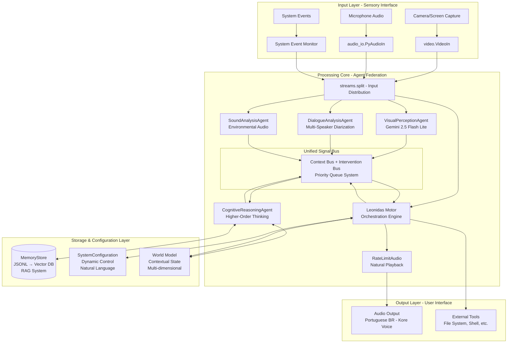

# Leonidas System - Design Overview v1.4

## System Vision

O sistema Leonidas implementa uma **interface de IA multimodal (voz e visão)** que atua como um **colaborador de desenvolvimento de software** baseado em uma arquitetura de **Federação de Agentes Especialistas Multicamadas**. O sistema funciona como um parceiro inteligente que compreende o contexto, mantém consciência do estado do mundo e age de forma intencional.

## Core Design Principles

### 1. Reatividade Pura
- **Leonidas nunca inicia a fala sem um estímulo** (fala do usuário, sinal de intervenção ou insight valioso)
- O sistema é primariamente um **ouvinte atento** que não preenche o silêncio
- Responde apenas quando necessário, solicitado ou quando tem insight valioso

### 2. Ciclo THINK-ACT Explícito
- **Todo estímulo significativo inicia um estado THINKING** para planejamento antes de qualquer ACTING
- Raciocínio explícito usando a ferramenta `think()` como "scratchpad" mental
- Decisões baseadas no contexto atual (`current_world_state`) e análise deliberativa

### 3. Único Ponto de Fala
- **Apenas o Motor de Orquestração (Leonidas) pode gerar saída de áudio**
- Agentes Especialistas nunca falam diretamente com o usuário
- Comunicação entre agentes exclusivamente via Barramento de Sinais

### 4. Desacoplamento Total
- **Agentes Especialistas se comunicam exclusivamente via Barramento de Sinais**
- Arquitetura modular permite desenvolvimento incremental e expansão
- Falha de um agente não afeta outros componentes

### 5. Consciência Contextual Abrangente
- **Mantém modelo de mundo multifacetado** (espacial, temporal, histórico, conversacional)
- Integração contínua de informações visuais, auditivas e conversacionais
- Memória persistente com aprendizado contínuo

## High-Level Architecture



## Component Interaction Flow

### 1. Input Processing Flow
```
Raw Input → Stream Split → Specialized Agents → Signal Generation → Signal Bus → Leonidas Motor
```

### 2. Signal Processing Flow
```
Signal Bus → Priority Queue → Context Update → THINK Cycle → ACT Decision → Output Generation
```

### 3. Cognitive Enhancement Flow
```
All Signals → Cognitive Agent → World Model Update → Insight Generation → Intervention Signal → Leonidas Motor
```

## Key Architectural Decisions

### 1. Gemini Live API Integration
- **Primary Model:** `gemini-live-2.5-flash-preview` for main conversation
- **Visual Detection:** `gemini-2.5-flash-lite-preview-06-17` for fast visual processing
- **Portuguese Brazilian:** Voice `Kore` for natural communication
- **Real-time Streaming:** Bidirectional audio with interruption support

### 2. Multi-Modal Processing Strategy
- **Parallel Processing:** All sensory inputs processed simultaneously
- **Event Correlation:** Cross-modal event detection and correlation
- **Context Integration:** Unified world model from all sensory sources
- **Priority Management:** Intervention signals can interrupt current processing

### 3. Memory and Learning Architecture
- **Short-term:** Rolling context windows with intelligent compression
- **Long-term:** Persistent memory store with RAG capabilities
- **Adaptive:** Importance-based memory retention and retrieval
- **Contextual:** Memory integrated with world model for decision making

### 4. Performance Optimization Strategy
- **Real-time Constraints:** TTFT < 500ms, processing latency < 100ms
- **Concurrent Processing:** Agents operate in parallel with shared signal bus
- **Intelligent Caching:** Context compression and memory optimization
- **Graceful Degradation:** System continues operating with component failures

## System Behavior Patterns

### 1. Normal Operation Cycle
1. **Passive Listening:** System monitors all inputs without speaking
2. **Event Detection:** Agents detect and classify events from their domains
3. **Signal Emission:** Relevant events generate context or intervention signals
4. **Cognitive Processing:** Higher-order analysis and world model updates
5. **Decision Making:** Leonidas evaluates signals and current context
6. **Action Execution:** THINK-ACT cycle produces appropriate response

### 2. Interruption Handling Pattern
1. **Priority Assessment:** Incoming intervention signal priority evaluation
2. **Context Preservation:** Current state and action context saved
3. **Smooth Transition:** Natural transition phrases for interruption
4. **Priority Processing:** High-priority signal processed immediately
5. **Context Restoration:** Previous context restored if appropriate

### 3. Learning and Adaptation Pattern
1. **Experience Capture:** All interactions and outcomes recorded
2. **Pattern Recognition:** Cognitive agent identifies improvement opportunities
3. **Behavior Adjustment:** System configuration updated based on learning
4. **Performance Monitoring:** Continuous evaluation of system effectiveness

## Quality Attributes

### 1. Performance
- **Latency:** Real-time response with minimal delay
- **Throughput:** Handle multiple concurrent inputs efficiently
- **Scalability:** Architecture supports additional agents and capabilities

### 2. Reliability
- **Fault Tolerance:** Individual agent failures don't crash system
- **Error Recovery:** Graceful handling of API failures and network issues
- **Data Integrity:** Consistent state management across components

### 3. Usability
- **Natural Interaction:** Conversational interface with smooth interruptions
- **Contextual Awareness:** Understands user environment and task context
- **Adaptive Behavior:** Learns and adapts to user preferences over time

### 4. Maintainability
- **Modular Design:** Clear separation of concerns and responsibilities
- **Extensibility:** Easy addition of new agents and capabilities
- **Observability:** Comprehensive logging and monitoring capabilities

## Integration Points

### 1. External System Integration
- **File System:** Read/write files, directory navigation
- **Shell Commands:** Execute system commands with security restrictions
- **Development Tools:** Integration with IDEs, version control, build systems
- **Web Services:** API calls and web content retrieval

### 2. Configuration Management
- **Runtime Configuration:** Dynamic behavior modification via natural language
- **User Preferences:** Persistent user-specific settings and adaptations
- **Environment Adaptation:** Automatic adjustment to different contexts

### 3. Monitoring and Observability
- **Performance Metrics:** Real-time system performance monitoring
- **Error Tracking:** Comprehensive error logging and analysis
- **Usage Analytics:** Understanding of user interaction patterns

## Security and Privacy Considerations

### 1. Data Protection
- **Local Processing:** Minimize data sent to external services
- **Encryption:** Secure storage of sensitive information
- **Access Control:** Appropriate permissions for file and system access

### 2. System Security
- **Input Validation:** Sanitization of all external inputs
- **Command Restrictions:** Limited and validated shell command execution
- **API Security:** Secure handling of API keys and authentication

## Future Evolution Path

### 1. Near-term Enhancements
- **Additional Agents:** Code analysis, document processing, web browsing
- **Enhanced Memory:** Vector database integration for semantic search
- **Multi-user Support:** User identification and personalized experiences

### 2. Long-term Vision
- **Distributed Architecture:** Multi-machine deployment and scaling
- **Advanced Learning:** Reinforcement learning and continuous improvement
- **Ecosystem Integration:** Plugin architecture for third-party extensions

This design overview provides the foundation for all detailed component specifications and implementation guidelines found in the accompanying design documents.