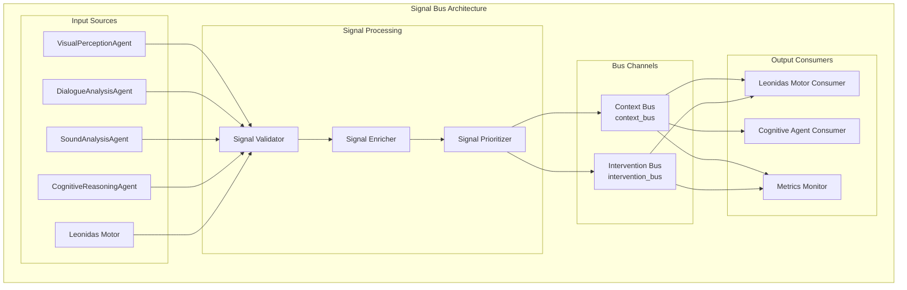

# Leonidas System - Signal Bus Architecture v1.4

## Overview

O **Barramento de Sinais Unificado** é o sistema nervoso central do Leonidas, responsável por toda comunicação entre agentes especialistas. Implementa um padrão de comunicação desacoplado que garante modularidade, escalabilidade e robustez do sistema.

## Core Architecture

### Signal Bus Components



## Signal Format Specification

### Base Signal Structure

```python
# Universal Signal Format
{
    "source": "AgentName",           # Required: Agent that generated the signal
    "type": "SignalType",            # Required: Type of signal (see type catalogs)
    "timestamp": "ISO8601",          # Auto-generated: UTC timestamp
    "priority": "Priority",          # Required for intervention_bus only
    "data": {                        # Required: Signal-specific payload
        # Signal-specific content
    },
    "metadata": {                    # Optional: Additional metadata
        "correlation_id": "uuid",    # For tracking related signals
        "sequence_number": 123,      # For ordering within agent
        "processing_time_ms": 45.2   # For performance monitoring
    }
}
```

### Signal Type Catalogs

#### Context Bus Signals (`substream_name='context_bus'`)
```python
CONTEXT_SIGNAL_TYPES = {
    # Visual Context Signals
    "visual_state": {
        "description": "Current visual environment state",
        "frequency": "periodic (1-2 seconds)",
        "priority": None,
        "example_data": {
            "activity": "user_typing_code",
            "window_focus": "VSCode",
            "objects_on_screen": ["terminal", "code_editor"],
            "user_attention": "focused"
        }
    },
    
    # Dialogue Context Signals  
    "user_transcription": {
        "description": "User speech transcription with metadata",
        "frequency": "event-driven",
        "priority": None,
        "example_data": {
            "speaker_id": "USER_1",
            "transcription": "Como posso otimizar este código?",
            "confidence": 0.95,
            "target": "LEONIDAS",
            "intent": "QUERY"
        }
    },
    
    "agent_utterance": {
        "description": "Leonidas own speech transcription",
        "frequency": "event-driven", 
        "priority": None,
        "example_data": {
            "utterance": "Vou analisar o código para sugerir otimizações",
            "duration_ms": 2500,
            "confidence": 1.0
        }
    },
    
    # Environmental Context Signals
    "ambient_sound": {
        "description": "Environmental audio classification",
        "frequency": "periodic or event-driven",
        "priority": None,
        "example_data": {
            "sound_event": "keyboard_typing",
            "confidence": 0.9,
            "duration_ms": 500,
            "intensity": "moderate"
        }
    },
    
    # Cognitive Context Signals
    "world_model_summary": {
        "description": "Updated world state summary",
        "frequency": "periodic (5-10 seconds)",
        "priority": None,
        "example_data": {
            "current_task": "code optimization analysis",
            "user_sentiment": "focused",
            "session_duration_minutes": 15,
            "context_summary": "User working on Python performance optimization"
        }
    },
    
    "memory_update": {
        "description": "Information to be persisted in memory",
        "frequency": "event-driven",
        "priority": None,
        "example_data": {
            "memory_type": "user_preference",
            "content": "User prefers detailed code explanations",
            "importance": "high",
            "tags": ["preference", "communication_style"]
        }
    },
    
    # Tool Context Signals
    "tool_output": {
        "description": "Result from external tool execution",
        "frequency": "event-driven",
        "priority": None,
        "example_data": {
            "tool_name": "read_file",
            "result": "File content successfully read",
            "execution_time_ms": 125,
            "success": True
        }
    }
}
```

#### Intervention Bus Signals (`substream_name='intervention_bus'`)
```python
INTERVENTION_SIGNAL_TYPES = {
    # User Interaction Interventions
    "user_query_detected": {
        "description": "Direct question or command to Leonidas",
        "priority_range": ["medium", "high"],
        "interrupt_threshold": "medium",
        "example_data": {
            "speaker_id": "USER_1", 
            "query": "Leonidas, explique este erro",
            "urgency": "high",
            "context_required": True
        }
    },
    
    # Visual Interventions
    "gesture_detected": {
        "description": "Explicit user gesture requiring attention",
        "priority_range": ["high"],
        "interrupt_threshold": "high",
        "example_data": {
            "gesture": "hand_five",
            "description": "User made stop gesture",
            "confidence": 0.95,
            "location": "center_screen"
        }
    },
    
    "critical_event_visual": {
        "description": "Critical visual events (errors, alerts)",
        "priority_range": ["critical"],
        "interrupt_threshold": "critical",
        "example_data": {
            "event": "system_error_popup",
            "text_snippet": "Erro fatal: Memória insuficiente",
            "severity": "critical",
            "requires_immediate_attention": True
        }
    },
    
    "new_presence": {
        "description": "New person detected in environment",
        "priority_range": ["medium"],
        "interrupt_threshold": "medium",
        "example_data": {
            "description": "Nova pessoa entrou no campo de visão",
            "person_count": 2,
            "confidence": 0.88
        }
    },
    
    # Environmental Interventions
    "ambient_critical_sound": {
        "description": "Critical environmental sounds",
        "priority_range": ["high", "critical"],
        "interrupt_threshold": "high",
        "example_data": {
            "sound_event": "fire_alarm",
            "confidence": 0.99,
            "duration_ms": 3000,
            "severity": "critical"
        }
    },
    
    # Cognitive Interventions
    "cognitive_insight": {
        "description": "Valuable insight from cognitive analysis",
        "priority_range": ["medium", "high"],
        "interrupt_threshold": "medium",
        "example_data": {
            "insight_type": "optimization_opportunity",
            "description": "Detected inefficient algorithm pattern",
            "confidence": 0.85,
            "suggested_action": "suggest_optimization"
        }
    },
    
    "cognitive_correction": {
        "description": "Error correction from cognitive analysis",
        "priority_range": ["high"],
        "interrupt_threshold": "high", 
        "example_data": {
            "error_type": "factual_error",
            "description": "Leonidas provided incorrect information",
            "correction": "Correct information is...",
            "confidence": 0.92
        }
    }
}
```

### Priority System

```python
PRIORITY_LEVELS = {
    "low": {
        "numeric_value": 1,
        "interrupt_threshold": False,
        "queue_timeout_ms": 30000,  # 30 seconds
        "description": "Background information, process when convenient"
    },
    "medium": {
        "numeric_value": 2, 
        "interrupt_threshold": True,
        "queue_timeout_ms": 10000,  # 10 seconds
        "description": "Important information requiring timely processing"
    },
    "high": {
        "numeric_value": 3,
        "interrupt_threshold": True,
        "queue_timeout_ms": 2000,   # 2 seconds
        "description": "Urgent information requiring immediate attention"
    },
    "critical": {
        "numeric_value": 4,
        "interrupt_threshold": True,
        "queue_timeout_ms": 500,    # 500ms
        "description": "Emergency information requiring instant response"
    }
}
```

## Implementation Architecture

### Signal Bus Core Implementation

```python
class UnifiedSignalBus:
    """Core signal bus implementation with priority handling and monitoring."""
    
    def __init__(self, config: SignalBusConfig):
        # Queue Configuration
        self.context_queue = asyncio.Queue(maxsize=config.context_queue_size)
        self.intervention_queue = asyncio.PriorityQueue(maxsize=config.intervention_queue_size)
        
        # Signal Processing Components
        self.validator = SignalValidator()
        self.enricher = SignalEnricher()
        self.prioritizer = SignalPrioritizer()
        
        # Monitoring and Metrics
        self.metrics = SignalBusMetrics()
        self.performance_monitor = PerformanceMonitor()
        
        # Subscriber Management
        self.context_subscribers = []
        self.intervention_subscribers = []
        
        # Error Handling
        self.error_handler = SignalErrorHandler()
        self.dead_letter_queue = asyncio.Queue(maxsize=1000)
    
    async def emit_signal(self, raw_signal: dict, substream: str) -> bool:
        """Emit signal to appropriate bus with full processing pipeline."""
        processing_start = time.time()
        
        try:
            # Step 1: Validate signal format
            validation_result = await self.validator.validate(raw_signal)
            if not validation_result.is_valid:
                await self._handle_invalid_signal(raw_signal, validation_result.errors)
                return False
            
            # Step 2: Enrich signal with metadata
            enriched_signal = await self.enricher.enrich(raw_signal)
            
            # Step 3: Route to appropriate bus
            if substream == "context_bus":
                await self._emit_to_context_bus(enriched_signal)
            elif substream == "intervention_bus":
                await self._emit_to_intervention_bus(enriched_signal)
            else:
                raise ValueError(f"Unknown substream: {substream}")
            
            # Step 4: Update metrics
            processing_time = time.time() - processing_start
            await self.metrics.record_signal_processed(
                substream, enriched_signal["type"], processing_time
            )
            
            return True
            
        except Exception as e:
            await self.error_handler.handle_emission_error(raw_signal, e)
            return False
    
    async def _emit_to_context_bus(self, signal: dict):
        """Emit signal to context bus with overflow handling."""
        try:
            await asyncio.wait_for(
                self.context_queue.put(signal),
                timeout=1.0  # 1 second timeout
            )
        except asyncio.TimeoutError:
            # Handle queue overflow
            await self._handle_context_queue_overflow(signal)
    
    async def _emit_to_intervention_bus(self, signal: dict):
        """Emit signal to intervention bus with priority handling."""
        priority = signal.get("priority", "medium")
        priority_value = PRIORITY_LEVELS[priority]["numeric_value"]
        
        # Invert priority for queue (lower number = higher priority)
        queue_priority = 5 - priority_value
        
        try:
            await asyncio.wait_for(
                self.intervention_queue.put((queue_priority, signal)),
                timeout=0.5  # 500ms timeout for interventions
            )
        except asyncio.TimeoutError:
            # Handle intervention queue overflow (critical)
            await self._handle_intervention_queue_overflow(signal)
    
    async def subscribe_to_context(self, callback: Callable, filter_types: list = None):
        """Subscribe to context bus with optional type filtering."""
        subscriber = ContextSubscriber(callback, filter_types)
        self.context_subscribers.append(subscriber)
        
        # Start processing task for this subscriber
        task = asyncio.create_task(self._process_context_for_subscriber(subscriber))
        subscriber.processing_task = task
    
    async def subscribe_to_interventions(self, callback: Callable, priority_threshold: str = "low"):
        """Subscribe to intervention bus with priority threshold."""
        subscriber = InterventionSubscriber(callback, priority_threshold)
        self.intervention_subscribers.append(subscriber)
        
        # Start processing task for this subscriber
        task = asyncio.create_task(self._process_interventions_for_subscriber(subscriber))
        subscriber.processing_task = task
```

### Signal Validation System

```python
class SignalValidator:
    """Comprehensive signal validation with detailed error reporting."""
    
    def __init__(self):
        self.required_fields = ["source", "type", "data"]
        self.valid_sources = [
            "VisualPerception", "DialogueAnalysis", "SoundAnalysis", 
            "CognitiveReasoning", "Leonidas"
        ]
        self.context_signal_types = set(CONTEXT_SIGNAL_TYPES.keys())
        self.intervention_signal_types = set(INTERVENTION_SIGNAL_TYPES.keys())
    
    async def validate(self, signal: dict) -> ValidationResult:
        """Comprehensive signal validation."""
        errors = []
        warnings = []
        
        # Check required fields
        for field in self.required_fields:
            if field not in signal:
                errors.append(f"Missing required field: {field}")
        
        # Validate source
        if "source" in signal:
            if signal["source"] not in self.valid_sources:
                warnings.append(f"Unknown source: {signal['source']}")
        
        # Validate signal type
        if "type" in signal:
            signal_type = signal["type"]
            if (signal_type not in self.context_signal_types and 
                signal_type not in self.intervention_signal_types):
                errors.append(f"Unknown signal type: {signal_type}")
        
        # Validate priority for intervention signals
        if "type" in signal and signal["type"] in self.intervention_signal_types:
            if "priority" not in signal:
                errors.append("Intervention signals must have priority field")
            elif signal["priority"] not in PRIORITY_LEVELS:
                errors.append(f"Invalid priority: {signal['priority']}")
        
        # Validate data field structure
        if "data" in signal:
            if not isinstance(signal["data"], dict):
                errors.append("Data field must be a dictionary")
        
        return ValidationResult(
            is_valid=len(errors) == 0,
            errors=errors,
            warnings=warnings
        )
```

### Signal Enrichment System

```python
class SignalEnricher:
    """Enrich signals with additional metadata and context."""
    
    def __init__(self):
        self.sequence_counters = {}  # Per-agent sequence counters
        self.correlation_tracker = CorrelationTracker()
    
    async def enrich(self, signal: dict) -> dict:
        """Enrich signal with metadata."""
        enriched = signal.copy()
        
        # Add timestamp if not present
        if "timestamp" not in enriched:
            enriched["timestamp"] = datetime.utcnow().isoformat()
        
        # Add sequence number
        source = enriched.get("source", "unknown")
        if source not in self.sequence_counters:
            self.sequence_counters[source] = 0
        self.sequence_counters[source] += 1
        
        # Initialize metadata if not present
        if "metadata" not in enriched:
            enriched["metadata"] = {}
        
        enriched["metadata"]["sequence_number"] = self.sequence_counters[source]
        enriched["metadata"]["enrichment_timestamp"] = time.time()
        
        # Add correlation ID if part of a related signal chain
        correlation_id = await self.correlation_tracker.get_correlation_id(enriched)
        if correlation_id:
            enriched["metadata"]["correlation_id"] = correlation_id
        
        return enriched
```

## Performance Optimization

### Queue Management Strategy

```python
class QueueOptimizer:
    """Optimize queue performance based on usage patterns."""
    
    def __init__(self):
        self.queue_metrics = QueueMetrics()
        self.optimization_rules = OptimizationRules()
    
    async def optimize_queue_sizes(self, bus: UnifiedSignalBus):
        """Dynamically adjust queue sizes based on usage patterns."""
        context_metrics = await self.queue_metrics.get_context_queue_metrics()
        intervention_metrics = await self.queue_metrics.get_intervention_queue_metrics()
        
        # Adjust context queue size
        if context_metrics.average_utilization > 0.8:
            new_size = min(context_metrics.current_size * 1.5, 10000)
            await bus.resize_context_queue(new_size)
        
        # Adjust intervention queue size  
        if intervention_metrics.average_utilization > 0.9:
            new_size = min(intervention_metrics.current_size * 1.2, 1000)
            await bus.resize_intervention_queue(new_size)
```

### Signal Compression and Batching

```python
class SignalOptimizer:
    """Optimize signal processing through compression and batching."""
    
    def __init__(self):
        self.compression_rules = CompressionRules()
        self.batching_rules = BatchingRules()
    
    async def compress_similar_signals(self, signals: list) -> list:
        """Compress similar signals to reduce processing overhead."""
        compressed = []
        signal_groups = self._group_similar_signals(signals)
        
        for group in signal_groups:
            if len(group) > 1 and self._can_compress(group):
                compressed_signal = await self._compress_signal_group(group)
                compressed.append(compressed_signal)
            else:
                compressed.extend(group)
        
        return compressed
    
    def _group_similar_signals(self, signals: list) -> list:
        """Group signals that can be compressed together."""
        groups = []
        current_group = []
        
        for signal in signals:
            if self._can_group_with_current(signal, current_group):
                current_group.append(signal)
            else:
                if current_group:
                    groups.append(current_group)
                current_group = [signal]
        
        if current_group:
            groups.append(current_group)
        
        return groups
```

## Monitoring and Observability

### Signal Bus Metrics

```python
class SignalBusMetrics:
    """Comprehensive metrics collection for signal bus performance."""
    
    def __init__(self):
        self.signal_counts = collections.defaultdict(int)
        self.processing_times = collections.defaultdict(list)
        self.queue_sizes = collections.defaultdict(list)
        self.error_counts = collections.defaultdict(int)
        
    async def record_signal_processed(self, substream: str, signal_type: str, processing_time: float):
        """Record signal processing metrics."""
        self.signal_counts[f"{substream}:{signal_type}"] += 1
        self.processing_times[signal_type].append(processing_time)
        
    async def get_performance_report(self) -> dict:
        """Generate comprehensive performance report."""
        return {
            "signal_throughput": self._calculate_throughput(),
            "average_processing_times": self._calculate_average_times(),
            "queue_utilization": self._calculate_queue_utilization(),
            "error_rates": self._calculate_error_rates(),
            "recommendations": self._generate_recommendations()
        }
```

## Error Handling and Recovery

### Signal Error Recovery

```python
class SignalErrorHandler:
    """Handle signal processing errors with recovery strategies."""
    
    def __init__(self):
        self.retry_strategies = RetryStrategies()
        self.dead_letter_processor = DeadLetterProcessor()
        
    async def handle_emission_error(self, signal: dict, error: Exception):
        """Handle signal emission errors with appropriate recovery."""
        error_type = type(error).__name__
        
        if error_type in ["ValidationError", "FormatError"]:
            # Log and discard malformed signals
            await self._log_malformed_signal(signal, error)
        elif error_type in ["QueueFullError", "TimeoutError"]:
            # Retry with backoff or send to dead letter queue
            await self._handle_queue_overflow(signal, error)
        else:
            # Unknown error - log and attempt recovery
            await self._handle_unknown_error(signal, error)
```

This signal bus architecture provides the robust, scalable communication backbone that enables the Leonidas system's modular agent federation to operate effectively while maintaining high performance and reliability.