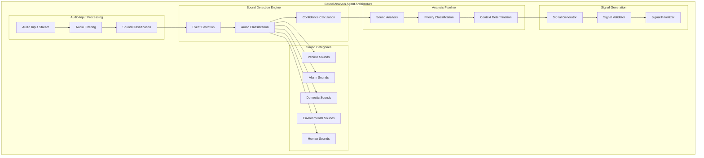

# Leonidas System - Sound Analysis Agent Specification v1.4

## Overview

O **Sound Analysis Agent** é responsável por analisar sons ambientais em tempo real, detectando e classificando eventos sonoros críticos e não-críticos no ambiente. Opera paralelamente ao sistema de análise de diálogo, fornecendo consciência situacional completa para o Leonidas.

## Architecture Overview

### Core Components



## Technical Specifications

### Audio Processing Pipeline
- **Input Format**: PCM 16-bit, 16kHz mono audio stream (shared with dialogue analysis)
- **Processing Window**: 1-second sliding windows with 50% overlap
- **Frequency Analysis**: FFT-based spectral analysis up to 8kHz
- **Real-time Processing**: Target <100ms latency for critical sound detection

### Sound Classification System

```python
@dataclass
class SoundEvent:
    event_type: str
    confidence: float
    start_time: float
    duration: float
    frequency_profile: Dict[str, float]
    intensity_db: float
    location_estimate: Optional[Tuple[float, float]]
    priority: str  # critical, high, medium, low

class SoundClassifier:
    """Advanced sound classification with multiple detection models."""
    
    SOUND_CATEGORIES = {
        # Vehicle Sounds
        'CAR_ENGINE': {'priority': 'medium', 'description': 'Car engine running'},
        'CAR_HORN': {'priority': 'high', 'description': 'Car horn honking'},
        'MOTORCYCLE': {'priority': 'medium', 'description': 'Motorcycle engine'},
        'TRUCK_ENGINE': {'priority': 'medium', 'description': 'Heavy truck engine'},
        'EMERGENCY_SIREN': {'priority': 'critical', 'description': 'Emergency vehicle siren'},
        
        # Alarm Sounds
        'FIRE_ALARM': {'priority': 'critical', 'description': 'Fire alarm'},
        'SECURITY_ALARM': {'priority': 'critical', 'description': 'Security/burglar alarm'},
        'SMOKE_DETECTOR': {'priority': 'critical', 'description': 'Smoke detector beeping'},
        'PHONE_RING': {'priority': 'high', 'description': 'Phone ringing'},
        'DOORBELL': {'priority': 'high', 'description': 'Doorbell'},
        
        # Domestic Sounds
        'DOOR_SLAM': {'priority': 'medium', 'description': 'Door slamming'},
        'FOOTSTEPS': {'priority': 'low', 'description': 'Footsteps'},
        'APPLIANCE_BEEP': {'priority': 'low', 'description': 'Appliance notification'},
        'WATER_RUNNING': {'priority': 'low', 'description': 'Water running'},
        'VACUUM_CLEANER': {'priority': 'low', 'description': 'Vacuum cleaner'},
        
        # Environmental Sounds
        'THUNDER': {'priority': 'high', 'description': 'Thunder'},
        'HEAVY_RAIN': {'priority': 'medium', 'description': 'Heavy rain'},
        'WIND_STRONG': {'priority': 'medium', 'description': 'Strong wind'},
        'CONSTRUCTION': {'priority': 'medium', 'description': 'Construction noise'},
        
        # Human Sounds (non-speech)
        'BABY_CRYING': {'priority': 'high', 'description': 'Baby crying'},
        'COUGHING': {'priority': 'medium', 'description': 'Coughing'},
        'LAUGHTER': {'priority': 'low', 'description': 'Laughter'},
        'CLAPPING': {'priority': 'low', 'description': 'Clapping'}
    }
    
    def __init__(self):
        self.frequency_analyzers = {
            'low_freq': FrequencyAnalyzer(0, 500),      # 0-500Hz
            'mid_freq': FrequencyAnalyzer(500, 2000),   # 500Hz-2kHz
            'high_freq': FrequencyAnalyzer(2000, 8000)  # 2-8kHz
        }
        self.pattern_matchers = self._initialize_pattern_matchers()
        self.ml_classifier = MLSoundClassifier()
        
    async def classify_sound(self, audio_data: bytes) -> List[SoundEvent]:
        """Classify sounds in audio data."""
        
        # Extract audio features
        features = await self._extract_audio_features(audio_data)
        
        # Multiple classification approaches
        pattern_results = await self._pattern_based_classification(features)
        ml_results = await self._ml_based_classification(features)
        frequency_results = await self._frequency_based_classification(features)
        
        # Combine and validate results
        combined_results = await self._combine_classification_results(
            pattern_results, ml_results, frequency_results
        )
        
        return combined_results
    
    async def _extract_audio_features(self, audio_data: bytes) -> Dict:
        """Extract comprehensive audio features."""
        
        # Convert to numpy array
        audio_array = np.frombuffer(audio_data, dtype=np.int16)
        audio_float = audio_array.astype(np.float32) / 32768.0
        
        features = {
            'duration': len(audio_float) / 16000,  # 16kHz sample rate
            'rms_energy': np.sqrt(np.mean(audio_float ** 2)),
            'zero_crossing_rate': self._calculate_zcr(audio_float),
            'spectral_centroid': self._calculate_spectral_centroid(audio_float),
            'spectral_rolloff': self._calculate_spectral_rolloff(audio_float),
            'mfcc': self._calculate_mfcc(audio_float),
            'frequency_bands': await self._analyze_frequency_bands(audio_float),
            'temporal_patterns': self._analyze_temporal_patterns(audio_float)
        }
        
        return features
```

## Signal Bus Integration

### Signal Types Generated

#### 1. Ambient Sound Detected Signal
```json
{
    "signal_type": "ambient_sound_detected",
    "timestamp": "2024-01-15T10:30:45.123Z",
    "priority": "medium",
    "source": "sound_analysis_agent",
    "data": {
        "sound_type": "CAR_ENGINE",
        "confidence": 0.87,
        "duration": 3.2,
        "intensity_db": 65.5,
        "frequency_profile": {
            "dominant_frequency": 120,
            "frequency_range": "80-200Hz",
            "harmonic_content": 0.75
        },
        "location_estimate": {
            "direction": "northwest",
            "distance_estimate": "close"
        },
        "context": {
            "environment_type": "urban",
            "time_of_day": "morning",
            "weather_conditions": "clear"
        }
    }
}
```

#### 2. Critical Sound Alert Signal
```json
{
    "signal_type": "ambient_critical_sound",
    "timestamp": "2024-01-15T10:30:45.123Z",
    "priority": "critical",
    "source": "sound_analysis_agent",
    "data": {
        "sound_type": "FIRE_ALARM",
        "confidence": 0.95,
        "duration": 1.8,
        "intensity_db": 85.2,
        "urgency_level": "immediate_attention",
        "recommended_action": "investigate_immediately",
        "safety_implications": "potential_fire_hazard",
        "location_estimate": {
            "direction": "inside_building",
            "confidence": 0.9
        }
    }
}
```

#### 3. Environmental Context Signal
```json
{
    "signal_type": "environmental_context_update",
    "timestamp": "2024-01-15T10:30:45.123Z",
    "priority": "low",
    "source": "sound_analysis_agent",
    "data": {
        "ambient_noise_level": 45.2,
        "dominant_sounds": ["TRAFFIC", "BIRDS", "WIND"],
        "acoustic_environment": "urban_residential",
        "noise_pollution_level": "moderate",
        "sound_masking_effects": {
            "speech_intelligibility": 0.85,
            "recommended_volume_adjustment": 1.2
        }
    }
}
```

## Implementation Architecture

### Core Classes

```python
class SoundAnalysisAgent(SpecializedAgent):
    """Advanced sound analysis agent with environmental awareness."""
    
    def __init__(self, config: SoundAnalysisConfig):
        super().__init__("sound_analysis_agent")
        self.config = config
        self.sound_classifier = SoundClassifier()
        self.environmental_analyzer = EnvironmentalSoundAnalyzer()
        self.critical_sound_detector = CriticalSoundDetector()
        self.audio_buffer = CircularAudioBuffer(size=config.buffer_size)
        
        # Performance optimization
        self.processing_queue = asyncio.Queue(maxsize=100)
        self.result_cache = SoundAnalysisCache(max_size=500)
        
        # State management
        self.current_environment = EnvironmentalContext()
        self.sound_history = SoundEventHistory(max_events=1000)
        
    async def process_audio_stream(self, audio_stream: AsyncIterable[bytes]) -> AsyncIterable[Signal]:
        """Main processing pipeline for ambient sound analysis."""
        
        async for audio_chunk in audio_stream:
            # Add to circular buffer for context
            self.audio_buffer.add_chunk(audio_chunk)
            
            # Process chunk for sound events
            sound_events = await self._analyze_audio_chunk(audio_chunk)
            
            # Generate signals for detected events
            for event in sound_events:
                signal = await self._create_sound_signal(event)
                if signal:
                    yield signal
            
            # Update environmental context
            await self._update_environmental_context(sound_events)
    
    async def _analyze_audio_chunk(self, audio_chunk: bytes) -> List[SoundEvent]:
        """Analyze audio chunk for sound events."""
        
        # Check cache first
        chunk_hash = hashlib.md5(audio_chunk).hexdigest()
        cached_result = await self.result_cache.get(chunk_hash)
        if cached_result:
            return cached_result
        
        # Parallel processing for different analysis types
        tasks = [
            self.sound_classifier.classify_sound(audio_chunk),
            self.critical_sound_detector.detect_critical_sounds(audio_chunk),
            self.environmental_analyzer.analyze_environment(audio_chunk)
        ]
        
        results = await asyncio.gather(*tasks, return_exceptions=True)
        
        # Combine results
        all_events = []
        for result in results:
            if isinstance(result, list):
                all_events.extend(result)
            elif isinstance(result, Exception):
                logging.error(f"Sound analysis error: {result}")
        
        # Filter and validate events
        validated_events = await self._validate_sound_events(all_events)
        
        # Cache result
        await self.result_cache.put(chunk_hash, validated_events)
        
        return validated_events
    
    async def _validate_sound_events(self, events: List[SoundEvent]) -> List[SoundEvent]:
        """Validate and filter sound events."""
        
        validated_events = []
        
        for event in events:
            # Confidence threshold filtering
            if event.confidence < self.config.min_confidence:
                continue
            
            # Duration filtering
            if event.duration < self.config.min_event_duration:
                continue
            
            # Duplicate detection
            if not await self._is_duplicate_event(event):
                validated_events.append(event)
        
        return validated_events
    
    async def _is_duplicate_event(self, event: SoundEvent) -> bool:
        """Check if event is a duplicate of recent events."""
        
        recent_events = self.sound_history.get_recent_events(time_window=5.0)
        
        for recent_event in recent_events:
            if (recent_event.event_type == event.event_type and
                abs(recent_event.start_time - event.start_time) < 2.0 and
                abs(recent_event.confidence - event.confidence) < 0.1):
                return True
        
        return False
```

### Critical Sound Detection System

```python
class CriticalSoundDetector:
    """Specialized detector for critical/emergency sounds."""
    
    CRITICAL_PATTERNS = {
        'FIRE_ALARM': {
            'frequency_pattern': [3000, 3500],  # Hz
            'pulse_pattern': [0.5, 0.5],        # seconds on/off
            'min_duration': 2.0,
            'intensity_threshold': 80           # dB
        },
        'EMERGENCY_SIREN': {
            'frequency_sweep': [400, 1200],     # Hz range
            'sweep_duration': 2.0,              # seconds
            'repetition_pattern': True,
            'intensity_threshold': 85
        },
        'SMOKE_DETECTOR': {
            'frequency_pattern': [3000, 3200],
            'pulse_pattern': [0.1, 0.9],        # short beep, long pause
            'repetition_interval': 10.0,
            'intensity_threshold': 75
        }
    }
    
    def __init__(self):
        self.pattern_analyzers = {}
        for sound_type, pattern in self.CRITICAL_PATTERNS.items():
            self.pattern_analyzers[sound_type] = CriticalPatternAnalyzer(pattern)
    
    async def detect_critical_sounds(self, audio_data: bytes) -> List[SoundEvent]:
        """Detect critical sounds requiring immediate attention."""
        
        critical_events = []
        
        # Analyze for each critical pattern
        for sound_type, analyzer in self.pattern_analyzers.items():
            detection_result = await analyzer.analyze(audio_data)
            
            if detection_result['detected']:
                event = SoundEvent(
                    event_type=sound_type,
                    confidence=detection_result['confidence'],
                    start_time=detection_result['start_time'],
                    duration=detection_result['duration'],
                    frequency_profile=detection_result['frequency_profile'],
                    intensity_db=detection_result['intensity_db'],
                    priority='critical'
                )
                critical_events.append(event)
        
        return critical_events
```

### Environmental Sound Analysis

```python
class EnvironmentalSoundAnalyzer:
    """Analyze overall acoustic environment and context."""
    
    def __init__(self):
        self.noise_level_analyzer = NoiseLevelAnalyzer()
        self.acoustic_scene_classifier = AcousticSceneClassifier()
        self.sound_masking_analyzer = SoundMaskingAnalyzer()
    
    async def analyze_environment(self, audio_data: bytes) -> List[SoundEvent]:
        """Analyze environmental acoustic context."""
        
        # Calculate overall noise level
        noise_level = await self.noise_level_analyzer.calculate_noise_level(audio_data)
        
        # Classify acoustic scene
        scene_classification = await self.acoustic_scene_classifier.classify_scene(audio_data)
        
        # Analyze sound masking effects
        masking_analysis = await self.sound_masking_analyzer.analyze_masking(audio_data)
        
        # Create environmental context event
        env_event = SoundEvent(
            event_type='ENVIRONMENTAL_CONTEXT',
            confidence=0.9,
            start_time=time.time(),
            duration=1.0,
            frequency_profile={},
            intensity_db=noise_level,
            priority='low'
        )
        
        return [env_event]
```

## Configuration

```python
@dataclass
class SoundAnalysisConfig:
    # Audio Processing
    sample_rate: int = 16000
    chunk_size: int = 1024
    buffer_size: int = 10  # seconds
    
    # Detection Thresholds
    min_confidence: float = 0.7
    min_event_duration: float = 0.1  # seconds
    critical_sound_threshold: float = 0.85
    
    # Environmental Analysis
    noise_level_update_interval: float = 5.0  # seconds
    environmental_context_window: float = 30.0  # seconds
    
    # Performance
    max_processing_latency: float = 0.1  # seconds
    cache_size: int = 500
    max_concurrent_analysis: int = 3
    
    # Signal Generation
    signal_debounce_time: float = 1.0  # seconds
    critical_signal_priority: str = "critical"
    ambient_signal_priority: str = "medium"
```

## Performance Requirements

### Latency Targets
- **Sound Detection**: <100ms
- **Critical Sound Alert**: <50ms
- **Environmental Analysis**: <200ms
- **Signal Generation**: <25ms
- **Total Pipeline Latency**: <300ms

### Accuracy Targets
- **Critical Sound Detection**: >95% accuracy, <1% false positive
- **Vehicle Sound Classification**: >85% accuracy
- **Environmental Sound Classification**: >80% accuracy
- **Noise Level Estimation**: ±3dB accuracy

### Resource Requirements
- **Memory Usage**: <50MB per session
- **CPU Usage**: <15% of single core
- **Concurrent Processing**: Up to 3 parallel analysis streams
- **Cache Efficiency**: >80% hit rate for repeated patterns

## Integration Points

### Signal Bus Integration
```python
class SoundAnalysisSignalBusIntegration:
    def __init__(self, signal_bus: UnifiedSignalBus):
        self.signal_bus = signal_bus
        
    async def emit_ambient_sound_signal(self, sound_event: SoundEvent):
        """Emit ambient sound detected signal"""
        
    async def emit_critical_sound_signal(self, sound_event: SoundEvent):
        """Emit critical sound alert signal"""
        
    async def emit_environmental_context_signal(self, context_data: dict):
        """Emit environmental context update signal"""
```

### World Model Integration
```python
class SoundAnalysisWorldModelIntegration:
    def __init__(self, world_model: WorldModel):
        self.world_model = world_model
        
    async def update_acoustic_environment(self, environment_data: dict):
        """Update world model with acoustic environment data"""
        
    async def get_location_context(self) -> dict:
        """Get location context for sound analysis"""
```

## Testing Strategy

### Unit Tests
- Sound classification accuracy with known audio samples
- Critical sound detection with emergency sound recordings
- Environmental analysis with various acoustic scenes
- Signal generation format validation

### Integration Tests
- End-to-end sound analysis pipeline
- Signal bus integration and priority handling
- Concurrent processing with dialogue analysis
- Real-time performance under various conditions

### Performance Tests
- Latency measurement with different sound types
- Memory usage profiling during extended operation
- CPU utilization optimization
- Accuracy testing with noise and interference

## Security and Privacy

### Audio Data Protection
- No persistent storage of audio data
- Real-time processing with immediate disposal
- Encrypted transmission of analysis results
- Configurable data retention policies

### False Alarm Prevention
- Multi-stage validation for critical sounds
- Confidence threshold tuning
- Pattern verification algorithms
- User feedback integration for accuracy improvement

## Monitoring and Observability

### Key Metrics
- Sound detection accuracy rates
- Critical sound response times
- Environmental context update frequency
- Signal emission patterns and priorities

### Health Checks
- Audio input quality validation
- Classification model performance monitoring
- Signal bus connectivity verification
- Resource usage tracking

### Alerting
- Critical sound detection failures
- High false positive rates
- Processing latency exceeding thresholds
- Resource usage anomalies