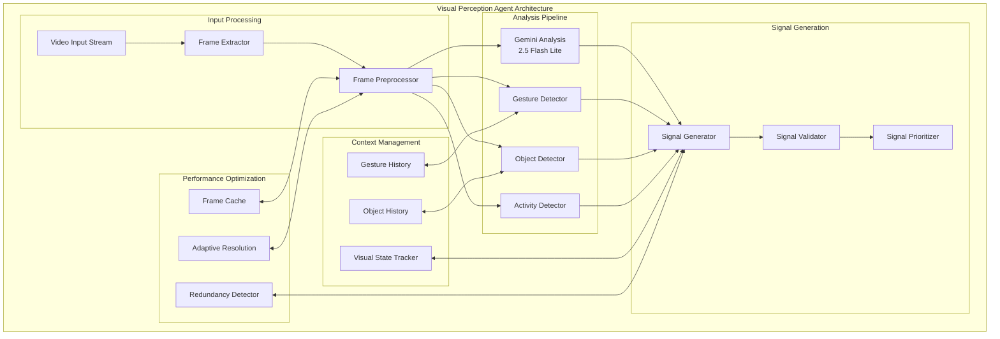

# Leonidas System - Visual Perception Agent Specification v1.4

## Overview

O **Visual Perception Agent** é o sistema de visão do Leonidas, responsável por analisar continuamente o fluxo de vídeo para extrair informações sobre o ambiente visual, ações do usuário, presença de objetos e eventos críticos. Opera com latência mínima para detecção de eventos em tempo real.

## Architecture Overview

### Core Components



## Gemini Integration

### Model Configuration

```python
class VisualPerceptionGeminiConfig:
    """Optimized Gemini configuration for visual perception."""
    
    MODEL_NAME = "gemini-2.5-flash-lite-preview-06-17"
    
    @staticmethod
    def create_config() -> genai_types.GenerateContentConfig:
        """Create optimized configuration for visual analysis."""
        return genai_types.GenerateContentConfig(
            system_instruction=VISUAL_PERCEPTION_PROMPT_V14,
            max_output_tokens=150,  # Sufficient for JSON responses
            response_mime_type='application/json',
            media_resolution=genai_types.MediaResolution.MEDIA_RESOLUTION_MEDIUM,
            temperature=0.3,  # Lower temperature for consistent JSON output
            candidate_count=1,
            stop_sequences=None
        )

# Complete Visual Perception Prompt v1.4
VISUAL_PERCEPTION_PROMPT_V14 = '''
Você é um agente especialista em percepção visual para Leonidas. Sua tarefa é analisar frames de vídeo e reportar observações como JSON em uma única linha para o Barramento de Sinais. Priorize informações relevantes para um ambiente de desenvolvimento ou interação humana.

Formato Geral: `{"source": "VisualPerception", "type": "TIPO_SINAL", "priority": "PRIORIDADE", "data": {...}}`
A `priority` é APENAS para sinais `INTERVENTION`.

TIPOS DE SINAL E SUAS REGRAS DE EMISSÃO:

1. **`type: "visual_state"` (Contexto):** Para descrever a atividade visual principal do usuário ou o estado do ambiente. Emita regularmente (ex: a cada 1-2 segundos) quando houver atividade relevante e não urgente.
   - Exemplo: `{"source": "VisualPerception", "type": "visual_state", "data": {"activity": "user_typing_code", "window_focus": "VSCode", "objects_on_screen": ["terminal", "code_editor"], "user_attention": "focused"}}`
   - Exemplo: `{"source": "VisualPerception", "type": "visual_state", "data": {"activity": "user_reading_document", "document_name": "PDR_Leonidas_v1.4.md", "scroll_position": "middle"}}`

2. **`type: "gesture_detected"` (Intervenção):** Para gestos explícitos do usuário que exigem atenção IMEDIATA. `priority: "high"`.
   - Exemplo: `{"source": "VisualPerception", "type": "gesture_detected", "priority": "high", "data": {"gesture": "hand_five", "description": "Usuário fez o sinal de mão aberta (parada ou '5').", "confidence": 0.95}}`
   - Exemplo: `{"source": "VisualPerception", "type": "gesture_detected", "priority": "high", "data": {"gesture": "pointing", "description": "Usuário apontando para tela", "target_area": "code_line_45"}}`

3. **`type: "critical_event_visual"` (Intervenção):** Para eventos visuais críticos, como pop-ups de erro do sistema, que exigem atenção. `priority: "critical"`.
   - Exemplo: `{"source": "VisualPerception", "type": "critical_event_visual", "priority": "critical", "data": {"event": "system_error_popup", "text_snippet": "Erro fatal: Memória insuficiente", "severity": "critical"}}`
   - Exemplo: `{"source": "VisualPerception", "type": "critical_event_visual", "priority": "critical", "data": {"event": "application_crash", "application": "VSCode", "error_visible": true}}`

4. **`type: "new_presence"` (Intervenção):** Para a entrada de uma nova pessoa no campo de visão. `priority: "medium"`.
   - Exemplo: `{"source": "VisualPerception", "type": "new_presence", "priority": "medium", "data": {"description": "Uma nova pessoa entrou no campo de visão da câmera.", "person_count": 2, "confidence": 0.88}}`

5. **`type: "object_change"` (Contexto):** Para mudanças significativas nos objetos detectados no ambiente.
   - Exemplo: `{"source": "VisualPerception", "type": "object_change", "data": {"change_type": "object_added", "object": "notebook", "location": "desk_left", "confidence": 0.92}}`

REGRAS IMPORTANTES:
- Responda APENAS com o objeto JSON válido. Nada mais.
- Seja preciso na classificação de prioridades - use "critical" apenas para emergências reais.
- Mantenha consistência nos nomes de objetos e atividades detectadas.
- Se não houver atividade visual significativa, não emita sinal.
'''
```

## Core Implementation

### Visual Perception Agent Class

```python
class VisualPerceptionAgent(processor.Processor):
    """Advanced visual perception agent with real-time analysis."""
    
    def __init__(self, api_key: str):
        self.api_key = api_key
        self.model = genai_model.GenaiModel(
            api_key=api_key,
            model_name=VisualPerceptionGeminiConfig.MODEL_NAME,
            config=VisualPerceptionGeminiConfig.create_config()
        )
        
        # Visual processing components
        self.frame_processor = FrameProcessor()
        self.gesture_detector = GestureDetector()
        self.object_tracker = ObjectTracker()
        self.activity_analyzer = ActivityAnalyzer()
        
        # State management
        self.visual_state = VisualStateTracker()
        self.signal_generator = VisualSignalGenerator()
        
        # Performance optimization
        self.frame_cache = FrameCache(max_size=50)
        self.adaptive_resolution = AdaptiveResolutionManager()
        self.redundancy_detector = RedundancyDetector()
        
        # Metrics and monitoring
        self.performance_metrics = VisualPerceptionMetrics()
        
    async def call(self, content: AsyncIterable[ProcessorPart]) -> AsyncIterable[ProcessorPart]:
        """Process video stream and generate visual perception signals."""
        
        async for part in content:
            if not content_api.is_image(part.mimetype):
                continue
            
            processing_start = time.time()
            
            try:
                # Process frame through analysis pipeline
                analysis_result = await self._process_frame(part)
                
                # Generate appropriate signals
                signals = await self._generate_signals(analysis_result)
                
                # Emit signals with validation
                for signal in signals:
                    validated_signal = await self._validate_and_emit_signal(signal)
                    if validated_signal:
                        yield validated_signal
                
                # Update performance metrics
                processing_time = time.time() - processing_start
                await self.performance_metrics.record_frame_processed(processing_time)
                
            except Exception as e:
                await self._handle_processing_error(part, e)
    
    async def _process_frame(self, frame_part: ProcessorPart) -> dict:
        """Process single frame through complete analysis pipeline."""
        
        # Preprocess frame
        processed_frame = await self.frame_processor.preprocess(frame_part.pil_image)
        
        # Check frame cache for similar frames
        cache_key = await self.frame_cache.get_cache_key(processed_frame)
        cached_result = await self.frame_cache.get(cache_key)
        
        if cached_result and not await self._requires_fresh_analysis(cached_result):
            return cached_result
        
        # Parallel analysis pipeline
        analysis_tasks = [
            self._gemini_analysis(processed_frame),
            self._gesture_detection(processed_frame),
            self._object_detection(processed_frame),
            self._activity_analysis(processed_frame)
        ]
        
        analysis_results = await asyncio.gather(*analysis_tasks, return_exceptions=True)
        
        # Combine analysis results
        combined_result = {
            'timestamp': time.time(),
            'gemini_analysis': analysis_results[0] if not isinstance(analysis_results[0], Exception) else None,
            'gesture_detection': analysis_results[1] if not isinstance(analysis_results[1], Exception) else None,
            'object_detection': analysis_results[2] if not isinstance(analysis_results[2], Exception) else None,
            'activity_analysis': analysis_results[3] if not isinstance(analysis_results[3], Exception) else None,
            'frame_metadata': {
                'resolution': processed_frame.size,
                'processing_time_ms': (time.time() - processing_start) * 1000
            }
        }
        
        # Cache result
        await self.frame_cache.put(cache_key, combined_result)
        
        return combined_result
    
    async def _gemini_analysis(self, frame: PIL.Image) -> dict:
        """Analyze frame using Gemini model."""
        try:
            # Convert frame to appropriate format
            frame_data = await self._prepare_frame_for_gemini(frame)
            
            # Send to Gemini for analysis
            response = await self.model.generate_content([frame_data])
            
            # Parse JSON response
            if response and response.text:
                try:
                    return json.loads(response.text)
                except json.JSONDecodeError:
                    # Handle malformed JSON
                    return await self._handle_malformed_response(response.text)
            
            return None
            
        except Exception as e:
            logging.error(f"Gemini analysis error: {e}")
            return None
    
    async def _gesture_detection(self, frame: PIL.Image) -> dict:
        """Detect gestures in frame using specialized detector."""
        return await self.gesture_detector.detect_gestures(frame)
    
    async def _object_detection(self, frame: PIL.Image) -> dict:
        """Detect and track objects in frame."""
        return await self.object_tracker.detect_objects(frame)
    
    async def _activity_analysis(self, frame: PIL.Image) -> dict:
        """Analyze user activity in frame."""
        return await self.activity_analyzer.analyze_activity(frame)
```

### Specialized Detection Components

#### Gesture Detection System

```python
class GestureDetector:
    """Specialized gesture detection for user interactions."""
    
    def __init__(self):
        self.gesture_history = collections.deque(maxlen=100)
        self.gesture_patterns = GesturePatterns()
        self.confidence_threshold = 0.7
        
    async def detect_gestures(self, frame: PIL.Image) -> dict:
        """Detect hand gestures and user interactions."""
        
        # Convert to numpy array for processing
        frame_array = np.array(frame)
        
        # Detect hand landmarks
        hand_landmarks = await self._detect_hand_landmarks(frame_array)
        
        if not hand_landmarks:
            return {'gestures_detected': []}
        
        # Classify gestures
        detected_gestures = []
        for landmarks in hand_landmarks:
            gesture = await self._classify_gesture(landmarks)
            if gesture and gesture['confidence'] > self.confidence_threshold:
                detected_gestures.append(gesture)
        
        # Filter and validate gestures
        validated_gestures = await self._validate_gestures(detected_gestures)
        
        return {
            'gestures_detected': validated_gestures,
            'hand_count': len(hand_landmarks),
            'detection_confidence': self._calculate_overall_confidence(validated_gestures)
        }
    
    async def _detect_hand_landmarks(self, frame_array: np.ndarray) -> list:
        """Detect hand landmarks using MediaPipe or similar."""
        # Implementation would use MediaPipe or similar hand detection
        # For now, placeholder implementation
        return []
    
    async def _classify_gesture(self, landmarks: dict) -> dict:
        """Classify gesture from hand landmarks."""
        # Common gestures to detect
        gesture_classifiers = {
            'hand_five': self._detect_hand_five,
            'pointing': self._detect_pointing,
            'thumbs_up': self._detect_thumbs_up,
            'stop_gesture': self._detect_stop_gesture,
            'wave': self._detect_wave
        }
        
        for gesture_name, classifier in gesture_classifiers.items():
            confidence = await classifier(landmarks)
            if confidence > self.confidence_threshold:
                return {
                    'gesture': gesture_name,
                    'confidence': confidence,
                    'landmarks': landmarks,
                    'timestamp': time.time()
                }
        
        return None
    
    async def _detect_hand_five(self, landmarks: dict) -> float:
        """Detect open hand (five fingers) gesture."""
        # Implementation would analyze finger positions
        # Placeholder returning random confidence for demo
        return 0.0
    
    async def _detect_pointing(self, landmarks: dict) -> float:
        """Detect pointing gesture."""
        # Implementation would analyze index finger extension
        return 0.0
```

#### Object Tracking System

```python
class ObjectTracker:
    """Advanced object detection and tracking system."""
    
    def __init__(self):
        self.tracked_objects = {}
        self.object_history = collections.deque(maxlen=1000)
        self.detection_confidence_threshold = 0.6
        
    async def detect_objects(self, frame: PIL.Image) -> dict:
        """Detect and track objects in frame."""
        
        # Object categories relevant to development environment
        target_categories = [
            'computer_monitor', 'laptop', 'keyboard', 'mouse',
            'coffee_cup', 'notebook', 'pen', 'phone',
            'book', 'papers', 'headphones', 'webcam'
        ]
        
        # Detect objects using YOLO or similar
        detections = await self._detect_objects_yolo(frame, target_categories)
        
        # Update object tracking
        tracked_objects = await self._update_object_tracking(detections)
        
        # Detect object changes
        object_changes = await self._detect_object_changes(tracked_objects)
        
        return {
            'detected_objects': tracked_objects,
            'object_changes': object_changes,
            'total_objects': len(tracked_objects),
            'detection_timestamp': time.time()
        }
    
    async def _detect_objects_yolo(self, frame: PIL.Image, categories: list) -> list:
        """Detect objects using YOLO or similar object detection."""
        # Implementation would use actual object detection model
        # Placeholder implementation
        return [
            {
                'category': 'computer_monitor',
                'confidence': 0.95,
                'bbox': [100, 50, 800, 600],
                'center': [450, 325]
            },
            {
                'category': 'keyboard',
                'confidence': 0.88,
                'bbox': [200, 650, 600, 750],
                'center': [400, 700]
            }
        ]
    
    async def _update_object_tracking(self, detections: list) -> list:
        """Update object tracking with new detections."""
        current_time = time.time()
        updated_objects = []
        
        for detection in detections:
            if detection['confidence'] > self.detection_confidence_threshold:
                object_id = self._get_or_create_object_id(detection)
                
                tracked_object = {
                    'id': object_id,
                    'category': detection['category'],
                    'confidence': detection['confidence'],
                    'location': self._categorize_location(detection['center']),
                    'bbox': detection['bbox'],
                    'last_seen': current_time,
                    'tracking_duration': self._get_tracking_duration(object_id)
                }
                
                updated_objects.append(tracked_object)
                self.tracked_objects[object_id] = tracked_object
        
        return updated_objects
```

#### Activity Analysis System

```python
class ActivityAnalyzer:
    """Analyze user activity and behavior patterns."""
    
    def __init__(self):
        self.activity_history = collections.deque(maxlen=500)
        self.activity_patterns = ActivityPatterns()
        
    async def analyze_activity(self, frame: PIL.Image) -> dict:
        """Analyze user activity in the frame."""
        
        # Activity detection components
        activity_analysis = {
            'user_present': await self._detect_user_presence(frame),
            'user_activity': await self._classify_user_activity(frame),
            'attention_level': await self._assess_attention_level(frame),
            'screen_interaction': await self._detect_screen_interaction(frame),
            'posture_analysis': await self._analyze_posture(frame)
        }
        
        # Combine into overall activity assessment
        overall_activity = await self._synthesize_activity_assessment(activity_analysis)
        
        return {
            'activity_type': overall_activity['type'],
            'activity_confidence': overall_activity['confidence'],
            'user_engagement': overall_activity['engagement'],
            'detailed_analysis': activity_analysis,
            'timestamp': time.time()
        }
    
    async def _detect_user_presence(self, frame: PIL.Image) -> dict:
        """Detect if user is present in frame."""
        # Implementation would use person detection
        return {
            'present': True,
            'confidence': 0.92,
            'person_count': 1
        }
    
    async def _classify_user_activity(self, frame: PIL.Image) -> dict:
        """Classify what the user is doing."""
        # Common development activities
        activities = [
            'typing_code', 'reading_document', 'debugging',
            'browsing_web', 'in_meeting', 'taking_break',
            'thinking', 'writing_notes'
        ]
        
        # Implementation would analyze visual cues
        return {
            'activity': 'typing_code',
            'confidence': 0.85,
            'duration_estimate': 120  # seconds
        }
```

## Signal Generation and Validation

### Visual Signal Generator

```python
class VisualSignalGenerator:
    """Generate and validate visual perception signals."""
    
    def __init__(self):
        self.signal_history = collections.deque(maxlen=1000)
        self.redundancy_detector = RedundancyDetector()
        self.signal_validator = VisualSignalValidator()
        
    async def generate_signals(self, analysis_result: dict) -> list:
        """Generate appropriate signals from analysis results."""
        signals = []
        
        # Process Gemini analysis result
        if analysis_result.get('gemini_analysis'):
            gemini_signal = await self._process_gemini_signal(analysis_result['gemini_analysis'])
            if gemini_signal:
                signals.append(gemini_signal)
        
        # Process gesture detection results
        if analysis_result.get('gesture_detection', {}).get('gestures_detected'):
            gesture_signals = await self._process_gesture_signals(
                analysis_result['gesture_detection']['gestures_detected']
            )
            signals.extend(gesture_signals)
        
        # Process object detection results
        if analysis_result.get('object_detection', {}).get('object_changes'):
            object_signals = await self._process_object_signals(
                analysis_result['object_detection']['object_changes']
            )
            signals.extend(object_signals)
        
        # Process activity analysis results
        if analysis_result.get('activity_analysis'):
            activity_signal = await self._process_activity_signal(
                analysis_result['activity_analysis']
            )
            if activity_signal:
                signals.append(activity_signal)
        
        # Filter redundant signals
        filtered_signals = await self.redundancy_detector.filter_redundant_signals(signals)
        
        # Validate all signals
        validated_signals = []
        for signal in filtered_signals:
            if await self.signal_validator.validate(signal):
                validated_signals.append(signal)
        
        return validated_signals
    
    async def _process_gemini_signal(self, gemini_result: dict) -> dict:
        """Process Gemini analysis result into signal format."""
        if not gemini_result or not isinstance(gemini_result, dict):
            return None
        
        # Validate required fields
        required_fields = ['source', 'type', 'data']
        if not all(field in gemini_result for field in required_fields):
            return None
        
        # Enrich signal with metadata
        signal = gemini_result.copy()
        signal['timestamp'] = time.time()
        signal['metadata'] = {
            'generated_by': 'gemini_analysis',
            'processing_time_ms': 0  # Would be filled by actual processing time
        }
        
        return signal
```

## Performance Optimization

### Adaptive Resolution Management

```python
class AdaptiveResolutionManager:
    """Manage frame resolution based on processing performance."""
    
    def __init__(self):
        self.current_resolution = (640, 480)  # Default resolution
        self.target_fps = 10  # Target processing FPS
        self.performance_history = collections.deque(maxlen=100)
        
    async def optimize_resolution(self, processing_time: float) -> tuple:
        """Optimize frame resolution based on processing performance."""
        self.performance_history.append(processing_time)
        
        if len(self.performance_history) < 10:
            return self.current_resolution
        
        # Calculate average processing time
        avg_processing_time = sum(self.performance_history) / len(self.performance_history)
        target_processing_time = 1.0 / self.target_fps  # 100ms for 10 FPS
        
        if avg_processing_time > target_processing_time * 1.2:
            # Processing too slow, reduce resolution
            new_resolution = self._reduce_resolution(self.current_resolution)
        elif avg_processing_time < target_processing_time * 0.8:
            # Processing fast enough, can increase resolution
            new_resolution = self._increase_resolution(self.current_resolution)
        else:
            # Performance is acceptable, keep current resolution
            new_resolution = self.current_resolution
        
        self.current_resolution = new_resolution
        return new_resolution
    
    def _reduce_resolution(self, current: tuple) -> tuple:
        """Reduce resolution while maintaining aspect ratio."""
        width, height = current
        scale_factor = 0.8
        
        new_width = max(320, int(width * scale_factor))
        new_height = max(240, int(height * scale_factor))
        
        return (new_width, new_height)
    
    def _increase_resolution(self, current: tuple) -> tuple:
        """Increase resolution while maintaining aspect ratio."""
        width, height = current
        scale_factor = 1.2
        
        new_width = min(1280, int(width * scale_factor))
        new_height = min(720, int(height * scale_factor))
        
        return (new_width, new_height)
```

### Frame Caching System

```python
class FrameCache:
    """Intelligent frame caching to avoid redundant processing."""
    
    def __init__(self, max_size: int = 50):
        self.cache = {}
        self.max_size = max_size
        self.access_times = {}
        self.similarity_threshold = 0.95
        
    async def get_cache_key(self, frame: PIL.Image) -> str:
        """Generate cache key based on frame content."""
        # Use perceptual hash for similar frame detection
        frame_hash = await self._calculate_perceptual_hash(frame)
        return f"frame_{frame_hash}"
    
    async def get(self, cache_key: str) -> dict:
        """Get cached analysis result."""
        if cache_key in self.cache:
            self.access_times[cache_key] = time.time()
            return self.cache[cache_key]
        return None
    
    async def put(self, cache_key: str, analysis_result: dict):
        """Cache analysis result with LRU eviction."""
        if len(self.cache) >= self.max_size:
            await self._evict_lru()
        
        self.cache[cache_key] = analysis_result
        self.access_times[cache_key] = time.time()
    
    async def _calculate_perceptual_hash(self, frame: PIL.Image) -> str:
        """Calculate perceptual hash for frame similarity detection."""
        # Implementation would use actual perceptual hashing
        # Placeholder implementation
        return hashlib.md5(frame.tobytes()).hexdigest()[:16]
    
    async def _evict_lru(self):
        """Evict least recently used cache entry."""
        if not self.access_times:
            return
        
        lru_key = min(self.access_times.keys(), key=lambda k: self.access_times[k])
        del self.cache[lru_key]
        del self.access_times[lru_key]
```

## Monitoring and Metrics

### Visual Perception Metrics

```python
class VisualPerceptionMetrics:
    """Comprehensive metrics for visual perception performance."""
    
    def __init__(self):
        self.processing_times = collections.deque(maxlen=1000)
        self.signal_counts = collections.defaultdict(int)
        self.error_counts = collections.defaultdict(int)
        self.detection_accuracy = collections.deque(maxlen=100)
        
    async def record_frame_processed(self, processing_time: float):
        """Record frame processing metrics."""
        self.processing_times.append(processing_time)
    
    async def record_signal_generated(self, signal_type: str):
        """Record signal generation metrics."""
        self.signal_counts[signal_type] += 1
    
    async def get_performance_report(self) -> dict:
        """Generate comprehensive performance report."""
        if not self.processing_times:
            return {'status': 'no_data'}
        
        avg_processing_time = sum(self.processing_times) / len(self.processing_times)
        max_processing_time = max(self.processing_times)
        min_processing_time = min(self.processing_times)
        
        return {
            'processing_performance': {
                'average_time_ms': avg_processing_time * 1000,
                'max_time_ms': max_processing_time * 1000,
                'min_time_ms': min_processing_time * 1000,
                'frames_processed': len(self.processing_times),
                'estimated_fps': 1.0 / avg_processing_time if avg_processing_time > 0 else 0
            },
            'signal_generation': dict(self.signal_counts),
            'error_statistics': dict(self.error_counts),
            'recommendations': self._generate_recommendations()
        }
    
    def _generate_recommendations(self) -> list:
        """Generate performance optimization recommendations."""
        recommendations = []
        
        if self.processing_times:
            avg_time = sum(self.processing_times) / len(self.processing_times)
            
            if avg_time > 0.2:  # > 200ms
                recommendations.append("Consider reducing frame resolution for better performance")
            
            if avg_time > 0.5:  # > 500ms
                recommendations.append("Processing time too high - review analysis pipeline")
        
        return recommendations
```

This comprehensive Visual Perception Agent specification provides the detailed architecture and implementation guidelines for the visual analysis component of the Leonidas system.