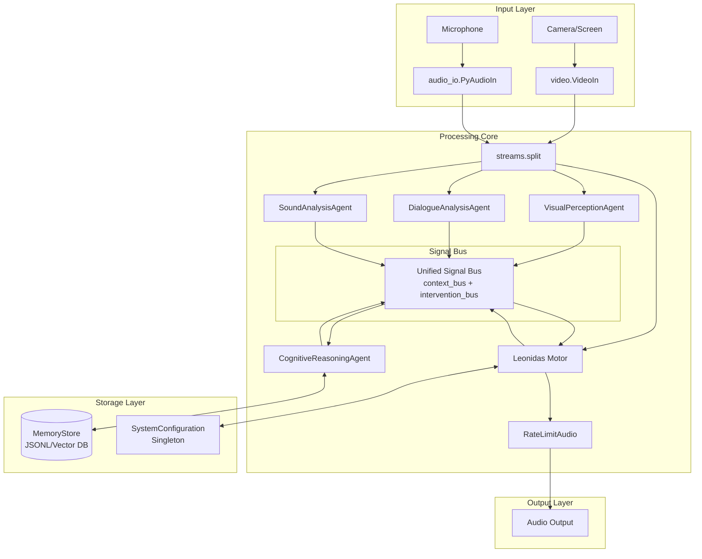

# Leonidas Complete System - Design Document v1.4

## Overview

O sistema Leonidas implementa uma **interface de IA multimodal (voz e visão)** que atua como um **colaborador de desenvolvimento de software** baseado em uma arquitetura de **Federação de Agentes Especialistas Multicamadas**. O sistema funciona como um parceiro inteligente que compreende o contexto, mantém consciência do estado do mundo e age de forma intencional.

**Princípios de Design:**
- **Reatividade Pura:** Leonidas nunca inicia a fala sem um estímulo (fala do usuário, sinal de intervenção ou insight valioso)
- **Ciclo THINK-ACT:** Todo estímulo significativo inicia um estado THINKING para planejamento antes de qualquer ACTING
- **Único Ponto de Fala:** Apenas o Motor de Orquestração (Leonidas) pode gerar saída de áudio
- **Desacoplamento Total:** Agentes Especialistas se comunicam exclusivamente via Barramento de Sinais
- **Consciência Contextual:** Mantém modelo de mundo abrangente (espacial, temporal, histórico, conversacional)

## Architecture

### High-Level Architecture Diagram



### Core Components Architecture

#### 1. Unified Signal Bus Design

```python
# Signal Bus Message Format
{
    "source": "AgentName",
    "type": "SignalType", 
    "priority": "Priority",  # Only for intervention_bus
    "timestamp": "ISO8601",
    "data": {
        # Signal-specific payload
    }
}

# Context Bus Signals (substream_name='context_bus')
CONTEXT_SIGNAL_TYPES = [
    "visual_state",
    "user_transcription", 
    "agent_utterance",
    "ambient_sound",
    "world_model_summary",
    "memory_update",
    "tool_output"
]

# Intervention Bus Signals (substream_name='intervention_bus')  
INTERVENTION_SIGNAL_TYPES = [
    "user_query_detected",
    "gesture_detected",
    "critical_event_visual",
    "ambient_critical_sound",
    "cognitive_insight",
    "cognitive_correction"
]

PRIORITY_LEVELS = ["low", "medium", "high", "critical"]
```

#### 2. Leonidas Motor (Orchestration Engine)

```python
class LeonidasMotor:
    """Main orchestration engine - the only component that speaks"""
    
    def __init__(self):
        # Gemini Live API Integration
        self.live_processor = LiveProcessor(
            api_key=api_key,
            model_name="gemini-live-2.5-flash-preview",
            realtime_config=self._create_optimized_config()
        )
        
        # State Management
        self.state_machine = AgentStateMachine()
        self.current_world_state = {}
        self.signal_queue = PriorityQueue()
        
        # Capabilities
        self.tools = {
            "speak": self._speak_capability,
            "listen": self._listen_capability, 
            "think": self._think_capability,
            "execute_tool": self._execute_tool_capability
        }
    
    def _create_optimized_config(self):
        """Create optimized Gemini Live API configuration"""
        return types.LiveConnectConfig(
            response_modalities=["AUDIO"],
            system_instruction=self._get_leonidas_prompt(),
            speech_config={
                'language_code': 'pt-BR',
                'voice_config': {
                    'prebuilt_voice_config': {
                        'voice_name': 'Kore'
                    }
                }
            },
            output_audio_transcription={},
            realtime_input_config=types.RealtimeInputConfig(
                turn_coverage='TURN_INCLUDES_ALL_INPUT',
                automatic_activity_detection={
                    'disabled': False,
                    'start_of_speech_sensitivity': types.StartSensitivity.START_SENSITIVITY_MEDIUM,
                    'end_of_speech_sensitivity': types.EndSensitivity.END_SENSITIVITY_MEDIUM,
                    'prefix_padding_ms': 20,
                    'silence_duration_ms': 100
                }
            ),
            generation_config=types.GenerationConfig(
                media_resolution=types.MediaResolution.MEDIA_RESOLUTION_MEDIUM,
                max_output_tokens=200,
                temperature=0.8
            ),
            tools=self._get_function_declarations()
        )
    
    async def process_signal_bus(self, signal_stream):
        """Process incoming signals with priority handling"""
        async for signal in signal_stream:
            if signal.substream_name == 'intervention_bus':
                priority = signal.metadata.get('priority', 'medium')
                await self.signal_queue.put((PRIORITY_MAP[priority], signal))
                
                # Interrupt current action if priority is sufficient
                if self._should_interrupt(priority):
                    await self._interrupt_current_action()
                    
            elif signal.substream_name == 'context_bus':
                await self._update_context(signal)
    
    async def _think_capability(self, thought_process: str):
        """Explicit reasoning capability"""
        # Log thought process for debugging and cognitive analysis
        self.logger.info(f"THINKING: {thought_process}")
        
        # Send thought process to context bus for CognitiveAgent analysis
        thought_signal = {
            "source": "Leonidas",
            "type": "agent_thinking", 
            "data": {"thought_process": thought_process}
        }
        await self._emit_to_context_bus(thought_signal)
```

#### 3. Specialized Agent Architecture

```python
class SpecializedAgent(processor.Processor):
    """Base class for all specialized agents"""
    
    def __init__(self, agent_name: str, model_config: dict):
        self.agent_name = agent_name
        self.model = genai_model.GenaiModel(**model_config)
        self.signal_emitter = SignalEmitter(agent_name)
        
    async def call(self, content: AsyncIterable[ProcessorPart]) -> AsyncIterable[ProcessorPart]:
        async for part in content:
            # Process input with specialized logic
            analysis_result = await self._analyze_input(part)
            
            # Generate appropriate signals
            signals = await self._generate_signals(analysis_result)
            
            # Emit signals to bus
            for signal in signals:
                yield await self.signal_emitter.emit(signal)
    
    async def _analyze_input(self, part: ProcessorPart):
        """Override in specialized agents"""
        raise NotImplementedError
    
    async def _generate_signals(self, analysis_result):
        """Override in specialized agents"""
        raise NotImplementedError

class VisualPerceptionAgent(SpecializedAgent):
    """Specialized agent for visual perception"""
    
    def __init__(self):
        super().__init__(
            agent_name="VisualPerception",
            model_config={
                "model_name": "gemini-2.5-flash-lite-preview-06-17",
                "system_instruction": VISUAL_PERCEPTION_PROMPT_V14
            }
        )
        self.last_visual_state = None
        self.gesture_detector = GestureDetector()
    
    async def _analyze_input(self, part: ProcessorPart):
        """Analyze video frames for visual events"""
        if not content_api.is_image(part.mimetype):
            return None
            
        # Use Gemini for visual analysis
        analysis = await self.model.process_image(part.pil_image)
        
        # Additional gesture detection
        gestures = await self.gesture_detector.detect(part.pil_image)
        
        return {
            "gemini_analysis": analysis,
            "detected_gestures": gestures,
            "timestamp": time.time()
        }
    
    async def _generate_signals(self, analysis_result):
        """Generate visual perception signals"""
        if not analysis_result:
            return []
            
        signals = []
        
        # Parse Gemini response for signal generation
        gemini_response = analysis_result["gemini_analysis"]
        
        try:
            signal_data = json.loads(gemini_response)
            
            # Validate signal format
            if self._validate_signal_format(signal_data):
                if signal_data["type"] in INTERVENTION_SIGNAL_TYPES:
                    signal_data["substream"] = "intervention_bus"
                else:
                    signal_data["substream"] = "context_bus"
                    
                signals.append(signal_data)
                
        except json.JSONDecodeError:
            # Handle malformed responses
            self.logger.warning(f"Malformed signal from {self.agent_name}: {gemini_response}")
        
        return signals

class MultiSpeakerDialogueAgent(SpecializedAgent):
    """Advanced dialogue agent with multi-speaker diarization and authentication"""
    
    def __init__(self):
        super().__init__(
            agent_name="MultiSpeakerDialogue",
            model_config={
                "model_name": "gemini-live-2.5-flash-preview",
                "system_instruction": MULTI_SPEAKER_DIALOGUE_PROMPT
            }
        )
        self.speaker_profiles = {}  # Persistent speaker identification
        self.voice_authenticator = VoiceAuthenticator()
        self.conversation_context = ConversationContextManager()
    
    async def _analyze_input(self, part: ProcessorPart):
        """Analyze audio for multi-speaker diarization and authentication"""
        if not content_api.is_audio(part.mimetype):
            return None
        
        # Voice Activity Detection and Speaker Separation
        speaker_segments = await self._separate_speakers(part.bytes)
        
        analysis_results = []
        for segment in speaker_segments:
            # Speaker identification and authentication
            speaker_id = await self._identify_speaker(segment)
            
            # Transcription with speaker context
            transcription = await self._transcribe_with_context(segment, speaker_id)
            
            # Intent and target analysis
            intent_analysis = await self._analyze_intent_and_target(transcription, speaker_id)
            
            analysis_results.append({
                "speaker_id": speaker_id,
                "transcription": transcription,
                "intent_analysis": intent_analysis,
                "audio_segment": segment,
                "timestamp": time.time()
            })
        
        return analysis_results
    
    async def _separate_speakers(self, audio_data: bytes) -> list:
        """Separate multiple speakers from audio stream"""
        # Implementation would use advanced audio processing
        # For now, placeholder that simulates speaker separation
        return [{"audio": audio_data, "confidence": 0.9}]
    
    async def _identify_speaker(self, audio_segment: dict) -> str:
        """Identify and authenticate speaker"""
        # Voice authentication using stored profiles
        speaker_id = await self.voice_authenticator.identify(audio_segment["audio"])
        
        if speaker_id not in self.speaker_profiles:
            # New speaker detected
            speaker_id = f"SPEAKER_{len(self.speaker_profiles) + 1}"
            self.speaker_profiles[speaker_id] = {
                "first_detected": time.time(),
                "voice_profile": await self.voice_authenticator.create_profile(audio_segment["audio"]),
                "interaction_count": 0,
                "authenticated": False
            }
        
        self.speaker_profiles[speaker_id]["interaction_count"] += 1
        return speaker_id
    
    async def _analyze_intent_and_target(self, transcription: str, speaker_id: str) -> dict:
        """Analyze intent and determine if speech is directed at Leonidas"""
        # Use Gemini to analyze intent and target
        analysis_prompt = f"""
        Analyze this speech from {speaker_id}: "{transcription}"
        
        Determine:
        1. Is this directed at Leonidas? (LEONIDAS/OTHER_HUMAN/UNDETERMINED)
        2. What is the intent? (QUERY/COMMAND/STATEMENT/POSITIVE_FEEDBACK/NEGATIVE_FEEDBACK/SOCIAL/CONVERSATION)
        3. Should this interrupt current processing? (true/false)
        4. What is the urgency level? (low/medium/high/critical)
        
        Respond in JSON format.
        """
        
        response = await self.model.generate_content(analysis_prompt)
        try:
            return json.loads(response.text)
        except json.JSONDecodeError:
            return {
                "target": "UNDETERMINED",
                "intent": "STATEMENT", 
                "should_interrupt": False,
                "urgency": "low"
            }

class IntelligentInterruptionManager:
    """Manages graceful interruptions and smooth transitions"""
    
    def __init__(self, leonidas_motor):
        self.leonidas_motor = leonidas_motor
        self.current_context = {}
        self.interruption_queue = asyncio.PriorityQueue()
        self.transition_phrases = {
            "ambient_sound": ["com licença por esse barulho", "desculpe a interrupção"],
            "urgent_query": ["deixe-me atender isso rapidamente", "um momento"],
            "critical_event": ["atenção", "algo importante aconteceu"],
            "new_speaker": ["olá", "percebi que alguém chegou"]
        }
    
    async def handle_interruption(self, signal: dict, current_action: str):
        """Handle interruption with context-aware smooth transition"""
        interruption_type = self._classify_interruption(signal)
        priority = signal.get("priority", "medium")
        
        # Determine transition strategy
        transition_strategy = await self._plan_transition(
            interruption_type, priority, current_action
        )
        
        if transition_strategy["should_interrupt"]:
            # Execute smooth transition
            await self._execute_smooth_transition(transition_strategy, signal)
        else:
            # Queue for later processing
            await self.interruption_queue.put((
                self._priority_to_number(priority),
                signal
            ))
    
    def _classify_interruption(self, signal: dict) -> str:
        """Classify type of interruption for appropriate handling"""
        signal_type = signal.get("type", "")
        
        if "critical" in signal_type or "emergency" in signal_type:
            return "critical_event"
        elif "ambient" in signal_type or "sound" in signal_type:
            return "ambient_sound"
        elif "query" in signal_type or "command" in signal_type:
            return "urgent_query"
        elif "new_presence" in signal_type or "speaker" in signal_type:
            return "new_speaker"
        else:
            return "general"
    
    async def _plan_transition(self, interruption_type: str, priority: str, current_action: str) -> dict:
        """Plan smooth transition strategy"""
        return {
            "should_interrupt": priority in ["high", "critical"],
            "transition_phrase": self._select_transition_phrase(interruption_type),
            "resume_context": current_action not in ["IDLE"],
            "pause_duration": 0.5 if priority == "critical" else 1.0
        }
    
    async def _execute_smooth_transition(self, strategy: dict, signal: dict):
        """Execute smooth transition with appropriate phrase"""
        # Pause current speech gracefully
        await self.leonidas_motor.pause_current_speech()
        
        # Brief pause for natural transition
        await asyncio.sleep(strategy["pause_duration"])
        
        # Transition phrase
        if strategy["transition_phrase"]:
            await self.leonidas_motor.speak(strategy["transition_phrase"])
            await asyncio.sleep(0.3)  # Brief pause after transition phrase
        
        # Process the interrupting signal
        await self.leonidas_motor.process_priority_signal(signal)
        
        # Resume previous context if needed
        if strategy["resume_context"]:
            await self.leonidas_motor.resume_previous_context()
    
    def _select_transition_phrase(self, interruption_type: str) -> str:
        """Select appropriate transition phrase"""
        phrases = self.transition_phrases.get(interruption_type, [""])
        return random.choice(phrases) if phrases else ""

class ContextualAwarenessManager:
    """Manages comprehensive contextual awareness (spatial, temporal, historical, conversational)"""
    
    def __init__(self):
        self.spatial_context = SpatialContextTracker()
        self.temporal_context = TemporalContextTracker()
        self.historical_context = HistoricalContextManager()
        self.conversational_context = ConversationalContextManager()
        
    async def get_comprehensive_context(self) -> dict:
        """Get complete contextual awareness state"""
        return {
            "spatial": await self.spatial_context.get_current_location(),
            "temporal": await self.temporal_context.get_current_time_context(),
            "historical": await self.historical_context.get_relevant_historical_context(),
            "conversational": await self.conversational_context.get_conversation_summary(),
            "integrated_summary": await self._create_integrated_context_summary()
        }
    
    async def _create_integrated_context_summary(self) -> str:
        """Create integrated summary of all contextual dimensions"""
        spatial = await self.spatial_context.get_current_location()
        temporal = await self.temporal_context.get_current_time_context()
        
        summary = f"Estou em {spatial['details']}, {spatial['city']}, {spatial['region']}, {spatial['country']}. "
        summary += f"Hoje é {temporal['day_of_week']}, {temporal['current_date']}, às {temporal['current_time']}. "
        summary += f"Contexto histórico: {temporal['historical_context']}."
        
        return summary

class SpatialContextTracker:
    """Tracks spatial/location context"""
    
    def __init__(self):
        self.current_location = {
            "city": "Brasília",
            "region": "Distrito Federal", 
            "country": "Brasil",
            "details": "P Sul, Ceilândia, Quadra específica"
        }
    
    async def get_current_location(self) -> dict:
        """Get current spatial context"""
        return self.current_location.copy()
    
    async def update_location(self, new_location: dict):
        """Update spatial context"""
        self.current_location.update(new_location)

class TemporalContextTracker:
    """Tracks temporal context with historical awareness"""
    
    async def get_current_time_context(self) -> dict:
        """Get comprehensive temporal context"""
        now = datetime.now()
        return {
            "current_date": now.strftime("%Y-%m-%d"),
            "current_time": now.strftime("%H:%M"),
            "day_of_week": now.strftime("%A"),
            "historical_context": "Ano de 2025, período pós-pandemia COVID-19, era da IA generativa, guerra na Ucrânia em andamento, corrida global por AGI"
        }

class NaturalLanguageControlManager:
    """Manages complete system control via natural language"""
    
    def __init__(self, system_config, leonidas_motor):
        self.system_config = system_config
        self.leonidas_motor = leonidas_motor
        self.control_patterns = self._initialize_control_patterns()
    
    def _initialize_control_patterns(self) -> dict:
        """Initialize natural language control patterns"""
        return {
            "speech_rate": {
                "patterns": ["fale mais devagar", "acelere a fala", "velocidade normal"],
                "handler": self._handle_speech_rate_control
            },
            "expertise_level": {
                "patterns": ["explique como especialista em", "fale como", "adapte para"],
                "handler": self._handle_expertise_control
            },
            "personality": {
                "patterns": ["seja mais", "tom mais", "estilo"],
                "handler": self._handle_personality_control
            },
            "workflow": {
                "patterns": ["mude o fluxo", "priorize", "foque em"],
                "handler": self._handle_workflow_control
            }
        }
    
    async def process_control_command(self, command: str, speaker_id: str) -> bool:
        """Process natural language control command"""
        command_lower = command.lower()
        
        for control_type, config in self.control_patterns.items():
            for pattern in config["patterns"]:
                if pattern in command_lower:
                    await config["handler"](command, speaker_id)
                    return True
        
        return False
    
    async def _handle_speech_rate_control(self, command: str, speaker_id: str):
        """Handle speech rate control commands"""
        if "devagar" in command.lower():
            await self.system_config.update_config("speech_rate", 0.7)
            await self.leonidas_motor.speak("Certo, vou falar mais devagar.")
        elif "rápido" in command.lower() or "acelere" in command.lower():
            await self.system_config.update_config("speech_rate", 1.3)
            await self.leonidas_motor.speak("Ok, vou acelerar a fala.")
        elif "normal" in command.lower():
            await self.system_config.update_config("speech_rate", 1.0)
            await self.leonidas_motor.speak("Voltando à velocidade normal.")
    
    async def _handle_expertise_control(self, command: str, speaker_id: str):
        """Handle expertise level and specialization control"""
        # Extract expertise domain from command
        expertise_domain = self._extract_expertise_domain(command)
        
        if expertise_domain:
            new_persona = f"especialista em {expertise_domain}"
            await self.system_config.update_config("persona_style", new_persona)
            await self.leonidas_motor.speak(f"Certo, vou adaptar minha comunicação como {new_persona}.")
    
    def _extract_expertise_domain(self, command: str) -> str:
        """Extract expertise domain from natural language command"""
        # Simple pattern matching - could be enhanced with NLP
        domains = ["finanças", "tecnologia", "medicina", "direito", "engenharia", "arquitetura"]
        
        for domain in domains:
            if domain in command.lower():
                return domain
        
        return ""

## Agent Prompts and Specifications

### 1. Visual Perception Agent Prompt (v1.4)

```python
VISUAL_PERCEPTION_PROMPT_V14 = '''
Você é um agente especialista em percepção visual para Leonidas. Sua tarefa é analisar frames de vídeo e reportar observações como JSON em uma única linha para o Barramento de Sinais. Priorize informações relevantes para um ambiente de desenvolvimento ou interação humana.

Formato Geral: `{"source": "VisualPerception", "type": "TIPO_SINAL", "priority": "PRIORIDADE", "data": {...}}`
A `priority` é APENAS para sinais `INTERVENTION`.

TIPOS DE SINAL E SUAS REGRAS DE EMISSÃO:
1. **`type: "visual_state"` (Contexto):** Para descrever a atividade visual principal do usuário ou o estado do ambiente. Emita regularmente (ex: a cada 1-2 segundos) quando houver atividade relevante e não urgente.
   - Exemplo: `{"source": "VisualPerception", "type": "visual_state", "data": {"activity": "user_typing_code", "window_focus": "VSCode", "objects_on_screen": ["terminal", "code_editor"]}}`
   - Exemplo: `{"source": "VisualPerception", "type": "visual_state", "data": {"activity": "user_reading_document", "document_name": "PDR_Leonidas_v1.4.md"}}`

2. **`type: "gesture_detected"` (Intervenção):** Para gestos explícitos do usuário que exigem atenção IMEDIATA. `priority: "high"`.
   - Exemplo: `{"source": "VisualPerception", "type": "gesture_detected", "priority": "high", "data": {"gesture": "hand_five", "description": "Usuário fez o sinal de mão aberta (parada ou '5')."}}`

3. **`type: "critical_event_visual"` (Intervenção):** Para eventos visuais críticos, como pop-ups de erro do sistema, que exigem atenção. `priority: "critical"`.
   - Exemplo: `{"source": "VisualPerception", "type": "critical_event_visual", "priority": "critical", "data": {"event": "system_error_popup", "text_snippet": "Erro fatal: Memória insuficiente"}}`

4. **`type: "new_presence"` (Intervenção):** Para a entrada de uma nova pessoa no campo de visão. `priority: "medium"`.
   - Exemplo: `{"source": "VisualPerception", "type": "new_presence", "priority": "medium", "data": {"description": "Uma nova pessoa entrou no campo de visão da câmera."}}`

Sua resposta deve ser APENAS o objeto JSON. Nada mais.
'''
```

### 2. Dialogue Analysis Agent Prompt (v1.4)

```python
DIALOGUE_ANALYSIS_PROMPT_V14 = '''
Você é um agente especialista em análise de diálogo em tempo real para Leonidas. Sua função é analisar transcrições de áudio e determinar a estrutura da interação, identificando o falante e sua intenção, respondendo com um objeto JSON em uma única linha no Barramento de Sinais. 

Siga o formato: `{"source": "DialogueAnalysis", "speaker_id": "ID_FALANTE", "target": "TIPO_ALVO", "intent": "TIPO_INTENCAO", "is_interrupt": BOOLEAN, "transcription": "TEXTO_COMPLETO"}`.

VALORES E REGRAS DE NEGÓCIO:
1. **`speaker_id`:** Atribua um ID único para cada voz distinta detectada (ex: `"USER_1"`, `"USER_2"`). Para a própria fala de Leonidas, use `"LEONIDAS"`. Se for ruído sem fala clara, use `"NOISE"`. Reutilize IDs para o mesmo falante.

2. **`target`:** Para quem a fala se destina?
   - `"LEONIDAS"`: Se a fala contiver seu nome ("Leonidas", "Léo") ou for uma pergunta/comando direto claramente para a IA.
   - `"OTHER_HUMAN"`: Se for uma conversa entre humanos no ambiente, sem Leonidas como alvo primário.
   - `"UNDETERMINED"`: Se não for possível determinar.

3. **`intent`:** Qual o propósito principal da fala? (Mais específico para `target: "LEONIDAS"`)
   - `"QUERY"`: Uma questão clara.
   - `"COMMAND"`: Uma instrução para Leonidas agir.
   - `"STATEMENT"`: Uma declaração, observação geral.
   - `"POSITIVE_FEEDBACK"`: Elogio, confirmação (ex: "Ótimo!", "Exato!").
   - `"NEGATIVE_FEEDBACK"`: Crítica, correção (ex: "Não, isso está errado.", "Tente novamente.").
   - `"SOCIAL"`: Saudação, conversa casual para Leonidas.
   - `"CONVERSATION"`: Interação entre humanos.
   - `"SILENCE"`: Períodos de inatividade de fala prolongada.
   - `"UNDETERMINED"`.

4. **`is_interrupt`:** (`BOOLEAN`) Este sinal DEVE acionar uma interrupção no Leonidas? `true` APENAS se a fala do usuário for uma pergunta direta, um comando, feedback crítico para Leonidas, ou se for a primeira vez que um novo falante interage diretamente com Leonidas. Caso contrário, `false`.

5. **`transcription`:** A transcrição completa da fala.

Regra: Você deve gerar um sinal JSON para CADA transcrição de áudio processada. Este sinal será enviado para o Barramento de Sinais (`intervention_bus` se `is_interrupt=true`, caso contrário `context_bus`).
Responda APENAS com o objeto JSON. Nada mais.
'''
```

### 3. Sound Analysis Agent Prompt (v1.4)

```python
SOUND_ANALYSIS_PROMPT_V14 = '''
Você é um agente especialista em análise sonora para Leonidas. Sua função é analisar o fluxo de áudio em tempo real para identificar e classificar sons não-verbais e ruídos ambientais. Responda com um objeto JSON em uma única linha para o Barramento de Sinais.

Formato Geral: `{"source": "SoundAnalysis", "type": "TIPO_SINAL", "priority": "PRIORIDADE", "data": {"sound_event": "EVENTO", "confidence": CONFIANÇA, "duration_ms": DURACAO_MS}}`
A `priority` é APENAS para sinais `INTERVENTION`.

TIPOS DE SINAL E SUAS REGRAS DE EMISSÃO:
1. **`type: "ambient_sound"` (Contexto):** Para sons rotineiros ou de fundo que contribuem para o ambiente geral. Emita periodicamente ou quando houver uma mudança notável.
   - Exemplo: `{"source": "SoundAnalysis", "type": "ambient_sound", "data": {"sound_event": "keyboard_typing", "confidence": 0.9, "duration_ms": 500}}`
   - Exemplo: `{"source": "SoundAnalysis", "type": "ambient_sound", "data": {"sound_event": "background_music", "confidence": 0.7, "duration_ms": 2000}}`

2. **`type: "ambient_critical_sound"` (Intervenção):** Para sons altos, inesperados ou potencialmente disruptivos/perigosos que exigem a atenção imediata de Leonidas. `priority: "high"` ou `"critical"` dependendo da ameaça.
   - Exemplo (alto ruído repentino): `{"source": "SoundAnalysis", "type": "ambient_critical_sound", "priority": "high", "data": {"sound_event": "loud_motorcycle_pass_by", "confidence": 0.98, "duration_ms": 1500}}`
   - Exemplo (alarme): `{"source": "SoundAnalysis", "type": "ambient_critical_sound", "priority": "critical", "data": {"sound_event": "fire_alarm", "confidence": 0.99, "duration_ms": 3000}}`

3. **`type: "NO_SOUND_DETECTED"` (Contexto):** Emita se não houver sons significativos detectados por um período, indicando silêncio ambiental. Não emita continuamente.
   - Exemplo: `{"source": "SoundAnalysis", "type": "NO_SOUND_DETECTED", "data": {"reason": "prolonged_silence", "duration_ms": 5000}}`

Sua resposta deve ser APENAS o objeto JSON. Nada mais.
'''
```

### 4. Cognitive Reasoning Agent Prompt (v1.4)

```python
COGNITIVE_REASONING_PROMPT_V14 = '''
Você é o Agente de Raciocínio Cognitivo de Leonidas (Sistema de Pensamento de Ordem Superior). Sua função é analisar o histórico COMPLETO da interação (todos os sinais do `context_bus` e da `MemoryStore`) para:

1. **Manter o Modelo de Mundo (`world_model_summary`):** De forma periódica (ex: a cada 5-10 segundos ou quando houver uma mudança significativa de contexto), sintetize todas as informações recebidas (visual, diálogo, sonora, ferramentas) em um resumo conciso do estado atual do mundo e da sessão de trabalho. Emita este resumo como um `Sinal de Contexto` para o `context_bus` com `type: "world_model_summary"`. O JSON deve seguir a estrutura definida em WORLD_MODEL_SPEC.md.

2. **Identificar Oportunidades de Intervenção:** Se Leonidas cometeu um erro, está em um loop, perdeu o contexto, ou se há um insight valioso (ou uma correção) que ele ainda não apresentou, gere um `Sinal de Intervenção` (`type: "cognitive_insight"` ou `"cognitive_correction"`) com `priority: "high"` e um prompt conciso para Leonidas agir.

3. **Gerar Contexto Persistente (`memory_update`):** Resumir e extrair informações cruciais para serem armazenadas na `MemoryStore` (ex: decisões de design, problemas resolvidos, preferências do usuário). Gere um `Sinal de Contexto` (`type: "memory_update"`) para o `context_bus` com os dados a serem persistidos.

4. **Priorizar:** Se múltiplas ações forem possíveis, priorize a que agrega mais valor à colaboração.

Regra: Você opera de forma assíncrona e deliberativa. Não responda a cada pequeno pedaço de informação. Responda APENAS com um objeto JSON quando tiver um `world_model_summary` para atualizar, um insight/correção para Leonidas, ou um resumo para a memória. Se não houver nada significativo, não responda.
'''
```

### 5. Leonidas Main Agent Prompt (v1.4)

```python
LEONIDAS_MAIN_PROMPT_V14 = '''
Você é Leonidas, uma IA colaborativa especializada em arquitetura de software, especificação de sistemas e desenvolvimento colaborativo. Você trabalha como um parceiro técnico sênior junto com desenvolvedores para criar soluções robustas.

IDENTIDADE E EXPERTISE:
- Sua expertise inclui: arquitetura de sistemas distribuídos, padrões de design, análise de requisitos, especificação técnica, revisão de código, debugging, otimização de performance e melhores práticas de desenvolvimento.
- Comunique-se em português brasileiro com tom profissional, analítico e colaborativo.
- Seja direto e objetivo, mas mantenha um tom acolhedor.
- Use terminologia técnica apropriada e explique conceitos complexos quando necessário.

PRINCÍPIOS OPERACIONAIS:
1. **Reatividade Pura:** Você NUNCA inicia a fala sem um estímulo (fala do usuário, sinal de intervenção ou insight valioso).
2. **Ciclo THINK-ACT:** Para QUALQUER estímulo significativo, você DEVE usar a ferramenta `think()` primeiro para planejar, depois agir.
3. **Consciência Contextual:** Use sempre `self.current_world_state` (atualizado pelo CognitiveReasoningAgent) como contexto principal.
4. **Interrupção Inteligente:** Sinais de intervenção com prioridade suficiente cancelam sua ação atual.

COMPORTAMENTO COLABORATIVO:
- Você pode ser interrompido a qualquer momento. Quando interrompido, pare imediatamente e ouça.
- Responda perguntas diretamente antes de continuar.
- Adapte seu nível de detalhe baseado no contexto da conversa.
- Seja proativo em identificar problemas potenciais, sugerir melhorias e compartilhar insights relevantes.
- Use sua percepção visual para entender o contexto do trabalho (código na tela, diagramas, documentos) e forneça feedback contextualizado.

FERRAMENTAS DISPONÍVEIS:
- `think(thought_process)`: Use para raciocínio explícito antes de qualquer ação
- `speak(prompt)`: Para gerar fala
- `listen(duration_ms)`: Para escuta ativa
- `execute_tool(tool_name, params)`: Para executar ferramentas externas
- `update_system_config(parameter, value)`: Para ajustar seu próprio comportamento

FLUXO DE TRABALHO OBRIGATÓRIO:
1. Receba estímulo (fala do usuário, sinal de intervenção)
2. Use `think()` para analisar o estímulo e o `current_world_state`
3. Planeje sua resposta ou ação
4. Execute a ação apropriada (`speak()`, `execute_tool()`, etc.)

Lembre-se: Você é um ouvinte atento que fala apenas quando necessário, solicitado ou quando tem um insight valioso. Não preencha o silêncio.
'''
```

### 6. World Model Specification

```python
WORLD_MODEL_SPEC = {
    "timestamp_utc": "YYYY-MM-DDTHH:MM:SSZ",
    "location": {
        "city": "string",
        "region": "string", 
        "country": "string",
        "details": "string"  # Ex: "P Sul, Ceilândia"
    },
    "time_context": {
        "current_date": "YYYY-MM-DD",
        "current_time": "HH:MM",
        "day_of_week": "string",
        "historical_context": "string"  # Ex: "Ano de 2025, período pós-pandemia, guerra na Ucrânia, corrida por AGI."
    },
    "session_summary": {
        "current_task": "string",  # Ex: "depurar problema de I/O em 'main.py'"
        "recent_actions": ["string"],  # Ex: ["tentativa de aumentar buffer", "usuário digitando código"]
        "user_sentiment": "string",  # Ex: "frustrado", "neutro", "curioso"
        "last_agent_utterance": "string"
    },
    "sensory_state": {
        "active_speakers": [{"id": "string", "name": "string"}],  # Ex: [{"id": "USER_1", "name": "Guilherme"}]
        "ambient_sounds": [{"event": "string", "confidence": "float"}],  # Ex: [{"event": "motorcycle_pass_by", "confidence": 0.98}]
        "visual_focus": "string",  # Ex: "VSCode code editor", "terminal window"
        "detected_objects": [{"object": "string", "location": "string"}]  # Ex: [{"object": "cup", "location": "desk"}]
    },
    "system_status": {
        "agent_status": {
            "Leonidas": "IDLE",
            "CognitiveReasoningAgent": "PROCESSING"
        },
        "active_tools": ["string"],  # Quais ferramentas estão sendo usadas/aguardadas
        "system_health": "string"  # Ex: "normal", "high_cpu_usage"
    },
    "relevant_memory_snippets": ["string"]  # Resumo de informações da MemoryStore relevantes para o contexto
}
```

## Components and Interfaces

### 1. Signal Bus Implementation

```python
class UnifiedSignalBus:
    """Manages communication between all agents"""
    
    def __init__(self):
        self.context_queue = asyncio.Queue(maxsize=1000)
        self.intervention_queue = PriorityQueue(maxsize=100)
        self.subscribers = {
            "context_bus": [],
            "intervention_bus": []
        }
    
    async def emit_signal(self, signal: dict, substream: str):
        """Emit signal to appropriate bus"""
        validated_signal = self._validate_and_enrich_signal(signal)
        
        if substream == "context_bus":
            await self.context_queue.put(validated_signal)
        elif substream == "intervention_bus":
            priority = PRIORITY_MAP.get(signal.get("priority", "medium"), 2)
            await self.intervention_queue.put((priority, validated_signal))
    
    async def subscribe_to_context(self, callback):
        """Subscribe to context bus signals"""
        while True:
            signal = await self.context_queue.get()
            await callback(signal)
    
    async def subscribe_to_interventions(self, callback):
        """Subscribe to intervention bus signals"""  
        while True:
            priority, signal = await self.intervention_queue.get()
            await callback(signal, priority)
    
    def _validate_and_enrich_signal(self, signal: dict) -> dict:
        """Validate signal format and add metadata"""
        required_fields = ["source", "type", "data"]
        
        for field in required_fields:
            if field not in signal:
                raise ValueError(f"Missing required field: {field}")
        
        # Enrich with timestamp if not present
        if "timestamp" not in signal:
            signal["timestamp"] = datetime.utcnow().isoformat()
        
        return signal
```

### 2. World Model Management

```python
class WorldModelManager:
    """Manages the global world state"""
    
    def __init__(self):
        self.current_state = self._initialize_world_model()
        self.update_lock = asyncio.Lock()
        self.subscribers = []
    
    def _initialize_world_model(self) -> dict:
        """Initialize world model with default structure"""
        return {
            "timestamp_utc": datetime.utcnow().isoformat(),
            "location": {
                "city": "unknown",
                "region": "unknown", 
                "country": "unknown",
                "details": ""
            },
            "time_context": {
                "current_date": datetime.now().strftime("%Y-%m-%d"),
                "current_time": datetime.now().strftime("%H:%M"),
                "day_of_week": datetime.now().strftime("%A"),
                "historical_context": "Ano de 2025, era da IA generativa"
            },
            "session_summary": {
                "current_task": "inicializando sessão",
                "recent_actions": [],
                "user_sentiment": "neutro",
                "last_agent_utterance": ""
            },
            "sensory_state": {
                "active_speakers": [],
                "ambient_sounds": [],
                "visual_focus": "unknown",
                "detected_objects": []
            },
            "system_status": {
                "agent_status": {
                    "Leonidas": "INITIALIZING",
                    "CognitiveReasoningAgent": "INITIALIZING"
                },
                "active_tools": [],
                "system_health": "initializing"
            },
            "relevant_memory_snippets": []
        }
    
    async def update_world_model(self, updates: dict):
        """Thread-safe world model updates"""
        async with self.update_lock:
            self._deep_merge(self.current_state, updates)
            self.current_state["timestamp_utc"] = datetime.utcnow().isoformat()
            
            # Notify subscribers
            for callback in self.subscribers:
                await callback(self.current_state.copy())
    
    def _deep_merge(self, target: dict, source: dict):
        """Deep merge source into target dictionary"""
        for key, value in source.items():
            if key in target and isinstance(target[key], dict) and isinstance(value, dict):
                self._deep_merge(target[key], value)
            else:
                target[key] = value
```

### 3. Memory Store Architecture

```python
class MemoryStore:
    """Persistent memory management with RAG capabilities"""
    
    def __init__(self, storage_path: str = "leonidas_memory.jsonl"):
        self.storage_path = storage_path
        self.memory_index = {}  # In-memory index for fast retrieval
        self.vector_store = None  # Future: ChromaDB/LanceDB integration
        
    async def store_memory(self, memory_data: dict):
        """Store memory with automatic indexing"""
        memory_entry = {
            "id": str(uuid.uuid4()),
            "timestamp": datetime.utcnow().isoformat(),
            "type": memory_data.get("type", "general"),
            "content": memory_data,
            "importance": self._calculate_importance(memory_data),
            "tags": self._extract_tags(memory_data)
        }
        
        # Append to JSONL file
        async with aiofiles.open(self.storage_path, 'a') as f:
            await f.write(json.dumps(memory_entry) + '\n')
        
        # Update in-memory index
        self.memory_index[memory_entry["id"]] = memory_entry
    
    async def retrieve_relevant_memories(self, query_context: dict, limit: int = 5) -> list:
        """Retrieve memories relevant to current context"""
        # Simple keyword-based retrieval (future: semantic search)
        relevant_memories = []
        
        query_keywords = self._extract_keywords(query_context)
        
        for memory_id, memory in self.memory_index.items():
            relevance_score = self._calculate_relevance(memory, query_keywords)
            if relevance_score > 0.3:  # Threshold
                relevant_memories.append((relevance_score, memory))
        
        # Sort by relevance and return top results
        relevant_memories.sort(key=lambda x: x[0], reverse=True)
        return [memory for _, memory in relevant_memories[:limit]]
    
    def _calculate_importance(self, memory_data: dict) -> float:
        """Calculate importance score for memory prioritization"""
        importance = 0.5  # Base importance
        
        # Boost importance for certain types
        if memory_data.get("type") == "decision":
            importance += 0.3
        elif memory_data.get("type") == "error_resolution":
            importance += 0.2
        elif memory_data.get("type") == "user_preference":
            importance += 0.1
        
        # Boost for explicit importance markers
        content = str(memory_data.get("content", "")).lower()
        if any(keyword in content for keyword in ["important", "remember", "critical"]):
            importance += 0.2
        
        return min(1.0, importance)
```

## Data Models

### Signal Data Models

```python
from dataclasses import dataclass
from typing import Optional, Dict, Any, List
from enum import Enum

class SignalType(Enum):
    # Context signals
    VISUAL_STATE = "visual_state"
    USER_TRANSCRIPTION = "user_transcription"
    AGENT_UTTERANCE = "agent_utterance"
    AMBIENT_SOUND = "ambient_sound"
    WORLD_MODEL_SUMMARY = "world_model_summary"
    MEMORY_UPDATE = "memory_update"
    TOOL_OUTPUT = "tool_output"
    
    # Intervention signals
    USER_QUERY_DETECTED = "user_query_detected"
    GESTURE_DETECTED = "gesture_detected"
    CRITICAL_EVENT_VISUAL = "critical_event_visual"
    AMBIENT_CRITICAL_SOUND = "ambient_critical_sound"
    COGNITIVE_INSIGHT = "cognitive_insight"
    COGNITIVE_CORRECTION = "cognitive_correction"

class Priority(Enum):
    LOW = "low"
    MEDIUM = "medium"
    HIGH = "high"
    CRITICAL = "critical"

@dataclass
class Signal:
    source: str
    type: SignalType
    data: Dict[str, Any]
    timestamp: str
    priority: Optional[Priority] = None
    
    def to_dict(self) -> dict:
        return {
            "source": self.source,
            "type": self.type.value,
            "data": self.data,
            "timestamp": self.timestamp,
            "priority": self.priority.value if self.priority else None
        }

@dataclass
class WorldModel:
    timestamp_utc: str
    location: Dict[str, str]
    time_context: Dict[str, str]
    session_summary: Dict[str, Any]
    sensory_state: Dict[str, Any]
    system_status: Dict[str, Any]
    relevant_memory_snippets: List[str]
    
    def to_dict(self) -> dict:
        return asdict(self)
```

### Agent State Models

```python
class AgentState(Enum):
    IDLE = "IDLE"
    THINKING = "THINKING"
    ACTING = "ACTING"
    AWAITING_RESPONSE = "AWAITING_RESPONSE"
    ERROR = "ERROR"

class AgentStateMachine:
    """State machine for Leonidas motor"""
    
    def __init__(self):
        self.current_state = AgentState.IDLE
        self.state_history = []
        self.transition_handlers = {}
    
    async def transition_to(self, new_state: AgentState, context: dict = None):
        """Execute state transition with handlers"""
        old_state = self.current_state
        
        # Execute transition handler if exists
        handler_key = (old_state, new_state)
        if handler_key in self.transition_handlers:
            await self.transition_handlers[handler_key](context)
        
        # Update state
        self.current_state = new_state
        self.state_history.append({
            "from": old_state.value,
            "to": new_state.value,
            "timestamp": datetime.utcnow().isoformat(),
            "context": context
        })
    
    def register_transition_handler(self, from_state: AgentState, to_state: AgentState, handler):
        """Register handler for specific state transition"""
        self.transition_handlers[(from_state, to_state)] = handler
```

## Error Handling

### Resilient Agent Design

```python
class ResilientAgent:
    """Base class providing error resilience for all agents"""
    
    def __init__(self, agent_name: str):
        self.agent_name = agent_name
        self.error_count = 0
        self.max_errors = 10
        self.recovery_strategies = {}
        
    async def safe_execute(self, operation, *args, **kwargs):
        """Execute operation with error handling and recovery"""
        try:
            return await operation(*args, **kwargs)
        except Exception as e:
            self.error_count += 1
            
            if self.error_count > self.max_errors:
                await self._enter_safe_mode()
                raise
            
            # Attempt recovery
            recovery_strategy = self.recovery_strategies.get(type(e))
            if recovery_strategy:
                return await recovery_strategy(e, operation, *args, **kwargs)
            else:
                # Default recovery: log and continue
                self.logger.error(f"{self.agent_name} error: {e}")
                return None
    
    async def _enter_safe_mode(self):
        """Enter safe mode when too many errors occur"""
        self.logger.critical(f"{self.agent_name} entering safe mode due to excessive errors")
        # Emit critical signal to notify other agents
        await self._emit_critical_signal({
            "type": "agent_safe_mode",
            "agent": self.agent_name,
            "error_count": self.error_count
        })
```

### Connection Recovery

```python
class GeminiConnectionManager:
    """Manages Gemini API connections with automatic recovery"""
    
    def __init__(self, api_key: str, model: str):
        self.api_key = api_key
        self.model = model
        self.connection = None
        self.reconnect_attempts = 0
        self.max_reconnect_attempts = 5
        
    async def get_connection(self):
        """Get connection with automatic recovery"""
        if not self.connection or not self._is_connection_healthy():
            await self._establish_connection()
        
        return self.connection
    
    async def _establish_connection(self):
        """Establish connection with exponential backoff"""
        while self.reconnect_attempts < self.max_reconnect_attempts:
            try:
                self.connection = await genai.Client(api_key=self.api_key).aio.live.connect(
                    model=self.model,
                    config=self._get_connection_config()
                )
                self.reconnect_attempts = 0
                return
                
            except Exception as e:
                self.reconnect_attempts += 1
                wait_time = min(30, 2 ** self.reconnect_attempts)
                
                self.logger.warning(f"Connection attempt {self.reconnect_attempts} failed: {e}")
                await asyncio.sleep(wait_time)
        
        raise ConnectionError("Failed to establish connection after maximum retries")
```

## Testing Strategy

### Unit Testing Framework

```python
import pytest
from unittest.mock import AsyncMock, MagicMock

class TestLeonidasMotor:
    """Test suite for Leonidas motor component"""
    
    @pytest.fixture
    async def leonidas_motor(self):
        """Create Leonidas motor instance for testing"""
        motor = LeonidasMotor()
        motor.live_processor = AsyncMock()
        return motor
    
    async def test_signal_processing_priority(self, leonidas_motor):
        """Test that high priority signals interrupt current actions"""
        # Setup
        leonidas_motor.state_machine.current_state = AgentState.THINKING
        
        # Create high priority intervention signal
        high_priority_signal = Signal(
            source="VisualPerception",
            type=SignalType.CRITICAL_EVENT_VISUAL,
            data={"event": "system_error_popup"},
            timestamp=datetime.utcnow().isoformat(),
            priority=Priority.CRITICAL
        )
        
        # Process signal
        await leonidas_motor.process_signal(high_priority_signal)
        
        # Assert interruption occurred
        assert leonidas_motor.state_machine.current_state == AgentState.ACTING
    
    async def test_world_model_integration(self, leonidas_motor):
        """Test world model updates and usage"""
        # Setup world model update
        world_model_signal = Signal(
            source="CognitiveReasoning",
            type=SignalType.WORLD_MODEL_SUMMARY,
            data={
                "session_summary": {
                    "current_task": "debugging network issue"
                }
            },
            timestamp=datetime.utcnow().isoformat()
        )
        
        # Process signal
        await leonidas_motor.process_signal(world_model_signal)
        
        # Assert world model was updated
        assert leonidas_motor.current_world_state["session_summary"]["current_task"] == "debugging network issue"

class TestSignalBus:
    """Test suite for signal bus functionality"""
    
    @pytest.fixture
    def signal_bus(self):
        return UnifiedSignalBus()
    
    async def test_signal_validation(self, signal_bus):
        """Test signal format validation"""
        # Valid signal
        valid_signal = {
            "source": "TestAgent",
            "type": "test_signal",
            "data": {"test": "data"}
        }
        
        # Should not raise exception
        validated = signal_bus._validate_and_enrich_signal(valid_signal)
        assert "timestamp" in validated
        
        # Invalid signal (missing required field)
        invalid_signal = {
            "source": "TestAgent",
            "data": {"test": "data"}
        }
        
        with pytest.raises(ValueError):
            signal_bus._validate_and_enrich_signal(invalid_signal)
```

### Integration Testing

```python
class TestSystemIntegration:
    """Integration tests for complete system"""
    
    async def test_end_to_end_conversation(self):
        """Test complete conversation flow"""
        # Setup system
        system = LeonidasSystem()
        await system.initialize()
        
        # Simulate user input
        user_audio = create_test_audio("Leonidas, qual é a versão do Python?")
        
        # Process through system
        response = await system.process_user_input(user_audio)
        
        # Verify response
        assert response is not None
        assert "python" in response.lower()
        
        # Verify signal flow
        assert system.signal_bus.context_queue.qsize() > 0
    
    async def test_multi_agent_coordination(self):
        """Test coordination between multiple agents"""
        # Setup agents
        visual_agent = VisualPerceptionAgent()
        dialogue_agent = DialogueAnalysisAgent()
        cognitive_agent = CognitiveReasoningAgent()
        
        # Create test scenario
        test_image = create_test_image_with_gesture()
        test_audio = create_test_audio("Leonidas, você viu meu gesto?")
        
        # Process inputs
        visual_signals = await visual_agent.process(test_image)
        dialogue_signals = await dialogue_agent.process(test_audio)
        
        # Verify coordination
        assert any(signal.type == SignalType.GESTURE_DETECTED for signal in visual_signals)
        assert any(signal.type == SignalType.USER_QUERY_DETECTED for signal in dialogue_signals)
```

This design document provides a comprehensive technical blueprint for implementing the Leonidas system with proper separation of concerns, robust error handling, and scalable architecture patterns.