# Leonidas Core v2.0 - Design Document

## Overview

O Leonidas Core v2.0 representa uma evolução arquitetural fundamental, transformando o sistema de um colaborador de software especializado em um **núcleo de IA de propósito geral** capaz de operar em sistemas físicos distribuídos. A arquitetura v2.0 introduz duas camadas críticas de abstração e evolui o conceito de Barramento de Sinais para suportar operações físicas e multi-stream.

### Principais Inovações Arquiteturais

1. **SITM (Serviço de Ingestão e Transmissão Multimodal)** - Sistema nervoso central para todos os dados sensoriais
2. **RAL (Camada de Abstração Robótica)** - Interface unificada para controle físico
3. **Hot-Swapping de Módulos** - Capacidade de conectar/desconectar componentes em runtime
4. **Processamento Multi-Stream Sincronizado** - Correlação temporal de múltiplas fontes de dados

## Architecture

### High-Level System Architecture

```mermaid
graph TD
    subgraph "Camada de Dispositivos e Sensores"
        D1["🎤 Notebook (Câmera/Mic)"]
        D2["📺 TV (Câmera/Mic)"]
        D3["📱 Celular (Câmera/Mic)"]
        D4["🤖 Sensores Robóticos<br/>(LIDAR, Sonares, Câmeras 3D)"]
        D5["🛰️ Drones (Feed de Vídeo/Áudio)"]
        D6["🏠 Dispositivos IoT<br/>(Sensores Ambientais)"]
    end
    
    subgraph "Middleware Central - SITM"
        style SITM fill:#f9f,stroke:#333,stroke-width:4px
        SITM["🌐 Serviço de Ingestão e Transmissão Multimodal<br/>• Descoberta Automática de Fontes<br/>• Sincronização Temporal Global<br/>• Transcodificação e Normalização<br/>• API de Hot-Swap<br/>• Distribuição de Streams"]
        
        subgraph "Pipeline Interno SITM"
            Ingestor["📥 Ingestão Multi-Fonte"]
            Sincronizador["⏰ Sincronizador Temporal"]
            Normalizador["🔄 Normalizador/Transcodificador"]
            Distribuidor["📡 Distribuidor de Streams"]
            HotSwapAPI["🔌 API Hot-Swap<br/>(WebSocket/gRPC)"]
        end
        
        Ingestor --> Sincronizador
        Sincronizador --> Normalizador
        Normalizador --> Distribuidor
        Distribuidor --> HotSwapAPI
    end
    
    subgraph "Núcleo Cognitivo Leonidas v2.0"
        VisualAgentV2["👁️ Agente Visual Multi-Feed<br/>• Processamento Panorâmico<br/>• Triangulação de Objetos<br/>• Visão Redundante"]
        
        DialogueAgentV2["🗣️ Agente de Diálogo Espacial<br/>• Separação por Localização<br/>• Áudio Multi-Canal<br/>• Localização 3D de Vozes"]
        
        SoundAgentV2["👂 Agente Sonoro Espacial<br/>• Localização de Fontes<br/>• Separação Multi-Fonte<br/>• Análise Acústica Ambiental"]
        
        CognitiveAgentV2["🧠 Agente Cognitivo Expandido<br/>• Fusão Multi-Modal<br/>• Raciocínio Físico<br/>• Planejamento de Ações"]
        
        LeonidasMotorV2["🎯 Motor Leonidas v2.0<br/>• Ciclo THINK-ACT Físico<br/>• Controle Multi-Modal<br/>• Coordenação Distribuída"]
        
        WorldModelV2["🌍 Modelo de Mundo Físico<br/>• Estado Corporal<br/>• Mapa Ambiental 3D<br/>• Propriocepção"]
    end
    
    subgraph "Camada de Atuação e Controle"
        style RAL fill:#dae8fc,stroke:#6c8ebf,stroke-width:2px
        RAL["🦾 Camada de Abstração Robótica (RAL)<br/>• Schema Corporal<br/>• Tradução de Comandos<br/>• Feedback de Propriocepção<br/>• Detecção de Colisão<br/>• Controle de Segurança"]
        
        MediaControllerV2["🖥️ Controlador de Mídia Multi-Display<br/>• Descoberta de Dispositivos<br/>• Sincronização Multi-Tela<br/>• Adaptação de Conteúdo<br/>• Controle de Volume Inteligente"]
        
        IoTController["🏠 Controlador IoT<br/>• Integração MQTT/CoAP<br/>• Automação Contextual<br/>• Monitoramento Ambiental"]
    end
    
    subgraph "Mundo Físico e Digital"
        O1["🦾 Atuadores Robóticos<br/>(Motores, Braços, Pernas)"]
        O2["🔈 Sistema de Áudio Multi-Zona<br/>(Alto-falantes Distribuídos)"]
        O3["📺 Displays Múltiplos<br/>(Telas, Projetores, HUDs)"]
        O4["🚁 Atuadores de Drone<br/>(Motores, Gimbal, Câmera)"]
        O5["🏠 Dispositivos Inteligentes<br/>(Luzes, Termostatos, Fechaduras)"]
    end
    
    %% Conexões de Entrada
    D1 & D2 & D3 & D4 & D5 & D6 --> Ingestor
    
    %% Conexões SITM para Agentes
    HotSwapAPI --> VisualAgentV2
    HotSwapAPI --> DialogueAgentV2
    HotSwapAPI --> SoundAgentV2
    HotSwapAPI --> LeonidasMotorV2
    
    %% Conexões entre Agentes
    VisualAgentV2 --> CognitiveAgentV2
    DialogueAgentV2 --> CognitiveAgentV2
    SoundAgentV2 --> CognitiveAgentV2
    CognitiveAgentV2 --> LeonidasMotorV2
    
    %% Conexões para Modelo de Mundo
    CognitiveAgentV2 <--> WorldModelV2
    LeonidasMotorV2 <--> WorldModelV2
    
    %% Conexões de Saída
    LeonidasMotorV2 --> RAL
    LeonidasMotorV2 --> MediaControllerV2
    LeonidasMotorV2 --> IoTController
    
    %% Conexões para Mundo Físico
    RAL --> O1 & O4
    MediaControllerV2 --> O2 & O3
    IoTController --> O5
    
    %% Feedback Loop
    O1 -.-> RAL
    RAL -.-> WorldModelV2
```



## Components and Interfaces

### 1. SITM (Serviço de Ingestão e Transmissão Multimodal)

#### 1.1 Core Architecture

```python
class SITMService:
    """Serviço central de ingestão e transmissão multimodal."""
    
    def __init__(self):
        self.device_discovery = DeviceDiscoveryManager()
        self.stream_ingestor = MultiStreamIngestor()
        self.temporal_synchronizer = TemporalSynchronizer()
        self.format_normalizer = FormatNormalizer()
        self.stream_distributor = StreamDistributor()
        self.hotswap_api = HotSwapAPI()
        
        # Estado do sistema
        self.active_sources = {}
        self.connected_agents = {}
        self.stream_subscriptions = {}
        
    async def start_service(self):
        """Inicia o serviço SITM."""
        await self.device_discovery.start_discovery()
        await self.hotswap_api.start_server()
        await self._start_processing_pipeline()
    
    async def _start_processing_pipeline(self):
        """Pipeline principal de processamento."""
        async for raw_data in self.stream_ingestor.get_data_stream():
            # Sincronização temporal
            synchronized_data = await self.temporal_synchronizer.process(raw_data)
            
            # Normalização de formato
            normalized_data = await self.format_normalizer.process(synchronized_data)
            
            # Distribuição para assinantes
            await self.stream_distributor.distribute(normalized_data)
```

#### 1.2 Device Discovery Manager

```python
class DeviceDiscoveryManager:
    """Gerencia descoberta automática de dispositivos."""
    
    def __init__(self):
        self.discovery_protocols = [
            UPnPDiscovery(),
            mDNSDiscovery(),
            NetworkScanDiscovery(),
            USBDeviceDiscovery()
        ]
        self.device_registry = {}
    
    async def start_discovery(self):
        """Inicia descoberta contínua de dispositivos."""
        for protocol in self.discovery_protocols:
            asyncio.create_task(protocol.continuous_discovery(self._on_device_found))
    
    async def _on_device_found(self, device_info):
        """Callback para dispositivo descoberto."""
        device_id = device_info['id']
        
        if device_id not in self.device_registry:
            # Novo dispositivo encontrado
            device = await self._create_device_interface(device_info)
            self.device_registry[device_id] = device
            
            # Notifica sistema sobre novo dispositivo
            await self._notify_new_device(device)
    
    async def _create_device_interface(self, device_info):
        """Cria interface apropriada para o dispositivo."""
        device_type = device_info['type']
        
        if device_type == 'camera':
            return CameraInterface(device_info)
        elif device_type == 'microphone':
            return MicrophoneInterface(device_info)
        elif device_type == 'robot_sensor':
            return RobotSensorInterface(device_info)
        elif device_type == 'iot_device':
            return IoTDeviceInterface(device_info)
        else:
            return GenericDeviceInterface(device_info)
```

#### 1.3 Temporal Synchronizer

```python
class TemporalSynchronizer:
    """Sincroniza timestamps de múltiplas fontes."""
    
    def __init__(self):
        self.reference_clock = ReferenceClock()
        self.source_offsets = {}
        self.sync_buffer = collections.defaultdict(list)
    
    async def process(self, raw_data):
        """Processa dados com sincronização temporal."""
        source_id = raw_data['source_id']
        
        # Calcula offset se necessário
        if source_id not in self.source_offsets:
            await self._calculate_offset(source_id, raw_data)
        
        # Aplica correção temporal
        corrected_timestamp = (
            raw_data['timestamp'] + 
            self.source_offsets[source_id]
        )
        
        # Adiciona timestamp global
        raw_data['global_timestamp'] = corrected_timestamp
        raw_data['sync_quality'] = self._calculate_sync_quality(source_id)
        
        return raw_data
    
    async def _calculate_offset(self, source_id, sample_data):
        """Calcula offset temporal para fonte."""
        reference_time = self.reference_clock.get_time()
        source_time = sample_data['timestamp']
        
        # Calcula offset inicial
        offset = reference_time - source_time
        
        # Refina offset com múltiplas amostras
        self.source_offsets[source_id] = await self._refine_offset(
            source_id, offset
        )
```

### 2. Hot-Swap API

#### 2.1 API Interface

```python
class HotSwapAPI:
    """API para conexão dinâmica de módulos."""
    
    def __init__(self):
        self.websocket_server = None
        self.grpc_server = None
        self.connected_agents = {}
        self.subscription_manager = SubscriptionManager()
    
    async def start_server(self):
        """Inicia servidores WebSocket e gRPC."""
        # WebSocket para conexões leves
        self.websocket_server = await websockets.serve(
            self._handle_websocket_connection,
            "localhost", 8765
        )
        
        # gRPC para conexões de alta performance
        self.grpc_server = grpc.aio.server()
        await self.grpc_server.start()
    
    async def _handle_websocket_connection(self, websocket, path):
        """Gerencia conexão WebSocket de agente."""
        agent_id = None
        
        try:
            # Handshake inicial
            handshake = await websocket.recv()
            agent_info = json.loads(handshake)
            
            agent_id = agent_info['agent_id']
            capabilities = agent_info['capabilities']
            
            # Registra agente
            await self._register_agent(agent_id, capabilities, websocket)
            
            # Loop de comunicação
            async for message in websocket:
                await self._handle_agent_message(agent_id, message)
                
        except websockets.exceptions.ConnectionClosed:
            if agent_id:
                await self._unregister_agent(agent_id)
    
    async def _register_agent(self, agent_id, capabilities, connection):
        """Registra novo agente no sistema."""
        agent_info = {
            'id': agent_id,
            'capabilities': capabilities,
            'connection': connection,
            'subscriptions': [],
            'last_heartbeat': time.time()
        }
        
        self.connected_agents[agent_id] = agent_info
        
        # Envia configuração inicial
        await self._send_initial_config(agent_id)
        
        # Notifica outros componentes
        await self._notify_agent_connected(agent_id, capabilities)
```

#### 2.2 Subscription Manager

```python
class SubscriptionManager:
    """Gerencia assinaturas de streams por agentes."""
    
    def __init__(self):
        self.subscriptions = collections.defaultdict(set)
        self.stream_metadata = {}
    
    async def subscribe_agent(self, agent_id, stream_types, filters=None):
        """Inscreve agente em tipos de stream."""
        for stream_type in stream_types:
            self.subscriptions[stream_type].add(agent_id)
            
            # Aplica filtros se especificados
            if filters:
                await self._apply_stream_filters(agent_id, stream_type, filters)
    
    async def unsubscribe_agent(self, agent_id, stream_types=None):
        """Remove assinatura de agente."""
        if stream_types is None:
            # Remove de todos os streams
            for stream_type in self.subscriptions:
                self.subscriptions[stream_type].discard(agent_id)
        else:
            for stream_type in stream_types:
                self.subscriptions[stream_type].discard(agent_id)
    
    def get_subscribers(self, stream_type):
        """Retorna agentes inscritos em tipo de stream."""
        return self.subscriptions[stream_type]
```

### 3. RAL (Camada de Abstração Robótica)

#### 3.1 Core Architecture

```python
class RoboticsAbstractionLayer:
    """Camada de abstração para controle robótico."""
    
    def __init__(self):
        self.body_schema = BodySchemaManager()
        self.command_translator = CommandTranslator()
        self.proprioception_monitor = ProprioceptionMonitor()
        self.safety_controller = SafetyController()
        self.hardware_drivers = {}
    
    async def execute_physical_action(self, abstract_command):
        """Executa comando físico abstrato."""
        # Validação de segurança
        if not await self.safety_controller.validate_command(abstract_command):
            raise SafetyViolationError("Comando rejeitado por segurança")
        
        # Tradução para comandos específicos
        hardware_commands = await self.command_translator.translate(
            abstract_command, self.body_schema.get_current_state()
        )
        
        # Execução coordenada
        results = []
        for hw_command in hardware_commands:
            result = await self._execute_hardware_command(hw_command)
            results.append(result)
        
        # Feedback de propriocepção
        await self._update_proprioception(results)
        
        return results
    
    async def _execute_hardware_command(self, hw_command):
        """Executa comando específico de hardware."""
        driver_type = hw_command['driver_type']
        
        if driver_type not in self.hardware_drivers:
            raise DriverNotFoundError(f"Driver {driver_type} não encontrado")
        
        driver = self.hardware_drivers[driver_type]
        return await driver.execute_command(hw_command)
```

#### 3.2 Body Schema Manager

```python
class BodySchemaManager:
    """Gerencia schema corporal do robô."""
    
    def __init__(self):
        self.body_parts = {}
        self.joint_limits = {}
        self.current_pose = {}
        self.capabilities = {}
    
    def load_body_schema(self, schema_file):
        """Carrega schema corporal de arquivo."""
        with open(schema_file, 'r') as f:
            schema = json.load(f)
        
        self.body_parts = schema['body_parts']
        self.joint_limits = schema['joint_limits']
        self.capabilities = schema['capabilities']
        
        # Inicializa pose atual
        for part_name in self.body_parts:
            self.current_pose[part_name] = self._get_default_pose(part_name)
    
    def get_reachable_workspace(self, body_part):
        """Calcula espaço de trabalho alcançável."""
        if body_part not in self.body_parts:
            return None
        
        part_config = self.body_parts[body_part]
        joint_limits = self.joint_limits.get(body_part, {})
        
        # Calcula workspace baseado em cinemática
        workspace = self._calculate_forward_kinematics(
            part_config, joint_limits
        )
        
        return workspace
    
    def validate_target_pose(self, body_part, target_pose):
        """Valida se pose alvo é alcançável."""
        workspace = self.get_reachable_workspace(body_part)
        
        if workspace is None:
            return False
        
        return self._point_in_workspace(target_pose, workspace)
```

#### 3.3 Safety Controller

```python
class SafetyController:
    """Controlador de segurança para operações físicas."""
    
    def __init__(self):
        self.safety_zones = {}
        self.emergency_stops = []
        self.collision_detector = CollisionDetector()
        self.force_limits = {}
    
    async def validate_command(self, command):
        """Valida comando por critérios de segurança."""
        # Verifica zona de segurança
        if not await self._check_safety_zone(command):
            return False
        
        # Verifica colisão potencial
        if await self._predict_collision(command):
            return False
        
        # Verifica limites de força
        if not await self._check_force_limits(command):
            return False
        
        # Verifica presença humana
        if await self._detect_human_proximity(command):
            return False
        
        return True
    
    async def _predict_collision(self, command):
        """Prediz possível colisão."""
        # Simula movimento
        predicted_path = await self._simulate_movement(command)
        
        # Verifica colisões ao longo do caminho
        for point in predicted_path:
            if await self.collision_detector.check_collision(point):
                return True
        
        return False
    
    async def emergency_stop(self):
        """Para todos os movimentos imediatamente."""
        for stop_mechanism in self.emergency_stops:
            await stop_mechanism.activate()
        
        # Notifica sistema sobre parada de emergência
        await self._notify_emergency_stop()
```

### 4. Multi-Display Media Controller

#### 4.1 Core Architecture

```python
class MultiDisplayMediaController:
    """Controlador de mídia para múltiplos displays."""
    
    def __init__(self):
        self.display_manager = DisplayManager()
        self.audio_manager = AudioManager()
        self.content_adapter = ContentAdapter()
        self.synchronization_manager = SynchronizationManager()
    
    async def play_content(self, content, target_devices=None, sync_mode='auto'):
        """Reproduz conteúdo em dispositivos especificados."""
        # Seleciona dispositivos alvo
        if target_devices is None:
            target_devices = await self._select_optimal_devices(content)
        
        # Adapta conteúdo para cada dispositivo
        adapted_content = {}
        for device_id in target_devices:
            device_info = await self.display_manager.get_device_info(device_id)
            adapted_content[device_id] = await self.content_adapter.adapt(
                content, device_info
            )
        
        # Reprodução sincronizada
        if sync_mode == 'synchronized':
            await self._synchronized_playback(adapted_content)
        else:
            await self._independent_playback(adapted_content)
    
    async def _select_optimal_devices(self, content):
        """Seleciona dispositivos ótimos baseado no conteúdo."""
        available_devices = await self.display_manager.get_available_devices()
        content_requirements = self._analyze_content_requirements(content)
        
        optimal_devices = []
        
        for device_id, device_info in available_devices.items():
            compatibility_score = self._calculate_compatibility(
                content_requirements, device_info
            )
            
            if compatibility_score > 0.7:  # Threshold de compatibilidade
                optimal_devices.append(device_id)
        
        return optimal_devices
```

#### 4.2 Display Manager

```python
class DisplayManager:
    """Gerencia descoberta e controle de displays."""
    
    def __init__(self):
        self.discovered_displays = {}
        self.display_capabilities = {}
        self.active_connections = {}
    
    async def discover_displays(self):
        """Descobre displays disponíveis na rede."""
        discovery_methods = [
            self._discover_hdmi_displays(),
            self._discover_wireless_displays(),
            self._discover_network_displays(),
            self._discover_mobile_displays()
        ]
        
        results = await asyncio.gather(*discovery_methods)
        
        for displays in results:
            for display_info in displays:
                await self._register_display(display_info)
    
    async def _register_display(self, display_info):
        """Registra novo display descoberto."""
        display_id = display_info['id']
        
        # Testa conectividade
        if await self._test_display_connection(display_info):
            self.discovered_displays[display_id] = display_info
            
            # Obtém capacidades
            capabilities = await self._query_display_capabilities(display_info)
            self.display_capabilities[display_id] = capabilities
            
            # Notifica sistema
            await self._notify_display_available(display_id, capabilities)
    
    async def _query_display_capabilities(self, display_info):
        """Consulta capacidades do display."""
        capabilities = {
            'resolutions': [],
            'refresh_rates': [],
            'color_spaces': [],
            'audio_support': False,
            'touch_support': False,
            'hdr_support': False
        }
        
        # Implementa consulta específica por tipo de display
        display_type = display_info['type']
        
        if display_type == 'hdmi':
            capabilities = await self._query_hdmi_capabilities(display_info)
        elif display_type == 'wireless':
            capabilities = await self._query_wireless_capabilities(display_info)
        elif display_type == 'network':
            capabilities = await self._query_network_capabilities(display_info)
        
        return capabilities
```

## Data Models

### 1. Stream Data Model

```python
@dataclass
class StreamData:
    """Modelo de dados para streams processados pelo SITM."""
    
    source_id: str
    stream_type: str  # 'video', 'audio', 'sensor', 'iot'
    data: bytes
    timestamp: float
    global_timestamp: float
    sync_quality: float
    metadata: Dict[str, Any]
    
    # Informações de qualidade
    resolution: Optional[Tuple[int, int]] = None
    sample_rate: Optional[int] = None
    bit_depth: Optional[int] = None
    compression: Optional[str] = None
    
    # Informações espaciais
    location: Optional[Dict[str, float]] = None
    orientation: Optional[Dict[str, float]] = None
    
    def to_dict(self) -> Dict[str, Any]:
        """Converte para dicionário."""
        return asdict(self)
    
    @classmethod
    def from_dict(cls, data: Dict[str, Any]) -> 'StreamData':
        """Cria instância a partir de dicionário."""
        return cls(**data)
```

### 2. Physical Command Model

```python
@dataclass
class PhysicalCommand:
    """Modelo para comandos físicos abstratos."""
    
    command_id: str
    action_type: str  # 'move', 'rotate', 'grasp', 'navigate', 'gesture'
    target_body_part: str
    parameters: Dict[str, Any]
    priority: str  # 'low', 'medium', 'high', 'critical'
    safety_constraints: Dict[str, Any]
    
    # Parâmetros espaciais
    target_position: Optional[Dict[str, float]] = None
    target_orientation: Optional[Dict[str, float]] = None
    velocity_limits: Optional[Dict[str, float]] = None
    force_limits: Optional[Dict[str, float]] = None
    
    # Parâmetros temporais
    duration: Optional[float] = None
    start_time: Optional[float] = None
    deadline: Optional[float] = None
    
    def validate(self) -> bool:
        """Valida comando."""
        required_fields = ['command_id', 'action_type', 'target_body_part']
        return all(getattr(self, field) is not None for field in required_fields)
```

### 3. World Model Physical Extension

```python
@dataclass
class PhysicalWorldModel:
    """Extensão do modelo de mundo para aspectos físicos."""
    
    # Estado corporal
    body_state: Dict[str, Any]
    joint_positions: Dict[str, float]
    joint_velocities: Dict[str, float]
    end_effector_poses: Dict[str, Dict[str, float]]
    
    # Mapa ambiental
    environmental_map: Dict[str, Any]
    obstacles: List[Dict[str, Any]]
    free_space: Dict[str, Any]
    navigation_graph: Dict[str, Any]
    
    # Estado sensorial
    sensor_readings: Dict[str, Any]
    proprioception_data: Dict[str, Any]
    external_forces: Dict[str, float]
    
    # Objetos detectados
    detected_objects: List[Dict[str, Any]]
    object_relationships: Dict[str, List[str]]
    interaction_history: List[Dict[str, Any]]
    
    # Informações de segurança
    safety_zones: Dict[str, Dict[str, Any]]
    collision_risks: List[Dict[str, Any]]
    emergency_status: Dict[str, Any]
    
    def update_body_state(self, new_state: Dict[str, Any]):
        """Atualiza estado corporal."""
        self.body_state.update(new_state)
        
    def add_obstacle(self, obstacle: Dict[str, Any]):
        """Adiciona obstáculo ao mapa."""
        self.obstacles.append(obstacle)
        
    def update_safety_status(self, status: Dict[str, Any]):
        """Atualiza status de segurança."""
        self.emergency_status.update(status)
```

## Error Handling

### 1. Resilience Patterns

```python
class ResilientComponent:
    """Classe base para componentes resilientes."""
    
    def __init__(self):
        self.health_monitor = HealthMonitor()
        self.circuit_breaker = CircuitBreaker()
        self.retry_policy = RetryPolicy()
        self.fallback_handler = FallbackHandler()
    
    async def execute_with_resilience(self, operation, *args, **kwargs):
        """Executa operação com padrões de resiliência."""
        
        # Verifica circuit breaker
        if self.circuit_breaker.is_open():
            return await self.fallback_handler.handle_fallback(operation, *args, **kwargs)
        
        # Executa com retry
        try:
            result = await self.retry_policy.execute(operation, *args, **kwargs)
            self.circuit_breaker.record_success()
            return result
            
        except Exception as e:
            self.circuit_breaker.record_failure()
            
            # Tenta fallback
            if self.fallback_handler.has_fallback(operation):
                return await self.fallback_handler.handle_fallback(operation, *args, **kwargs)
            else:
                raise
```

### 2. Safety Error Handling

```python
class SafetyErrorHandler:
    """Manipulador especializado para erros de segurança."""
    
    def __init__(self):
        self.emergency_protocols = {}
        self.safety_logger = SafetyLogger()
    
    async def handle_safety_violation(self, violation_type, context):
        """Manipula violação de segurança."""
        
        # Log crítico
        await self.safety_logger.log_critical(violation_type, context)
        
        # Protocolo de emergência
        if violation_type in self.emergency_protocols:
            protocol = self.emergency_protocols[violation_type]
            await protocol.execute(context)
        
        # Parada de emergência se necessário
        if self._requires_emergency_stop(violation_type):
            await self._execute_emergency_stop()
    
    async def _execute_emergency_stop(self):
        """Executa parada de emergência."""
        # Para todos os movimentos
        await self._stop_all_motion()
        
        # Desativa atuadores perigosos
        await self._disable_dangerous_actuators()
        
        # Notifica operadores
        await self._notify_emergency()
```

## Testing Strategy

### 1. Simulation Framework

```python
class PhysicalSimulator:
    """Simulador para testes de sistemas físicos."""
    
    def __init__(self):
        self.physics_engine = PhysicsEngine()
        self.virtual_environment = VirtualEnvironment()
        self.virtual_robot = VirtualRobot()
        self.sensor_simulator = SensorSimulator()
    
    async def setup_test_scenario(self, scenario_config):
        """Configura cenário de teste."""
        
        # Configura ambiente virtual
        await self.virtual_environment.load_scenario(scenario_config['environment'])
        
        # Configura robô virtual
        await self.virtual_robot.load_configuration(scenario_config['robot'])
        
        # Configura sensores virtuais
        await self.sensor_simulator.setup_sensors(scenario_config['sensors'])
    
    async def run_simulation(self, test_commands):
        """Executa simulação com comandos de teste."""
        results = []
        
        for command in test_commands:
            # Executa comando no simulador
            result = await self._simulate_command(command)
            results.append(result)
            
            # Atualiza física
            await self.physics_engine.step()
        
        return results
    
    async def _simulate_command(self, command):
        """Simula execução de comando."""
        
        # Valida comando
        if not self._validate_command_safety(command):
            return {'status': 'rejected', 'reason': 'safety_violation'}
        
        # Simula movimento
        motion_result = await self.virtual_robot.execute_motion(command)
        
        # Simula sensores
        sensor_data = await self.sensor_simulator.generate_sensor_data()
        
        # Detecta colisões
        collisions = await self.physics_engine.check_collisions()
        
        return {
            'status': 'completed',
            'motion_result': motion_result,
            'sensor_data': sensor_data,
            'collisions': collisions
        }
```

### 2. Integration Testing

```python
class IntegrationTestSuite:
    """Suite de testes de integração para Leonidas v2.0."""
    
    async def test_multi_stream_processing(self):
        """Testa processamento de múltiplos streams."""
        
        # Configura múltiplas fontes simuladas
        sources = [
            SimulatedCamera('camera_1'),
            SimulatedCamera('camera_2'),
            SimulatedMicrophone('mic_1'),
            SimulatedMicrophone('mic_2')
        ]
        
        # Inicia SITM
        sitm = SITMService()
        await sitm.start_service()
        
        # Conecta agentes
        visual_agent = VisualAgentV2()
        audio_agent = DialogueAgentV2()
        
        await visual_agent.connect_to_sitm(sitm.hotswap_api)
        await audio_agent.connect_to_sitm(sitm.hotswap_api)
        
        # Executa teste
        test_duration = 30  # segundos
        start_time = time.time()
        
        while time.time() - start_time < test_duration:
            # Gera dados de teste
            for source in sources:
                await source.generate_test_data()
            
            await asyncio.sleep(0.1)
        
        # Valida resultados
        assert visual_agent.processed_frames > 0
        assert audio_agent.processed_audio_chunks > 0
        assert sitm.get_sync_quality() > 0.9
    
    async def test_physical_command_execution(self):
        """Testa execução de comandos físicos."""
        
        # Configura simulador
        simulator = PhysicalSimulator()
        await simulator.setup_test_scenario({
            'environment': 'office_environment',
            'robot': 'humanoid_robot',
            'sensors': ['cameras', 'lidar', 'imu']
        })
        
        # Configura RAL com simulador
        ral = RoboticsAbstractionLayer()
        ral.set_simulation_mode(simulator)
        
        # Testa comandos básicos
        commands = [
            PhysicalCommand(
                command_id='test_1',
                action_type='move',
                target_body_part='right_arm',
                target_position={'x': 0.5, 'y': 0.0, 'z': 0.3}
            ),
            PhysicalCommand(
                command_id='test_2',
                action_type='navigate',
                target_body_part='base',
                target_position={'x': 1.0, 'y': 0.0, 'z': 0.0}
            )
        ]
        
        for command in commands:
            result = await ral.execute_physical_action(command)
            assert result['status'] == 'completed'
            assert 'safety_violations' not in result
```

Este design document estabelece a arquitetura completa para o Leonidas Core v2.0, fornecendo a base técnica para a implementação de um sistema de IA verdadeiramente distribuído e fisicamente capaz.