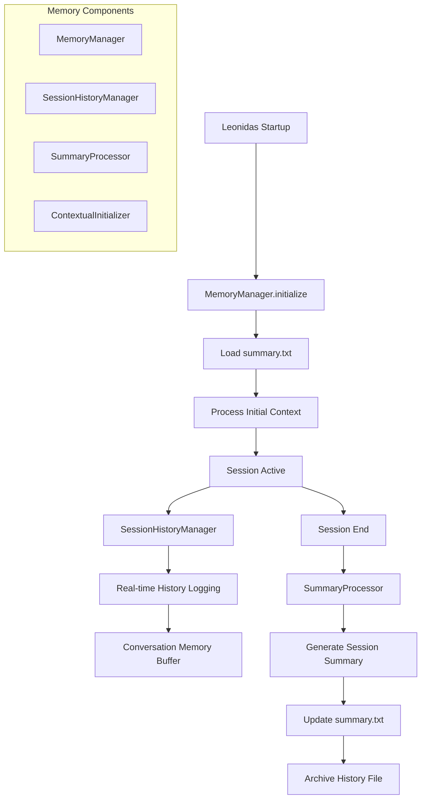

# Design Técnico - Sistema de Memória e Contexto Avançado

## Overview

O sistema de memória e contexto avançado para o Leonidas implementa uma arquitetura de três camadas: **Histórico de Sessões** (dados brutos), **Processamento de Resumo** (inteligência), e **Memória Persistente** (conhecimento acumulado). O design segue os padrões estabelecidos na arquitetura modular do Leonidas (InputManager → Orchestrator → OutputManager) e integra-se nativamente com o sistema de ferramentas existente.

## Architecture

### Visão Geral da Arquitetura



### Integração com Arquitetura Existente

O sistema se integra com a arquitetura modular existente do Leonidas:

```python
# Integração no LeonidasOrchestrator
class LeonidasOrchestrator:
    def __init__(self):
        # Componentes existentes...
        self.memory_manager = MemoryManager()
        self.session_history = SessionHistoryManager()
        
    async def initialize(self):
        # Carregamento de contexto inicial
        await self.memory_manager.initialize()
        initial_context = await self.memory_manager.get_initial_context()
        
        # Processamento contextual inicial usando função think
        if initial_context:
            await self._process_initial_context(initial_context)
```

## Components and Interfaces

### 1. MemoryManager (Componente Principal)

```python
class MemoryManager:
    """Gerenciador principal do sistema de memória."""
    
    def __init__(self, 
                 summary_file: str = "summary.txt",
                 history_dir: str = "history",
                 max_summary_size: int = 50000):
        self.summary_file = Path(summary_file)
        self.history_dir = Path(history_dir)
        self.max_summary_size = max_summary_size
        self.current_context = {}
        
    async def initialize(self) -> dict:
        """Inicializa o sistema de memória e carrega contexto."""
        
    async def get_initial_context(self) -> Optional[dict]:
        """Retorna contexto inicial para nova sessão."""
        
    async def finalize_session(self, session_history: list) -> None:
        """Finaliza sessão e atualiza resumo persistente."""
```

### 2. SessionHistoryManager (Histórico de Sessão)

```python
class SessionHistoryManager:
    """Gerencia histórico da sessão atual."""
    
    def __init__(self, history_dir: str = "history"):
        self.history_dir = Path(history_dir)
        self.current_session_file = None
        self.session_data = []
        self.session_start_time = None
        
    async def start_session(self) -> str:
        """Inicia nova sessão e cria arquivo de histórico."""
        
    async def log_interaction(self, 
                            role: str, 
                            content: str, 
                            metadata: dict = None) -> None:
        """Registra interação no histórico atual."""
        
    async def end_session(self) -> list:
        """Finaliza sessão e retorna dados completos."""
```

### 3. SummaryProcessor (Processamento Inteligente)

```python
class SummaryProcessor:
    """Processa históricos para gerar resumos inteligentes."""
    
    def __init__(self, model: str = "gemini-2.0-flash-live-001"):
        self.model = model
        self.client = genai.Client()
        
    async def process_session_history(self, 
                                    session_data: list) -> dict:
        """Processa histórico de sessão e gera resumo estruturado."""
        
    async def consolidate_summaries(self, 
                                  existing_summary: str, 
                                  new_summary: dict) -> str:
        """Consolida novo resumo com resumo existente."""
        
    async def compress_summary(self, summary: str) -> str:
        """Comprime resumo mantendo informações críticas."""
```

### 4. ContextualInitializer (Inicialização Inteligente)

```python
class ContextualInitializer:
    """Gerencia inicialização contextual do Leonidas."""
    
    def __init__(self, orchestrator):
        self.orchestrator = orchestrator
        
    async def process_initial_context(self, context: dict) -> str:
        """Processa contexto inicial e decide ação de inicialização."""
        
    async def generate_contextual_greeting(self, context: dict) -> str:
        """Gera cumprimento contextual baseado no histórico."""
        
    async def identify_pending_tasks(self, context: dict) -> list:
        """Identifica tarefas pendentes do contexto."""
```

## Data Models

### Estrutura do Arquivo de Histórico

```json
{
  "session_id": "leonidas_20250121_143022",
  "start_time": "2025-01-21T14:30:22.123456",
  "end_time": "2025-01-21T15:45:33.789012",
  "interactions": [
    {
      "timestamp": "2025-01-21T14:30:25.456789",
      "role": "user",
      "content": "Vamos revisar a arquitetura do sistema de autenticação",
      "metadata": {
        "audio_duration": 3.2,
        "confidence": 0.95,
        "agent_state": "listening"
      }
    },
    {
      "timestamp": "2025-01-21T14:30:28.123456",
      "role": "assistant", 
      "content": "Claro! Vou analisar a arquitetura atual...",
      "metadata": {
        "function_calls": ["think", "get_context"],
        "agent_state": "analyzing",
        "response_time_ms": 450
      }
    }
  ],
  "session_summary": {
    "total_interactions": 45,
    "duration_minutes": 75,
    "main_topics": ["arquitetura", "autenticação", "revisão de código"],
    "decisions_made": ["Migrar para OAuth 2.0", "Implementar rate limiting"],
    "pending_tasks": ["Documentar nova API", "Criar testes unitários"]
  }
}
```

### Estrutura do Summary.txt

```
# Leonidas - Resumo de Contexto Acumulado
Última atualização: 2025-01-21 15:45:33

## Contexto Geral
O usuário é um desenvolvedor sênior trabalhando em um sistema de e-commerce complexo. 
Principais tecnologias: Python, FastAPI, PostgreSQL, Redis.
Estilo de trabalho: Prefere arquiteturas modulares e testes abrangentes.

## Decisões Importantes
- [2025-01-21] Migração do sistema de autenticação para OAuth 2.0
- [2025-01-20] Adoção de arquitetura hexagonal para novos módulos
- [2025-01-19] Implementação de rate limiting em todas as APIs

## Tarefas Pendentes
- Documentar nova API de autenticação (prazo: 2025-01-25)
- Criar testes unitários para módulo de pagamentos
- Revisar performance do sistema de busca

## Preferências do Usuário
- Comunicação: Direto e técnico, com exemplos práticos
- Documentação: Prefere markdown com diagramas mermaid
- Código: Segue PEP 8, usa type hints, testes pytest

## Contexto Técnico Atual
Sistema principal: E-commerce com 50k usuários ativos
Arquitetura: Microserviços com API Gateway
Deploy: Docker + Kubernetes em AWS
Monitoramento: Prometheus + Grafana
```

## Error Handling

### Estratégias de Recuperação

1. **Falha no Carregamento do Summary**
   - Fallback para inicialização padrão
   - Log de erro estruturado
   - Criação de summary.txt vazio

2. **Erro no Processamento de Resumo**
   - Retry com backoff exponencial
   - Fallback para resumo simples baseado em templates
   - Preservação do histórico bruto

3. **Corrupção de Arquivo de Histórico**
   - Backup automático antes de modificações
   - Validação de integridade JSON
   - Recuperação de sessões anteriores

4. **Limite de Token Excedido**
   - Compressão automática de contexto
   - Chunking de histórico para processamento
   - Priorização de informações críticas

### Implementação de Error Handling

```python
class MemoryError(Exception):
    """Exceção base para erros do sistema de memória."""
    pass

class SummaryProcessingError(MemoryError):
    """Erro no processamento de resumo."""
    pass

class HistoryCorruptionError(MemoryError):
    """Erro de corrupção no histórico."""
    pass

# Exemplo de tratamento robusto
async def safe_load_summary(self) -> Optional[str]:
    try:
        return await self._load_summary_file()
    except FileNotFoundError:
        logger.warning("Summary file not found, creating new one")
        return None
    except json.JSONDecodeError as e:
        logger.error(f"Summary file corrupted: {e}")
        await self._backup_corrupted_summary()
        return None
    except Exception as e:
        logger.error(f"Unexpected error loading summary: {e}")
        return None
```

## Testing Strategy

### Testes Unitários

1. **MemoryManager Tests**
   - Inicialização com e sem summary existente
   - Carregamento de contexto inicial
   - Finalização de sessão

2. **SessionHistoryManager Tests**
   - Criação de arquivos de histórico únicos
   - Logging de interações em tempo real
   - Finalização e serialização de dados

3. **SummaryProcessor Tests**
   - Processamento de históricos variados
   - Consolidação de resumos
   - Compressão inteligente

4. **ContextualInitializer Tests**
   - Processamento de diferentes tipos de contexto
   - Geração de cumprimentos contextuais
   - Identificação de tarefas pendentes

### Testes de Integração

1. **Fluxo Completo de Sessão**
   - Inicialização → Conversação → Finalização
   - Verificação de persistência entre sessões
   - Validação de continuidade contextual

2. **Cenários de Erro**
   - Recuperação de falhas de processamento
   - Comportamento com arquivos corrompidos
   - Handling de limites de memória

3. **Performance Tests**
   - Processamento de históricos longos
   - Tempo de inicialização com summaries grandes
   - Uso de memória durante sessões extensas

### Estrutura de Testes

```python
# leonidas/tests/test_memory_system.py
class TestMemoryManager:
    async def test_initialize_with_existing_summary(self):
        """Testa inicialização com summary existente."""
        
    async def test_initialize_without_summary(self):
        """Testa inicialização sem summary (primeira execução)."""
        
    async def test_finalize_session_updates_summary(self):
        """Testa se finalização atualiza summary corretamente."""

class TestSessionHistoryManager:
    async def test_unique_session_files(self):
        """Testa criação de arquivos únicos por sessão."""
        
    async def test_real_time_logging(self):
        """Testa logging em tempo real de interações."""

class TestSummaryProcessor:
    async def test_session_summary_generation(self):
        """Testa geração de resumo de sessão."""
        
    async def test_summary_consolidation(self):
        """Testa consolidação de resumos."""
        
    async def test_summary_compression(self):
        """Testa compressão inteligente."""

class TestContextualInitializer:
    async def test_contextual_greeting_generation(self):
        """Testa geração de cumprimento contextual."""
        
    async def test_pending_tasks_identification(self):
        """Testa identificação de tarefas pendentes."""
```

## Performance Considerations

### Otimizações de Performance

1. **Lazy Loading**
   - Carregamento sob demanda de históricos antigos
   - Cache em memória de contexto frequentemente acessado

2. **Processamento Assíncrono**
   - Geração de resumos em background
   - Non-blocking I/O para operações de arquivo

3. **Compressão Inteligente**
   - Algoritmos de compressão baseados em importância
   - Chunking de dados para processamento eficiente

4. **Caching Strategy**
   - Cache de resumos processados
   - Invalidação inteligente baseada em mudanças

### Métricas de Performance

```python
class MemoryPerformanceMetrics:
    def __init__(self):
        self.initialization_time = 0
        self.summary_processing_time = 0
        self.context_loading_time = 0
        self.memory_usage = 0
        self.file_operations_count = 0
        
    def record_operation(self, operation: str, duration: float):
        """Registra métricas de operação."""
        
    def get_performance_report(self) -> dict:
        """Gera relatório de performance."""
```

## Security Considerations

### Proteção de Dados

1. **Sanitização de Conteúdo**
   - Remoção de informações sensíveis antes do armazenamento
   - Validação de entrada para prevenir injection

2. **Controle de Acesso**
   - Permissões adequadas para arquivos de histórico
   - Isolamento de dados entre usuários (futuro)

3. **Backup e Recovery**
   - Backup automático de summaries críticos
   - Estratégias de recovery para dados corrompidos

### Implementação de Segurança

```python
class SecurityManager:
    def __init__(self):
        self.sensitive_patterns = [
            r'\b\d{4}[-\s]?\d{4}[-\s]?\d{4}[-\s]?\d{4}\b',  # Credit cards
            r'\b[A-Za-z0-9._%+-]+@[A-Za-z0-9.-]+\.[A-Z|a-z]{2,}\b',  # Emails
            r'\b\d{3}[-.]?\d{3}[-.]?\d{4}\b'  # Phone numbers
        ]
    
    def sanitize_content(self, content: str) -> str:
        """Remove informações sensíveis do conteúdo."""
        
    def validate_file_access(self, file_path: Path) -> bool:
        """Valida acesso seguro a arquivos."""
```

Este design técnico fornece uma base sólida para implementar o sistema de memória e contexto avançado do Leonidas, mantendo compatibilidade com a arquitetura existente e seguindo as melhores práticas de desenvolvimento estabelecidas no projeto.