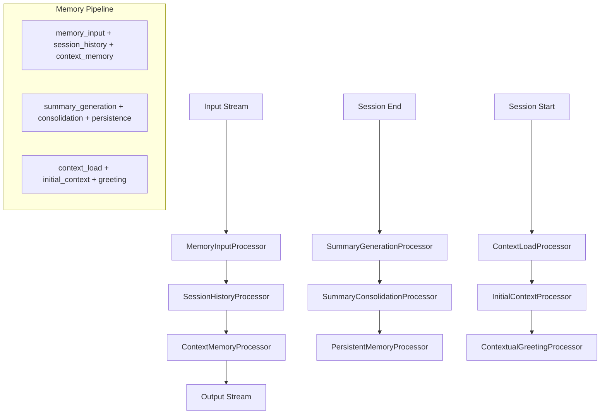

# Design Técnico - Sistema de Memória e Contexto Avançado

## Overview

O sistema de memória e contexto avançado para o Leonidas implementa uma arquitetura baseada em **genai-processors**, utilizando processadores especializados para gerenciar histórico, resumos e contexto. O design segue os padrões fundamentais da biblioteca: processamento assíncrono baseado em streams, composição modular de processadores, e uso de `ProcessorPart` para fluxo de dados.

## Architecture

### Arquitetura Baseada em Processadores



### Integração com Arquitetura Existente do Leonidas

O sistema se integra como processadores na pipeline existente:

```python
# Integração no LeonidasOrchestrator usando padrões genai-processors
class LeonidasOrchestrator(processor.Processor):
    def __init__(self):
        # Pipeline de memória integrada
        self.memory_pipeline = (
            MemoryInputProcessor() +
            SessionHistoryProcessor() +
            ContextMemoryProcessor()
        )
        
        # Pipeline de inicialização
        self.initialization_pipeline = (
            ContextLoadProcessor() +
            InitialContextProcessor() +
            ContextualGreetingProcessor()
        )
        
        # Pipeline de finalização
        self.finalization_pipeline = (
            SummaryGenerationProcessor() +
            SummaryConsolidationProcessor() +
            PersistentMemoryProcessor()
        )
    
    async def call(self, content: AsyncIterable[content_api.ProcessorPart]) -> AsyncIterable[content_api.ProcessorPartTypes]:
        # Processamento com memória integrada
        memory_enhanced_stream = self.memory_pipeline(content)
        
        async for part in memory_enhanced_stream:
            yield part
```

## Components and Interfaces

### 1. MemoryInputProcessor (Entrada de Dados)

```python
class MemoryInputProcessor(processor.Processor):
    """Processa entrada de dados para o sistema de memória."""
    
    def __init__(self, 
                 summary_file: str = "summary.txt",
                 history_dir: str = "history"):
        self.summary_file = Path(summary_file)
        self.history_dir = Path(history_dir)
        
    async def call(self, content: AsyncIterable[content_api.ProcessorPart]) -> AsyncIterable[content_api.ProcessorPartTypes]:
        """Processa stream de entrada adicionando contexto de memória."""
        async for part in content:
            # Adiciona metadata de memória
            part.metadata['memory_timestamp'] = time.time()
            part.metadata['session_id'] = self._get_current_session_id()
            
            # Emite parte original com metadata enriquecida
            yield part
            
            # Emite debug info
            yield processor.debug(f"Memory input processed: {part.role}")
    
    @functools.cached_property
    def key_prefix(self) -> str:
        return f"{self.__class__.__qualname__}:{self.summary_file}"
```

### 2. SessionHistoryProcessor (Histórico de Sessão)

```python
class SessionHistoryProcessor(processor.PartProcessor):
    """Processa e armazena histórico da sessão em tempo real."""
    
    def __init__(self, history_dir: str = "history"):
        self.history_dir = Path(history_dir)
        self.current_session_file = None
        self.session_data = collections.deque(maxlen=10000)
        
    def match(self, part: content_api.ProcessorPart) -> bool:
        """Processa todas as partes que têm conteúdo conversacional."""
        return (content_api.is_text(part.mimetype) and 
                part.role in ['user', 'assistant', 'system'])
    
    async def call(self, part: content_api.ProcessorPart) -> AsyncIterable[content_api.ProcessorPartTypes]:
        """Registra interação no histórico e passa adiante."""
        if self.match(part):
            # Registra no histórico da sessão
            await self._log_interaction(part)
            
            # Emite status de logging
            yield processor.status(f"Logged {part.role} interaction")
        
        # Sempre passa a parte adiante
        yield part
    
    async def _log_interaction(self, part: content_api.ProcessorPart):
        """Registra interação no histórico atual."""
        interaction_data = {
            'timestamp': part.metadata.get('memory_timestamp', time.time()),
            'role': part.role,
            'content': part.text,
            'metadata': part.metadata.copy()
        }
        
        self.session_data.append(interaction_data)
        
        # Persiste periodicamente
        if len(self.session_data) % 10 == 0:
            await self._persist_session_data()
    
    @functools.cached_property
    def key_prefix(self) -> str:
        return f"{self.__class__.__qualname__}:{self.history_dir}"
```

### 3. SummaryGenerationProcessor (Geração de Resumos)

```python
class SummaryGenerationProcessor(processor.Processor):
    """Gera resumos inteligentes usando modelo Gemini."""
    
    def __init__(self, 
                 model: str = "gemini-2.0-flash-live-001",
                 api_key: str = None):
        self.model = model
        self.genai_model = GenaiModel(
            model=model,
            api_key=api_key,
            generation_config={'max_output_tokens': 2000}
        )
        
    async def call(self, content: AsyncIterable[content_api.ProcessorPart]) -> AsyncIterable[content_api.ProcessorPartTypes]:
        """Processa histórico de sessão e gera resumo estruturado."""
        
        # Coleta dados da sessão
        session_parts = []
        async for part in content:
            session_parts.append(part)
            yield part  # Passa adiante
        
        # Gera resumo se há dados suficientes
        if len(session_parts) > 5:  # Mínimo de interações
            summary_prompt = self._create_summary_prompt(session_parts)
            
            # Processa com modelo Gemini
            summary_stream = self.genai_model(streams.stream_content([
                content_api.ProcessorPart(
                    summary_prompt,
                    role='user',
                    substream_name='summary_generation'
                )
            ]))
            
            async for summary_part in summary_stream:
                # Emite resumo gerado
                summary_part.metadata['summary_type'] = 'session_summary'
                summary_part.metadata['source_parts_count'] = len(session_parts)
                yield summary_part
    
    def _create_summary_prompt(self, session_parts: list) -> str:
        """Cria prompt para geração de resumo."""
        conversation_text = "\n".join([
            f"{part.role}: {part.text}" 
            for part in session_parts 
            if content_api.is_text(part.mimetype)
        ])
        
        return f"""
        Analise a seguinte conversa e gere um resumo estruturado em português:

        CONVERSA:
        {conversation_text}

        Gere um resumo no seguinte formato JSON:
        {{
            "contexto_geral": "Resumo do contexto da conversa",
            "decisoes_importantes": ["decisão 1", "decisão 2"],
            "tarefas_pendentes": ["tarefa 1", "tarefa 2"],
            "preferencias_usuario": ["preferência 1", "preferência 2"],
            "contexto_tecnico": "Detalhes técnicos relevantes"
        }}
        """
    
    @functools.cached_property
    def key_prefix(self) -> str:
        return f"{self.__class__.__qualname__}:{self.model}"
```

### 4. PersistentMemoryProcessor (Memória Persistente)

```python
class PersistentMemoryProcessor(processor.PartProcessor):
    """Gerencia memória persistente e arquivo summary.txt."""
    
    def __init__(self, summary_file: str = "summary.txt"):
        self.summary_file = Path(summary_file)
        self.cache = cache.InMemoryCache(
            ttl_hours=24,
            max_items=100,
            hash_fn=self._summary_hash_fn
        )
        
    def match(self, part: content_api.ProcessorPart) -> bool:
        """Processa partes que são resumos de sessão."""
        return (part.metadata.get('summary_type') == 'session_summary' and
                content_api.is_text(part.mimetype))
    
    async def call(self, part: content_api.ProcessorPart) -> AsyncIterable[content_api.ProcessorPartTypes]:
        """Atualiza summary.txt com novo resumo."""
        if self.match(part):
            # Carrega summary existente
            existing_summary = await self._load_existing_summary()
            
            # Consolida com novo resumo
            consolidated_summary = await self._consolidate_summaries(
                existing_summary, part.text
            )
            
            # Persiste summary atualizado
            await self._save_summary(consolidated_summary)
            
            # Emite confirmação
            yield processor.status("Summary.txt updated successfully")
            
            # Emite summary consolidado
            yield content_api.ProcessorPart(
                consolidated_summary,
                role='system',
                metadata={
                    'summary_type': 'consolidated_summary',
                    'updated_at': time.time()
                }
            )
        else:
            yield part
    
    def _summary_hash_fn(self, content: content_api.ProcessorContentTypes) -> str:
        """Hash function customizada para cache de summaries."""
        # Exclui timestamps para cache consistente
        filtered_content = []
        for part in content_api.ProcessorContent(content).all_parts:
            if 'updated_at' not in part.metadata:
                filtered_content.append(part)
        
        return cache.default_processor_content_hash(filtered_content) if filtered_content else None
    
    @functools.cached_property
    def key_prefix(self) -> str:
        return f"{self.__class__.__qualname__}:{self.summary_file}"
```

### 5. ContextLoadProcessor (Carregamento de Contexto)

```python
class ContextLoadProcessor(processor.Processor):
    """Carrega contexto inicial do summary.txt na inicialização."""
    
    def __init__(self, summary_file: str = "summary.txt"):
        self.summary_file = Path(summary_file)
        
    async def call(self, content: AsyncIterable[content_api.ProcessorPart]) -> AsyncIterable[content_api.ProcessorPartTypes]:
        """Carrega contexto inicial e injeta no stream."""
        
        # Carrega summary existente
        summary_content = await self._load_summary_content()
        
        if summary_content:
            # Emite contexto inicial
            yield content_api.ProcessorPart(
                summary_content,
                role='system',
                substream_name='initial_context',
                metadata={
                    'context_type': 'initial_summary',
                    'loaded_at': time.time()
                }
            )
            
            yield processor.debug("Initial context loaded from summary.txt")
        
        # Processa stream original
        async for part in content:
            yield part
    
    async def _load_summary_content(self) -> Optional[str]:
        """Carrega conteúdo do summary.txt."""
        try:
            if self.summary_file.exists():
                return self.summary_file.read_text(encoding='utf-8')
        except Exception as e:
            logging.error(f"Error loading summary: {e}")
        return None
    
    @functools.cached_property
    def key_prefix(self) -> str:
        return f"{self.__class__.__qualname__}:{self.summary_file}"
```

## Data Models

### Estrutura do Arquivo de Histórico

```json
{
  "session_id": "leonidas_20250121_143022",
  "start_time": "2025-01-21T14:30:22.123456",
  "end_time": "2025-01-21T15:45:33.789012",
  "interactions": [
    {
      "timestamp": "2025-01-21T14:30:25.456789",
      "role": "user",
      "content": "Vamos revisar a arquitetura do sistema de autenticação",
      "metadata": {
        "audio_duration": 3.2,
        "confidence": 0.95,
        "agent_state": "listening"
      }
    },
    {
      "timestamp": "2025-01-21T14:30:28.123456",
      "role": "assistant", 
      "content": "Claro! Vou analisar a arquitetura atual...",
      "metadata": {
        "function_calls": ["think", "get_context"],
        "agent_state": "analyzing",
        "response_time_ms": 450
      }
    }
  ],
  "session_summary": {
    "total_interactions": 45,
    "duration_minutes": 75,
    "main_topics": ["arquitetura", "autenticação", "revisão de código"],
    "decisions_made": ["Migrar para OAuth 2.0", "Implementar rate limiting"],
    "pending_tasks": ["Documentar nova API", "Criar testes unitários"]
  }
}
```

### Estrutura do Summary.txt

```
# Leonidas - Resumo de Contexto Acumulado
Última atualização: 2025-01-21 15:45:33

## Contexto Geral
O usuário é um desenvolvedor sênior trabalhando em um sistema de e-commerce complexo. 
Principais tecnologias: Python, FastAPI, PostgreSQL, Redis.
Estilo de trabalho: Prefere arquiteturas modulares e testes abrangentes.

## Decisões Importantes
- [2025-01-21] Migração do sistema de autenticação para OAuth 2.0
- [2025-01-20] Adoção de arquitetura hexagonal para novos módulos
- [2025-01-19] Implementação de rate limiting em todas as APIs

## Tarefas Pendentes
- Documentar nova API de autenticação (prazo: 2025-01-25)
- Criar testes unitários para módulo de pagamentos
- Revisar performance do sistema de busca

## Preferências do Usuário
- Comunicação: Direto e técnico, com exemplos práticos
- Documentação: Prefere markdown com diagramas mermaid
- Código: Segue PEP 8, usa type hints, testes pytest

## Contexto Técnico Atual
Sistema principal: E-commerce com 50k usuários ativos
Arquitetura: Microserviços com API Gateway
Deploy: Docker + Kubernetes em AWS
Monitoramento: Prometheus + Grafana
```

## Error Handling

### Estratégias de Recuperação

1. **Falha no Carregamento do Summary**
   - Fallback para inicialização padrão
   - Log de erro estruturado
   - Criação de summary.txt vazio

2. **Erro no Processamento de Resumo**
   - Retry com backoff exponencial
   - Fallback para resumo simples baseado em templates
   - Preservação do histórico bruto

3. **Corrupção de Arquivo de Histórico**
   - Backup automático antes de modificações
   - Validação de integridade JSON
   - Recuperação de sessões anteriores

4. **Limite de Token Excedido**
   - Compressão automática de contexto
   - Chunking de histórico para processamento
   - Priorização de informações críticas

### Implementação de Error Handling

```python
class MemoryError(Exception):
    """Exceção base para erros do sistema de memória."""
    pass

class SummaryProcessingError(MemoryError):
    """Erro no processamento de resumo."""
    pass

class HistoryCorruptionError(MemoryError):
    """Erro de corrupção no histórico."""
    pass

# Exemplo de tratamento robusto
async def safe_load_summary(self) -> Optional[str]:
    try:
        return await self._load_summary_file()
    except FileNotFoundError:
        logger.warning("Summary file not found, creating new one")
        return None
    except json.JSONDecodeError as e:
        logger.error(f"Summary file corrupted: {e}")
        await self._backup_corrupted_summary()
        return None
    except Exception as e:
        logger.error(f"Unexpected error loading summary: {e}")
        return None
```

## Testing Strategy

### Testes Unitários

1. **MemoryManager Tests**
   - Inicialização com e sem summary existente
   - Carregamento de contexto inicial
   - Finalização de sessão

2. **SessionHistoryManager Tests**
   - Criação de arquivos de histórico únicos
   - Logging de interações em tempo real
   - Finalização e serialização de dados

3. **SummaryProcessor Tests**
   - Processamento de históricos variados
   - Consolidação de resumos
   - Compressão inteligente

4. **ContextualInitializer Tests**
   - Processamento de diferentes tipos de contexto
   - Geração de cumprimentos contextuais
   - Identificação de tarefas pendentes

### Testes de Integração

1. **Fluxo Completo de Sessão**
   - Inicialização → Conversação → Finalização
   - Verificação de persistência entre sessões
   - Validação de continuidade contextual

2. **Cenários de Erro**
   - Recuperação de falhas de processamento
   - Comportamento com arquivos corrompidos
   - Handling de limites de memória

3. **Performance Tests**
   - Processamento de históricos longos
   - Tempo de inicialização com summaries grandes
   - Uso de memória durante sessões extensas

### Estrutura de Testes

```python
# leonidas/tests/test_memory_system.py
class TestMemoryManager:
    async def test_initialize_with_existing_summary(self):
        """Testa inicialização com summary existente."""
        
    async def test_initialize_without_summary(self):
        """Testa inicialização sem summary (primeira execução)."""
        
    async def test_finalize_session_updates_summary(self):
        """Testa se finalização atualiza summary corretamente."""

class TestSessionHistoryManager:
    async def test_unique_session_files(self):
        """Testa criação de arquivos únicos por sessão."""
        
    async def test_real_time_logging(self):
        """Testa logging em tempo real de interações."""

class TestSummaryProcessor:
    async def test_session_summary_generation(self):
        """Testa geração de resumo de sessão."""
        
    async def test_summary_consolidation(self):
        """Testa consolidação de resumos."""
        
    async def test_summary_compression(self):
        """Testa compressão inteligente."""

class TestContextualInitializer:
    async def test_contextual_greeting_generation(self):
        """Testa geração de cumprimento contextual."""
        
    async def test_pending_tasks_identification(self):
        """Testa identificação de tarefas pendentes."""
```

## Performance Considerations

### Otimizações de Performance

1. **Lazy Loading**
   - Carregamento sob demanda de históricos antigos
   - Cache em memória de contexto frequentemente acessado

2. **Processamento Assíncrono**
   - Geração de resumos em background
   - Non-blocking I/O para operações de arquivo

3. **Compressão Inteligente**
   - Algoritmos de compressão baseados em importância
   - Chunking de dados para processamento eficiente

4. **Caching Strategy**
   - Cache de resumos processados
   - Invalidação inteligente baseada em mudanças

### Métricas de Performance

```python
class MemoryPerformanceMetrics:
    def __init__(self):
        self.initialization_time = 0
        self.summary_processing_time = 0
        self.context_loading_time = 0
        self.memory_usage = 0
        self.file_operations_count = 0
        
    def record_operation(self, operation: str, duration: float):
        """Registra métricas de operação."""
        
    def get_performance_report(self) -> dict:
        """Gera relatório de performance."""
```

## Security Considerations

### Proteção de Dados

1. **Sanitização de Conteúdo**
   - Remoção de informações sensíveis antes do armazenamento
   - Validação de entrada para prevenir injection

2. **Controle de Acesso**
   - Permissões adequadas para arquivos de histórico
   - Isolamento de dados entre usuários (futuro)

3. **Backup e Recovery**
   - Backup automático de summaries críticos
   - Estratégias de recovery para dados corrompidos

### Implementação de Segurança

```python
class SecurityManager:
    def __init__(self):
        self.sensitive_patterns = [
            r'\b\d{4}[-\s]?\d{4}[-\s]?\d{4}[-\s]?\d{4}\b',  # Credit cards
            r'\b[A-Za-z0-9._%+-]+@[A-Za-z0-9.-]+\.[A-Z|a-z]{2,}\b',  # Emails
            r'\b\d{3}[-.]?\d{3}[-.]?\d{4}\b'  # Phone numbers
        ]
    
    def sanitize_content(self, content: str) -> str:
        """Remove informações sensíveis do conteúdo."""
        
    def validate_file_access(self, file_path: Path) -> bool:
        """Valida acesso seguro a arquivos."""
```

Este design técnico fornece uma base sólida para implementar o sistema de memória e contexto avançado do Leonidas, mantendo compatibilidade com a arquitetura existente e seguindo as melhores práticas de desenvolvimento estabelecidas no projeto.

### 6. InitialContextProcessor (Processamento de Contexto Inicial)

```python
class InitialContextProcessor(processor.PartProcessor):
    """Processa contexto inicial carregado e prepara para decisão de inicialização."""
    
    def __init__(self):
        self.genai_model = GenaiModel(
            model="gemini-2.0-flash-live-001",
            generation_config={'max_output_tokens': 500}
        )
    
    def match(self, part: content_api.ProcessorPart) -> bool:
        """Processa partes que são contexto inicial."""
        return (part.substream_name == 'initial_context' and
                part.metadata.get('context_type') == 'initial_summary')
    
    async def call(self, part: content_api.ProcessorPart) -> AsyncIterable[content_api.ProcessorPartTypes]:
        """Processa contexto inicial usando função think do modelo."""
        if self.match(part):
            # Cria prompt para análise do contexto
            analysis_prompt = self._create_context_analysis_prompt(part.text)
            
            # Processa com modelo para análise
            analysis_stream = self.genai_model(streams.stream_content([
                content_api.ProcessorPart(
                    analysis_prompt,
                    role='user',
                    substream_name='context_analysis'
                )
            ]))
            
            async for analysis_part in analysis_stream:
                # Emite análise do contexto
                analysis_part.metadata['analysis_type'] = 'initial_context_analysis'
                analysis_part.metadata['source_context_length'] = len(part.text)
                yield analysis_part
        
        # Sempre passa a parte original adiante
        yield part
    
    def _create_context_analysis_prompt(self, context: str) -> str:
        """Cria prompt para análise do contexto inicial."""
        return f"""
        Analise o seguinte resumo de contexto e determine como inicializar a sessão:

        CONTEXTO HISTÓRICO:
        {context}

        Com base neste contexto, responda em JSON:
        {{
            "deve_cumprimentar": true/false,
            "tipo_inicializacao": "contextual|silenciosa|pergunta",
            "tarefas_pendentes_encontradas": ["tarefa1", "tarefa2"],
            "contexto_relevante": "resumo do que é mais relevante",
            "acao_sugerida": "descrição da ação inicial recomendada"
        }}
        """
    
    @functools.cached_property
    def key_prefix(self) -> str:
        return f"{self.__class__.__qualname__}"
```

### 7. ContextualGreetingProcessor (Geração de Cumprimento Contextual)

```python
class ContextualGreetingProcessor(processor.PartProcessor):
    """Gera cumprimento contextual baseado na análise do contexto inicial."""
    
    def __init__(self):
        self.genai_model = GenaiModel(
            model="gemini-2.0-flash-live-001",
            generation_config={'max_output_tokens': 200}
        )
    
    def match(self, part: content_api.ProcessorPart) -> bool:
        """Processa análises de contexto inicial."""
        return part.metadata.get('analysis_type') == 'initial_context_analysis'
    
    async def call(self, part: content_api.ProcessorPart) -> AsyncIterable[content_api.ProcessorPartTypes]:
        """Gera cumprimento contextual baseado na análise."""
        if self.match(part):
            try:
                # Parse da análise JSON
                import json
                analysis = json.loads(part.text)
                
                if analysis.get('deve_cumprimentar', False):
                    # Gera cumprimento contextual
                    greeting_prompt = self._create_greeting_prompt(analysis)
                    
                    greeting_stream = self.genai_model(streams.stream_content([
                        content_api.ProcessorPart(
                            greeting_prompt,
                            role='user',
                            substream_name='greeting_generation'
                        )
                    ]))
                    
                    async for greeting_part in greeting_stream:
                        # Emite cumprimento gerado
                        greeting_part.metadata['greeting_type'] = 'contextual'
                        greeting_part.metadata['initialization_type'] = analysis.get('tipo_inicializacao')
                        greeting_part.role = 'assistant'  # Resposta do Leonidas
                        yield greeting_part
                
                elif analysis.get('tipo_inicializacao') == 'silenciosa':
                    # Emite indicação de inicialização silenciosa
                    yield content_api.ProcessorPart(
                        "",  # Conteúdo vazio para inicialização silenciosa
                        role='system',
                        metadata={
                            'initialization_type': 'silent',
                            'context_processed': True
                        }
                    )
                    
            except json.JSONDecodeError:
                # Fallback para inicialização padrão
                yield processor.debug("Failed to parse context analysis, using default initialization")
        
        # Passa parte original adiante
        yield part
    
    def _create_greeting_prompt(self, analysis: dict) -> str:
        """Cria prompt para geração de cumprimento contextual."""
        return f"""
        Gere um cumprimento natural e contextual em português brasileiro para iniciar uma sessão do Leonidas.

        CONTEXTO DA ANÁLISE:
        - Tipo de inicialização: {analysis.get('tipo_inicializacao')}
        - Tarefas pendentes: {analysis.get('tarefas_pendentes_encontradas', [])}
        - Contexto relevante: {analysis.get('contexto_relevante', '')}
        - Ação sugerida: {analysis.get('acao_sugerida', '')}

        Gere um cumprimento que:
        1. Seja natural e não robótico
        2. Mencione brevemente o contexto relevante
        3. Sugira continuidade se há tarefas pendentes
        4. Seja conciso (máximo 2 frases)
        
        Responda apenas com o cumprimento, sem explicações adicionais.
        """
    
    @functools.cached_property
    def key_prefix(self) -> str:
        return f"{self.__class__.__qualname__}"
```

### 8. Pipeline de Composição Completa

```python
class LeonidasMemorySystem:
    """Sistema completo de memória integrado com genai-processors."""
    
    def __init__(self, 
                 summary_file: str = "summary.txt",
                 history_dir: str = "history",
                 api_key: str = None):
        
        # Processadores individuais
        self.memory_input = MemoryInputProcessor(summary_file, history_dir)
        self.session_history = SessionHistoryProcessor(history_dir)
        self.context_load = ContextLoadProcessor(summary_file)
        self.initial_context = InitialContextProcessor()
        self.contextual_greeting = ContextualGreetingProcessor()
        self.summary_generation = SummaryGenerationProcessor(api_key=api_key)
        self.persistent_memory = PersistentMemoryProcessor(summary_file)
        
        # Pipelines compostas usando padrões genai-processors
        self.initialization_pipeline = (
            self.context_load +
            self.initial_context +
            self.contextual_greeting
        )
        
        self.runtime_pipeline = (
            self.memory_input +
            self.session_history
        )
        
        self.finalization_pipeline = (
            self.summary_generation +
            self.persistent_memory
        )
    
    def get_initialization_processor(self) -> processor.Processor:
        """Retorna pipeline de inicialização."""
        return self.initialization_pipeline
    
    def get_runtime_processor(self) -> processor.Processor:
        """Retorna pipeline de runtime."""
        return self.runtime_pipeline
    
    def get_finalization_processor(self) -> processor.Processor:
        """Retorna pipeline de finalização."""
        return self.finalization_pipeline
    
    async def initialize_session(self) -> AsyncIterable[content_api.ProcessorPart]:
        """Inicializa sessão com contexto carregado."""
        # Stream vazio para trigger de inicialização
        empty_stream = streams.stream_content([
            content_api.ProcessorPart(
                "",
                role='system',
                metadata={'trigger': 'session_initialization'}
            )
        ])
        
        async for part in self.initialization_pipeline(empty_stream):
            yield part
    
    async def finalize_session(self, session_data: list) -> AsyncIterable[content_api.ProcessorPart]:
        """Finaliza sessão e processa resumo."""
        # Converte dados da sessão para stream
        session_stream = streams.stream_content([
            content_api.ProcessorPart(
                interaction['content'],
                role=interaction['role'],
                metadata=interaction.get('metadata', {})
            )
            for interaction in session_data
        ])
        
        async for part in self.finalization_pipeline(session_stream):
            yield part
```