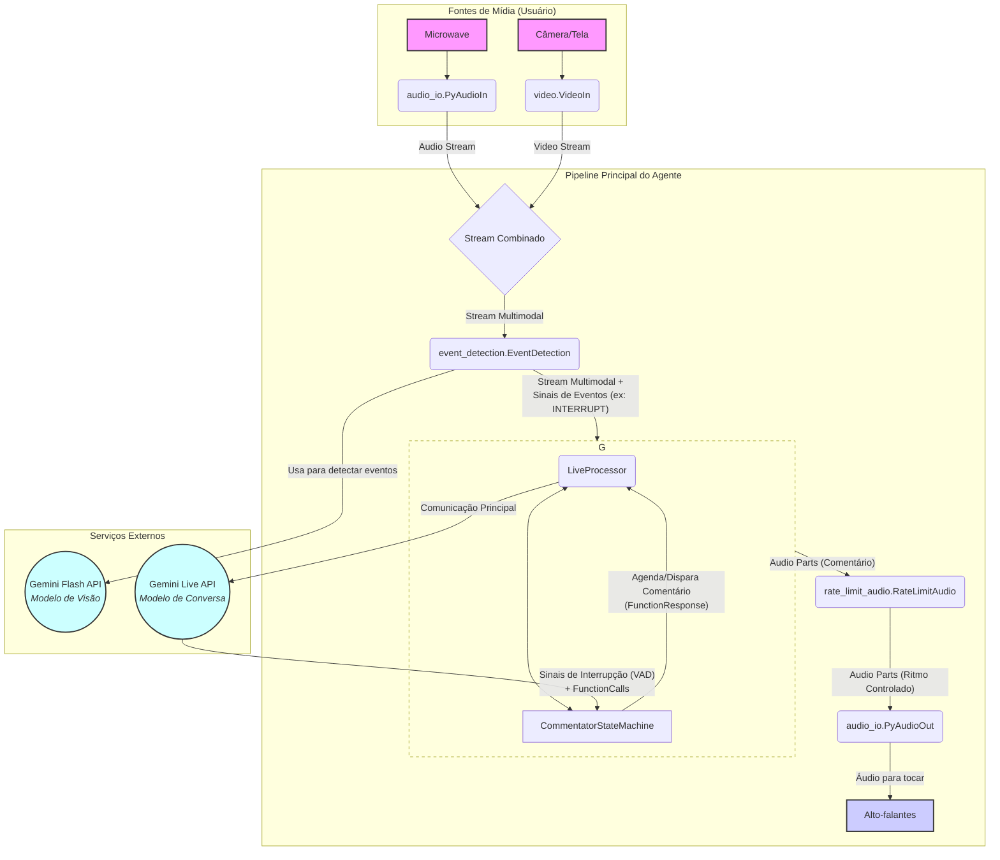

# Commentator Diagram

```mermaid
graph TD
    subgraph "Fontes de Mídia (Usuário)"
        A[Microwave] --> B(audio_io.PyAudioIn);
        C[Câmera/Tela] --> D(video.VideoIn);
    end

    subgraph "Pipeline Principal do Agente"
        B -- "Audio Stream" --> E{Stream Combinado};
        D -- "Video Stream" --> E;

        E -- "Stream Multimodal" --> F(event_detection.EventDetection);
        F -- "Stream Multimodal +<br>Sinais de Eventos (ex: INTERRUPT)" --> G[LiveCommentator Processor];

        subgraph G
            direction LR
            H(LiveProcessor) <--> I[CommentatorStateMachine];
            I -- "Agenda/Dispara Comentário<br>(FunctionResponse)" --> H;
        end

        G -- "Audio Parts (Comentário)" --> K(rate_limit_audio.RateLimitAudio);
        K -- "Audio Parts (Ritmo Controlado)" --> L(audio_io.PyAudioOut);
        L -- "Áudio para tocar" --> M[Alto-falantes];
    end

    subgraph "Serviços Externos"
        F -- "Usa para detectar eventos" --> N((Gemini Flash API<br><i>Modelo de Visão</i>));
        H -- "Comunicação Principal" --> O((Gemini Live API<br><i>Modelo de Conversa</i>));
        O -- "Sinais de Interrupção (VAD)<br>+ FunctionCalls" --> I;
    end

    style A fill:#f9f,stroke:#333,stroke-width:2px
    style C fill:#f9f,stroke:#333,stroke-width:2px
    style M fill:#ccf,stroke:#333,stroke-width:2px
    style N fill:#cff,stroke:#333,stroke-width:2px
    style O fill:#cff,stroke:#333,stroke-width:2px
    style G stroke-dasharray: 5 5
```
