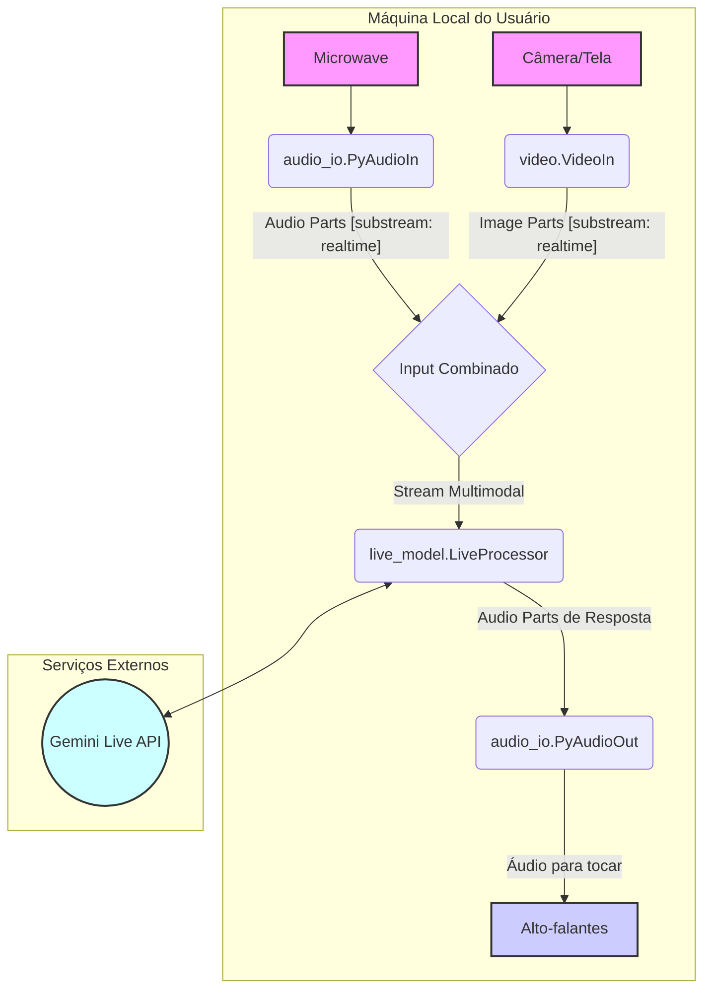

# Live Simple CLI Diagram

```mermaid
graph TD
    subgraph "Máquina Local do Usuário"
        A[Microwave] --> B(audio_io.PyAudioIn);
        C[Câmera/Tela] --> D(video.VideoIn);
        B -- "Audio Parts [substream: realtime]" --> E{Input Combinado};
        D -- "Image Parts [substream: realtime]" --> E;
        E -- "Stream Multimodal" --> F(live_model.LiveProcessor);
        F -- "Audio Parts de Resposta" --> G(audio_io.PyAudioOut);
        G -- "Áudio para tocar" --> H[Alto-falantes];
    end

    subgraph "Serviços Externos"
        F <--> I((Gemini Live API));
    end

    style A fill:#f9f,stroke:#333,stroke-width:2px
    style C fill:#f9f,stroke:#333,stroke-width:2px
    style H fill:#ccf,stroke:#333,stroke-width:2px
    style I fill:#cff,stroke:#333,stroke-width:2px
```
