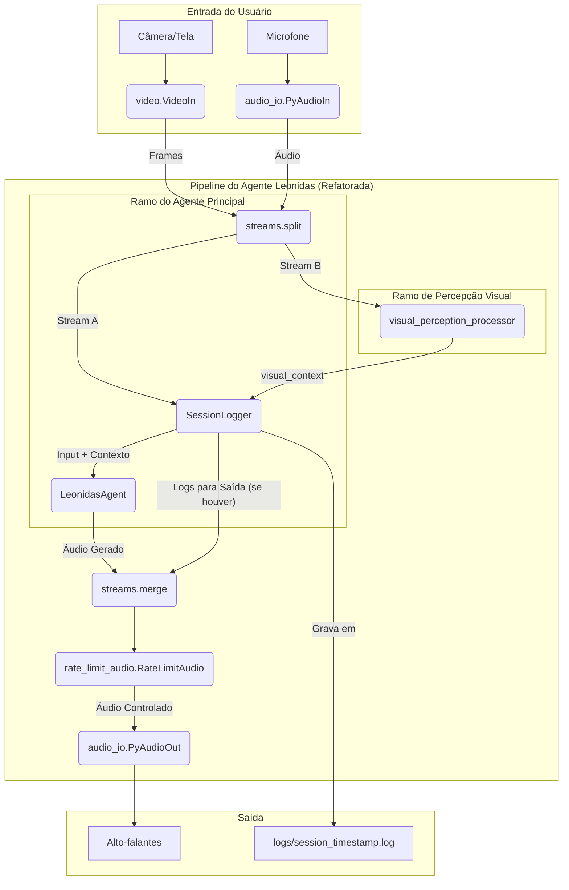

# Documento de Design do Projeto (PDR): Leonidas v1.0

**Autor:** Arquiteto-Chefe de IA
**Data:** 24 de Maio de 2024
**Status:** Proposto

## 1. Visão Geral e Objetivos

O projeto Leonidas visa criar uma interface de IA multimodal (voz e visão) que atue como um colaborador de desenvolvimento de software. Diferente de assistentes reativos, Leonidas deve possuir uma capacidade de "pensamento" secundária que lhe permita analisar o contexto da tarefa, aprender com as interações e intervir proativamente com insights e correções relevantes.

**Objetivos Principais:**
- **Estabilidade:** Criar uma arquitetura robusta que permita desenvolvimento incremental.
- **Inteligência Contextual:** O agente deve entender o que está sendo trabalhado, não apenas responder a comandos isolados.
- **Comportamento Humano:** O agente deve ser primariamente um ouvinte, falando apenas quando necessário ou quando tiver uma contribuição valiosa.
- **Memória:** O agente deve ser capaz de armazenar e recuperar informações de interações passadas.

## 2. Arquitetura Proposta: Múltiplos Sistemas Concorrentes

A arquitetura evoluiu de um "Sistema Duplo" para um modelo de **N-Sistemas Concorrentes**. Esta abordagem permite que múltiplos processadores especializados operem em paralelo, cada um com a capacidade de analisar o fluxo de dados e interromper o agente principal quando um evento relevante for detectado.

- **Agente Principal (O Atuador):** `LeonidasAgent`. É o único componente que interage diretamente com o usuário (fala). Ele é primariamente reativo, otimizado para baixa latência.
- **Sistemas Auxiliares (Os Sentidos e Pensamentos):** Uma coleção de processadores paralelos (`VisualPerception`, `CognitiveAnalyzer`, etc.). Cada um atua como um "sentido" ou um "processo de pensamento" independente. Eles analisam o ambiente e a conversa, mas não falam diretamente. Sua principal saída são sinais de **contexto** ou de **interrupção**.

**Princípio da Interrupção Universal e Criteriosa:** Qualquer sistema auxiliar pode solicitar uma interrupção do Agente Principal. No entanto, essa interrupção deve ser criteriosa, reservada para eventos de alta relevância (insights, correções, mudanças drásticas no ambiente visual) para simular um comportamento humano e evitar um fluxo constante de comentários.

## 3. Detalhamento dos Componentes

### 3.1. `VisualPerception` (Sistema Auxiliar: Percepção Visual)
- **Responsabilidade:** Atuar como os "olhos" passivos do sistema. Sua função é dupla:
    1.  **Fornecer Contexto Passivo:** Gerar continuamente descrições textuais concisas do que o usuário está fazendo (ex: "usuário está editando o arquivo X.py").
    2.  **Gerar Interrupções Visuais:** Identificar eventos visuais "absurdos" ou de alta importância (ex: uma nova pessoa entra no quadro, uma mensagem de erro crítica aparece na tela) e emitir um sinal de interrupção.
- **Tecnologia:** `genai_processors.core.event_detection` reconfigurado com um prompt mais sofisticado.
- **Fluxo de Dados:** O fluxo de vídeo é enviado em paralelo para o `VisualPerception`. Sua saída (substream `visual_context`) é mesclada de volta ao fluxo de entrada do `LeonidasAgent`.

### 3.2. `LeonidasAgent` (Agente Principal)
- **Responsabilidade:** Gerenciar a conversação em tempo real com o usuário.
- **Tecnologia:** `genai_processors.core.live_model` (`LiveProcessor`).
- **Fluxo de Dados:**
    - **Entrada:** Áudio do usuário, contexto do `VisualPerception`, sinais de interrupção de **qualquer** sistema auxiliar.
    - **Saída:** Áudio de resposta para o usuário, transcrição da sua própria resposta para os sistemas auxiliares.
- **Comportamento Chave:** **Totalmente reativo.** Não inicia a fala. Apenas responde ao usuário ou a um sinal de interrupção. A lógica de agendamento de comentários foi removida.

### 3.3. `CognitiveAnalyzer` (Sistema Auxiliar: Análise Cognitiva)
- **Responsabilidade:** Analisar o diálogo completo (usuário e Leonidas) e o contexto para gerar insights ou correções. É o "pensador" de segunda ordem.
- **Tecnologia:** Novo `processor.Processor` contendo um `genai_model.GenaiModel`.
- **Fluxo de Dados:**
    - **Entrada:** Transcrição do usuário, transcrição do `LeonidasAgent`, contexto do `VisualPerception`, dados da `MemoryStore`.
    - **Saída:** Um sinal de interrupção (`interrupt_request`) contendo o texto do insight, direcionado ao `LeonidasAgent`.

### 3.4. `MemoryStore` (Camada de Memória)
- **Responsabilidade:** Persistir e recuperar dados de interações passadas.
- **Tecnologia:** (A ser definida) Inicialmente pode ser um arquivo de log estruturado (JSONL), evoluindo para um banco de dados vetorial.
- **Fluxo de Dados:** O `CognitiveAnalyzer` lê e escreve nesta camada.

## 4. Diagrama da Arquitetura Implementada

O diagrama abaixo ilustra a estrutura da pipeline após a refatoração, com os fluxos de dados paralelos e o novo `SessionLogger`.

## 5. Plano de Implementação Futuro

Com a arquitetura paralela e o logging estabelecidos, as próximas fases se concentrarão em ativar o "Sistema 2":

1.  **Fase 3: Introdução do Sistema 2 (Passivo).** Adicionar o `CognitiveAnalyzer` como um terceiro ramo paralelo na pipeline, mas com uma implementação "passthrough" (sem lógica) para validar a estrutura.
2.  **Fase 4: Ativação do Sistema 2 (Ativo).** Implementar a lógica de análise e interrupção no `CognitiveAnalyzer`, fazendo-o consumir as transcrições do usuário e do agente.
3.  **Fase 5: Implementação da Memória.** Conectar o `CognitiveAnalyzer` a uma `MemoryStore` inicial para persistir aprendizados entre sessões.
