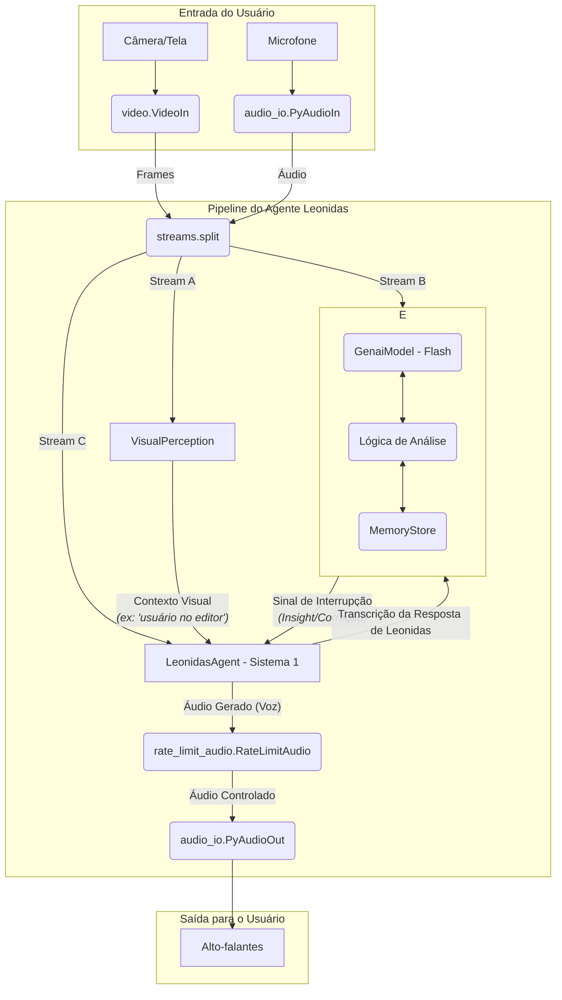

# Leonidas Agent - Visão e Arquitetura Alvo

Este documento descreve a arquitetura final desejada para o agente Leonidas, transformando-o em um colaborador de IA pensante e multimodal.

## Visão do Agente

Leonidas deve se comportar como um parceiro de trabalho humano. Ele não deve falar incessantemente. Em vez disso, ele deve observar, ouvir, entender o contexto e intervir de forma inteligente e proativa apenas quando tiver um insight valioso, uma correção ou quando for diretamente solicitado.

## Arquitetura Conceitual: Sistema Duplo

A arquitetura será baseada em um modelo de "sistema duplo", inspirado na psicologia cognitiva:

1.  **Sistema 1 (O Falante Rápido):** O `LeonidasAgent` principal. É responsável pela interação direta e em tempo real com o usuário. Ele é reativo, rápido e lida com o fluxo da conversação (ouvir o usuário, responder diretamente). Ele opera com o contexto fornecido, mas não realiza análises profundas por conta própria.

2.  **Sistema 2 (O Pensador Lento):** O `CognitiveAnalyzer`. É um sistema secundário que opera em paralelo. Ele recebe todas as mesmas informações que o Sistema 1, **além das respostas do próprio Sistema 1**. Sua função é analisar a conversa em um nível mais profundo, consultar a memória e o contexto visual, e "pensar" sobre o quadro geral. Ele só se manifesta quando gera um "insight" ou uma "correção", momento em que ele interrompe o Sistema 1.

## Componentes e Fluxo de Dados

O fluxo de dados será orquestrado da seguinte maneira:

- **`VisualPerception`**: Atua como os "olhos" passivos do sistema. Ele analisa o feed de vídeo e gera descrições textuais concisas do que está acontecendo (ex: "usuário está no arquivo X.py"). Este é o **contexto visual**.

- **`LeonidasAgent` (Sistema 1)**:
    - Recebe o áudio do usuário e o **contexto visual** do `VisualPerception`.
    - Interage com a API Gemini Live para conversas em tempo real.
    - **Não é proativo**. Só fala quando o usuário fala ou quando é interrompido pelo Sistema 2.
    - Envia a transcrição de suas próprias respostas para o Sistema 2.

- **`CognitiveAnalyzer` (Sistema 2)**:
    - Recebe o áudio/transcrição do usuário, o contexto visual e a **transcrição da resposta do Sistema 1**.
    - Interage com a `MemoryStore` para buscar informações passadas e armazenar novos aprendizados.
    - Usa um modelo de linguagem para analisar a coerência, a precisão e a estratégia da conversa.
    - Se detectar uma oportunidade (insight, correção), ele gera um **sinal de interrupção** com o texto do insight, que é enviado ao `LeonidasAgent`.

- **`MemoryStore`**: Uma camada de persistência que armazena o histórico de interações, decisões e feedbacks. O Sistema 2 a utiliza para embasar seu "pensamento".

## Diagrama da Arquitetura Alvo

