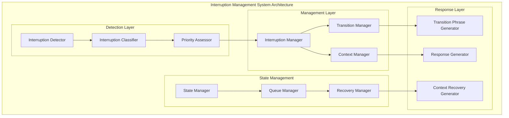

# Leonidas System - Interruption Management System Specification v1.4

## Overview

O **Interruption Management System** é responsável por gerenciar interrupções de forma inteligente e natural, permitindo transições suaves durante conversas, pausas graciosamente quando necessário e retomando o contexto adequadamente após interrupções.

## Architecture Overview

### Core Components



## Technical Specifications

### Interruption Detection and Classification

```python
@dataclass
class InterruptionEvent:
    """Represents an interruption event."""
    
    # Identification
    interruption_id: str
    timestamp: datetime
    source: str  # user_speech, visual_change, critical_sound, etc.
    
    # Classification
    interruption_type: str
    priority: str  # critical, high, medium, low
    urgency: float  # 0.0 to 1.0
    
    # Context
    current_state: str
    speech_progress: float  # 0.0 to 1.0 (how much of response was spoken)
    context_data: Dict[str, Any]
    
    # Metadata
    confidence: float
    processing_time_ms: float
    requires_immediate_response: bool

class InterruptionClassifier:
    """Classifies different types of interruptions."""
    
    INTERRUPTION_TYPES = {
        'USER_SPEECH': {
            'description': 'User started speaking',
            'default_priority': 'high',
            'requires_pause': True,
            'context_preservation': True
        },
        'CRITICAL_SOUND': {
            'description': 'Critical sound detected (alarm, emergency)',
            'default_priority': 'critical',
            'requires_pause': True,
            'context_preservation': False
        },
        'VISUAL_CHANGE': {
            'description': 'Significant visual change detected',
            'default_priority': 'medium',
            'requires_pause': False,
            'context_preservation': True
        },
        'COGNITIVE_INSIGHT': {
            'description': 'Important cognitive insight available',
            'default_priority': 'medium',
            'requires_pause': False,
            'context_preservation': True
        },
        'SYSTEM_ERROR': {
            'description': 'System error requiring attention',
            'default_priority': 'high',
            'requires_pause': True,
            'context_preservation': True
        },
        'TIMEOUT': {
            'description': 'Response timeout or extended pause',
            'default_priority': 'low',
            'requires_pause': False,
            'context_preservation': True
        }
    }
    
    def __init__(self):
        self.classification_models = self._initialize_classification_models()
        self.priority_calculator = PriorityCalculator()
        
    async def classify_interruption(self, 
                                  interruption_signal: Dict[str, Any],
                                  current_context: Dict[str, Any]) -> InterruptionEvent:
        """Classify an interruption event."""
        
        # Determine interruption type
        interruption_type = await self._determine_interruption_type(interruption_signal)
        
        # Calculate priority and urgency
        priority, urgency = await self.priority_calculator.calculate_priority(
            interruption_type,
            interruption_signal,
            current_context
        )
        
        # Create interruption event
        event = InterruptionEvent(
            interruption_id=str(uuid.uuid4()),
            timestamp=datetime.now(),
            source=interruption_signal.get('source', 'unknown'),
            interruption_type=interruption_type,
            priority=priority,
            urgency=urgency,
            current_state=current_context.get('current_state', 'unknown'),
            speech_progress=current_context.get('speech_progress', 0.0),
            context_data=current_context,
            confidence=interruption_signal.get('confidence', 0.8),
            processing_time_ms=0.0,  # Will be set by caller
            requires_immediate_response=self._requires_immediate_response(interruption_type, urgency)
        )
        
        return event
    
    def _requires_immediate_response(self, interruption_type: str, urgency: float) -> bool:
        """Determine if interruption requires immediate response."""
        
        immediate_types = ['USER_SPEECH', 'CRITICAL_SOUND', 'SYSTEM_ERROR']
        return interruption_type in immediate_types or urgency > 0.8

class IntelligentInterruptionManager:
    """Main interruption management system."""
    
    def __init__(self, config: InterruptionConfig):
        self.config = config
        
        # Core components
        self.classifier = InterruptionClassifier()
        self.transition_manager = TransitionManager(config.transition_config)
        self.context_manager = InterruptionContextManager()
        self.recovery_manager = RecoveryManager()
        
        # State management
        self.current_state = InterruptionState.NORMAL
        self.interruption_queue = asyncio.PriorityQueue()
        self.active_interruptions = {}
        
        # Performance tracking
        self.performance_metrics = InterruptionPerformanceMetrics()
        
    async def handle_interruption(self, 
                                interruption_signal: Dict[str, Any],
                                current_context: Dict[str, Any]) -> InterruptionResponse:
        """Handle an interruption event."""
        
        start_time = time.time()
        
        try:
            # Classify interruption
            interruption_event = await self.classifier.classify_interruption(
                interruption_signal,
                current_context
            )
            
            # Determine response strategy
            response_strategy = await self._determine_response_strategy(
                interruption_event,
                current_context
            )
            
            # Execute interruption handling
            response = await self._execute_interruption_handling(
                interruption_event,
                response_strategy,
                current_context
            )
            
            # Update performance metrics
            processing_time = time.time() - start_time
            self.performance_metrics.record_interruption_handled(processing_time)
            
            return response
            
        except Exception as e:
            self.performance_metrics.record_interruption_error()
            logging.error(f"Interruption handling error: {e}")
            raise
    
    async def _determine_response_strategy(self, 
                                         interruption_event: InterruptionEvent,
                                         current_context: Dict[str, Any]) -> str:
        """Determine the best response strategy for the interruption."""
        
        # Strategy decision matrix
        if interruption_event.priority == 'critical':
            return 'IMMEDIATE_STOP'
        elif interruption_event.interruption_type == 'USER_SPEECH':
            if interruption_event.urgency > 0.8:
                return 'GRACEFUL_PAUSE'
            else:
                return 'SMOOTH_TRANSITION'
        elif interruption_event.priority == 'high':
            return 'CONTEXTUAL_PAUSE'
        else:
            return 'QUEUE_FOR_LATER'
    
    async def _execute_interruption_handling(self,
                                           interruption_event: InterruptionEvent,
                                           strategy: str,
                                           current_context: Dict[str, Any]) -> InterruptionResponse:
        """Execute the interruption handling strategy."""
        
        if strategy == 'IMMEDIATE_STOP':
            return await self._immediate_stop(interruption_event, current_context)
        elif strategy == 'GRACEFUL_PAUSE':
            return await self._graceful_pause(interruption_event, current_context)
        elif strategy == 'SMOOTH_TRANSITION':
            return await self._smooth_transition(interruption_event, current_context)
        elif strategy == 'CONTEXTUAL_PAUSE':
            return await self._contextual_pause(interruption_event, current_context)
        else:  # QUEUE_FOR_LATER
            return await self._queue_for_later(interruption_event, current_context)
```### Tra
nsition Management

```python
class TransitionManager:
    """Manages smooth transitions during interruptions."""
    
    def __init__(self, config: TransitionConfig):
        self.config = config
        self.phrase_generator = TransitionPhraseGenerator()
        self.timing_calculator = TransitionTimingCalculator()
        
    async def create_smooth_transition(self,
                                     interruption_event: InterruptionEvent,
                                     current_context: Dict[str, Any]) -> TransitionResponse:
        """Create a smooth transition for interruption."""
        
        # Calculate optimal transition timing
        transition_timing = await self.timing_calculator.calculate_timing(
            interruption_event,
            current_context
        )
        
        # Generate appropriate transition phrase
        transition_phrase = await self.phrase_generator.generate_phrase(
            interruption_event.interruption_type,
            current_context.get('current_topic', ''),
            transition_timing.pause_duration
        )
        
        # Create transition response
        response = TransitionResponse(
            transition_phrase=transition_phrase,
            pause_duration=transition_timing.pause_duration,
            fade_out_duration=transition_timing.fade_out_duration,
            context_preservation=transition_timing.preserve_context,
            recovery_strategy=transition_timing.recovery_strategy
        )
        
        return response

class TransitionPhraseGenerator:
    """Generates contextually appropriate transition phrases."""
    
    TRANSITION_PHRASES = {
        'USER_SPEECH': {
            'immediate': [
                "Desculpe, vou pausar para ouvir você.",
                "Claro, me diga.",
                "Sim, estou ouvindo."
            ],
            'polite': [
                "Perdão, deixe-me pausar aqui para ouvir sua pergunta.",
                "Claro, vou parar por um momento. O que você gostaria de saber?",
                "Sem problemas, estou aqui para ouvir."
            ],
            'contextual': [
                "Vou pausar minha explicação sobre {topic} para ouvir você.",
                "Deixe-me interromper este ponto sobre {topic} - o que você precisa?",
                "Posso continuar falando sobre {topic} depois. Me diga."
            ]
        },
        'CRITICAL_SOUND': {
            'immediate': [
                "Detectei um som importante. Vou pausar.",
                "Há algo que requer atenção. Pausando.",
                "Som crítico detectado. Interrompendo."
            ]
        },
        'VISUAL_CHANGE': {
            'observational': [
                "Vejo que algo mudou. Deixe-me verificar.",
                "Notei uma mudança visual. Um momento.",
                "Algo chamou minha atenção visualmente."
            ]
        },
        'COGNITIVE_INSIGHT': {
            'thoughtful': [
                "Tenho uma observação importante sobre isso.",
                "Acabei de perceber algo relevante.",
                "Há um ponto adicional que gostaria de mencionar."
            ]
        }
    }
    
    async def generate_phrase(self,
                            interruption_type: str,
                            current_topic: str,
                            pause_duration: float) -> str:
        """Generate appropriate transition phrase."""
        
        phrases = self.TRANSITION_PHRASES.get(interruption_type, {})
        
        # Select phrase category based on pause duration
        if pause_duration < 1.0:
            category = 'immediate'
        elif pause_duration < 3.0:
            category = 'polite'
        else:
            category = 'contextual'
        
        # Get phrases for category
        category_phrases = phrases.get(category, phrases.get('immediate', ['Um momento.']))
        
        # Select phrase
        selected_phrase = random.choice(category_phrases)
        
        # Replace placeholders
        if '{topic}' in selected_phrase and current_topic:
            selected_phrase = selected_phrase.replace('{topic}', current_topic)
        
        return selected_phrase

### Context Recovery System

```python
class RecoveryManager:
    """Manages context recovery after interruptions."""
    
    def __init__(self):
        self.context_store = InterruptionContextStore()
        self.recovery_strategy_selector = RecoveryStrategySelector()
        self.continuation_generator = ContinuationGenerator()
        
    async def prepare_recovery(self,
                             interruption_event: InterruptionEvent,
                             pre_interruption_context: Dict[str, Any]) -> RecoveryPlan:
        """Prepare recovery plan for after interruption."""
        
        # Store context for recovery
        context_id = await self.context_store.store_context(
            interruption_event.interruption_id,
            pre_interruption_context
        )
        
        # Select recovery strategy
        recovery_strategy = await self.recovery_strategy_selector.select_strategy(
            interruption_event,
            pre_interruption_context
        )
        
        # Create recovery plan
        plan = RecoveryPlan(
            context_id=context_id,
            recovery_strategy=recovery_strategy,
            continuation_point=pre_interruption_context.get('speech_progress', 0.0),
            topic_context=pre_interruption_context.get('current_topic', ''),
            estimated_recovery_time=self._estimate_recovery_time(recovery_strategy)
        )
        
        return plan
    
    async def execute_recovery(self, recovery_plan: RecoveryPlan) -> RecoveryResponse:
        """Execute context recovery after interruption."""
        
        # Retrieve stored context
        stored_context = await self.context_store.retrieve_context(recovery_plan.context_id)
        
        # Generate continuation
        continuation = await self.continuation_generator.generate_continuation(
            recovery_plan.recovery_strategy,
            stored_context,
            recovery_plan.continuation_point
        )
        
        # Create recovery response
        response = RecoveryResponse(
            continuation_text=continuation.text,
            context_summary=continuation.context_summary,
            recovery_successful=continuation.success,
            recovery_confidence=continuation.confidence
        )
        
        return response

class ContinuationGenerator:
    """Generates natural continuations after interruptions."""
    
    CONTINUATION_TEMPLATES = {
        'RESUME_EXACT': [
            "Como eu estava dizendo, {previous_content}",
            "Voltando ao que eu estava explicando, {previous_content}",
            "Continuando de onde parei, {previous_content}"
        ],
        'RESUME_SUMMARY': [
            "Para resumir o que eu estava explicando sobre {topic}: {summary}",
            "Voltando ao tópico de {topic}, o ponto principal é: {summary}",
            "Retomando nossa discussão sobre {topic}: {summary}"
        ],
        'CONTEXTUAL_BRIDGE': [
            "Agora que resolvemos isso, voltemos a {topic}. {continuation}",
            "Certo, retornando ao nosso tópico sobre {topic}: {continuation}",
            "Perfeito. Onde estávamos? Ah sim, {topic}. {continuation}"
        ],
        'FRESH_START': [
            "Vamos recomeçar com {topic}.",
            "Deixe-me abordar {topic} novamente.",
            "Vou explicar {topic} de forma mais clara."
        ]
    }
    
    async def generate_continuation(self,
                                  recovery_strategy: str,
                                  stored_context: Dict[str, Any],
                                  continuation_point: float) -> ContinuationResult:
        """Generate natural continuation after interruption."""
        
        topic = stored_context.get('current_topic', 'o tópico')
        previous_content = stored_context.get('previous_speech', '')
        
        # Select template based on strategy
        templates = self.CONTINUATION_TEMPLATES.get(recovery_strategy, 
                                                   self.CONTINUATION_TEMPLATES['RESUME_SUMMARY'])
        
        selected_template = random.choice(templates)
        
        # Generate continuation based on strategy
        if recovery_strategy == 'RESUME_EXACT' and continuation_point > 0.5:
            # Resume from where we left off
            continuation_text = selected_template.format(
                previous_content=previous_content[-100:] if previous_content else topic
            )
        elif recovery_strategy == 'RESUME_SUMMARY':
            # Provide summary and continue
            summary = await self._generate_summary(stored_context)
            continuation_text = selected_template.format(
                topic=topic,
                summary=summary
            )
        elif recovery_strategy == 'CONTEXTUAL_BRIDGE':
            # Bridge from interruption back to topic
            continuation = await self._generate_bridge_continuation(stored_context)
            continuation_text = selected_template.format(
                topic=topic,
                continuation=continuation
            )
        else:  # FRESH_START
            continuation_text = selected_template.format(topic=topic)
        
        return ContinuationResult(
            text=continuation_text,
            context_summary=f"Resuming discussion about {topic}",
            success=True,
            confidence=0.85
        )

### Queue Management for Multiple Interruptions

```python
class InterruptionQueueManager:
    """Manages queue of multiple interruptions."""
    
    def __init__(self, config: QueueConfig):
        self.config = config
        self.priority_queue = asyncio.PriorityQueue()
        self.active_interruptions = {}
        self.queue_processor = QueueProcessor()
        
    async def queue_interruption(self, interruption_event: InterruptionEvent) -> bool:
        """Queue an interruption for processing."""
        
        # Calculate priority score (lower number = higher priority)
        priority_score = self._calculate_priority_score(interruption_event)
        
        # Create queue item
        queue_item = QueueItem(
            priority=priority_score,
            interruption_event=interruption_event,
            queued_at=datetime.now()
        )
        
        try:
            await self.priority_queue.put(queue_item)
            return True
        except asyncio.QueueFull:
            logging.warning("Interruption queue full, dropping low priority interruption")
            return False
    
    async def process_interruption_queue(self) -> AsyncIterable[InterruptionEvent]:
        """Process interruptions from queue in priority order."""
        
        while True:
            try:
                # Get next interruption
                queue_item = await asyncio.wait_for(
                    self.priority_queue.get(),
                    timeout=1.0
                )
                
                # Check if interruption is still relevant
                if self._is_interruption_still_relevant(queue_item):
                    yield queue_item.interruption_event
                
                # Mark task as done
                self.priority_queue.task_done()
                
            except asyncio.TimeoutError:
                # No interruptions in queue
                continue
            except Exception as e:
                logging.error(f"Queue processing error: {e}")
    
    def _calculate_priority_score(self, interruption_event: InterruptionEvent) -> float:
        """Calculate priority score for queue ordering."""
        
        base_scores = {
            'critical': 1.0,
            'high': 10.0,
            'medium': 50.0,
            'low': 100.0
        }
        
        base_score = base_scores.get(interruption_event.priority, 50.0)
        
        # Adjust based on urgency
        urgency_adjustment = (1.0 - interruption_event.urgency) * 10.0
        
        # Adjust based on age (older interruptions get higher priority)
        age_seconds = (datetime.now() - interruption_event.timestamp).total_seconds()
        age_adjustment = min(age_seconds / 10.0, 20.0)  # Max 20 point boost
        
        final_score = base_score + urgency_adjustment - age_adjustment
        
        return max(1.0, final_score)

## Configuration

```python
@dataclass
class InterruptionConfig:
    # Detection settings
    interruption_sensitivity: str = "medium"  # high, medium, low
    min_interruption_confidence: float = 0.7
    
    # Response settings
    max_response_time_ms: float = 200.0
    default_pause_duration: float = 1.0
    max_queue_size: int = 50
    
    # Transition settings
    transition_config: TransitionConfig = field(default_factory=TransitionConfig)
    
    # Recovery settings
    context_preservation_time: int = 300  # seconds
    max_recovery_attempts: int = 3
    
    # Performance settings
    enable_interruption_analytics: bool = True
    log_all_interruptions: bool = False

@dataclass
class TransitionConfig:
    # Phrase generation
    phrase_style: str = "polite"  # immediate, polite, contextual
    include_topic_context: bool = True
    
    # Timing
    min_transition_time: float = 0.5
    max_transition_time: float = 3.0
    fade_out_duration: float = 0.2
    
    # Context preservation
    preserve_speech_progress: bool = True
    preserve_topic_context: bool = True
    preserve_user_context: bool = True

## Performance Requirements

### Response Time Targets
- **Interruption Detection**: <100ms
- **Classification**: <50ms
- **Response Generation**: <200ms
- **Transition Execution**: <300ms
- **Total Response Time**: <500ms

### Quality Targets
- **Transition Naturalness**: >85% user satisfaction
- **Context Preservation**: >90% accuracy
- **Recovery Success Rate**: >95%
- **Queue Processing Efficiency**: >98%

### Resource Requirements
- **Memory Usage**: <20MB for queue management
- **CPU Usage**: <5% during normal operation
- **Queue Capacity**: 50 concurrent interruptions
- **Context Storage**: 100 stored contexts

## Integration Points

### Signal Bus Integration
```python
class InterruptionSignalBusIntegration:
    def __init__(self, interruption_manager: IntelligentInterruptionManager, signal_bus: UnifiedSignalBus):
        self.interruption_manager = interruption_manager
        self.signal_bus = signal_bus
        
    async def handle_interruption_signals(self):
        """Handle interruption signals from signal bus"""
        
    async def emit_interruption_response(self, response: InterruptionResponse):
        """Emit interruption response to signal bus"""
```

### Leonidas Motor Integration
```python
class InterruptionLeonidasIntegration:
    def __init__(self, interruption_manager: IntelligentInterruptionManager):
        self.interruption_manager = interruption_manager
        
    async def handle_speech_interruption(self, current_speech_state: Dict):
        """Handle interruption during Leonidas speech"""
        
    async def resume_after_interruption(self, recovery_plan: RecoveryPlan):
        """Resume Leonidas speech after interruption"""
```

## Testing Strategy

### Unit Tests
- Interruption classification accuracy
- Transition phrase generation quality
- Context preservation and recovery
- Queue management functionality
- Priority calculation accuracy

### Integration Tests
- End-to-end interruption handling
- Signal bus integration
- Leonidas motor integration
- Multi-interruption scenarios
- Recovery after complex interruptions

### Performance Tests
- Response time measurement
- Memory usage profiling
- Queue throughput testing
- Concurrent interruption handling
- Context storage efficiency

## Monitoring and Observability

### Key Metrics
- Interruption frequency and types
- Response time distributions
- Transition quality scores
- Recovery success rates
- Queue processing statistics

### Health Checks
- Queue size monitoring
- Context storage integrity
- Response time validation
- Memory usage tracking
- Error rate monitoring

### Alerting
- High response latency
- Queue overflow conditions
- Context recovery failures
- Memory usage anomalies
- Frequent interruption patterns