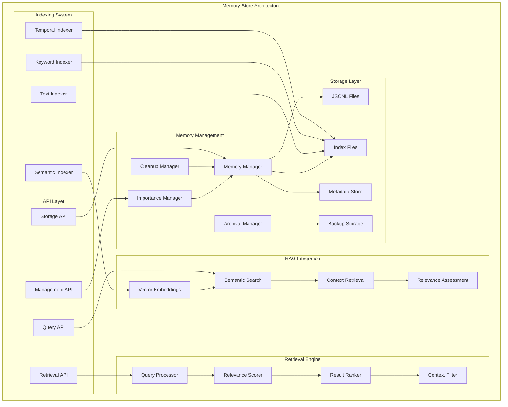

# Leonidas System - Memory Store Specification v1.4

## Overview

O **Memory Store** é o sistema de memória persistente do Leonidas, responsável por armazenar, indexar e recuperar informações de interações passadas, contexto histórico e conhecimento acumulado. Implementa capacidades de Retrieval Augmented Generation (RAG) para enriquecer as respostas com informações relevantes do histórico.

## Architecture Overview

### Core Components



## Technical Specifications

### Memory Entry Structure

```python
@dataclass
class MemoryEntry:
    """Core memory entry structure."""
    
    # Identification
    entry_id: str
    entry_type: str  # interaction, insight, correction, context, etc.
    timestamp: datetime
    session_id: str
    
    # Content
    content: Dict[str, Any]
    summary: str
    keywords: List[str]
    
    # Metadata
    importance_score: float  # 0.0 to 1.0
    access_count: int
    last_accessed: datetime
    source: str  # cognitive_agent, user_interaction, etc.
    
    # Relationships
    related_entries: List[str]  # IDs of related entries
    parent_entry: Optional[str]
    child_entries: List[str]
    
    # Indexing
    text_embedding: Optional[List[float]]
    semantic_tags: List[str]
    temporal_context: Dict[str, Any]
    
    # Lifecycle
    created_at: datetime
    updated_at: datetime
    expires_at: Optional[datetime]
    archived: bool = False

class MemoryEntryType:
    """Memory entry type definitions."""
    
    INTERACTION = "interaction"
    INSIGHT = "insight"
    CORRECTION = "correction"
    CONTEXT = "context"
    LEARNING = "learning"
    ERROR = "error"
    SUCCESS = "success"
    PATTERN = "pattern"
    PREFERENCE = "preference"
    KNOWLEDGE = "knowledge"

class ImportanceLevel:
    """Importance level definitions."""
    
    CRITICAL = 1.0      # Never delete, always relevant
    HIGH = 0.8          # Important for context
    MEDIUM = 0.6        # Useful for patterns
    LOW = 0.4           # Background information
    MINIMAL = 0.2       # Can be archived quickly
```

### Storage Implementation

```python
class MemoryStore:
    """Advanced memory storage system with RAG capabilities."""
    
    def __init__(self, config: MemoryStoreConfig):
        self.config = config
        
        # Storage components
        self.file_manager = MemoryFileManager(config.storage_path)
        self.index_manager = MemoryIndexManager(config.index_path)
        self.embedding_manager = EmbeddingManager(config.embedding_config)
        
        # Management components
        self.importance_calculator = ImportanceCalculator()
        self.cleanup_manager = CleanupManager(config.cleanup_config)
        self.archival_manager = ArchivalManager(config.archival_config)
        
        # Performance optimization
        self.memory_cache = MemoryCache(max_size=config.cache_size)
        self.query_cache = QueryCache(max_size=config.query_cache_size)
        
        # Metrics
        self.performance_metrics = MemoryPerformanceMetrics()
        
    async def store_entry(self, entry: MemoryEntry) -> str:
        """Store a memory entry with full indexing."""
        
        start_time = time.time()
        
        try:
            # Calculate importance score
            entry.importance_score = await self.importance_calculator.calculate_importance(entry)
            
            # Generate embeddings for semantic search
            if entry.content and isinstance(entry.content.get('text'), str):
                entry.text_embedding = await self.embedding_manager.generate_embedding(
                    entry.content['text']
                )
            
            # Extract keywords and semantic tags
            entry.keywords = await self._extract_keywords(entry)
            entry.semantic_tags = await self._extract_semantic_tags(entry)
            
            # Store in file system
            await self.file_manager.store_entry(entry)
            
            # Update indexes
            await self.index_manager.index_entry(entry)
            
            # Cache entry
            await self.memory_cache.put(entry.entry_id, entry)
            
            # Update metrics
            storage_time = time.time() - start_time
            self.performance_metrics.record_storage(storage_time)
            
            logging.debug(f"Stored memory entry {entry.entry_id} in {storage_time:.3f}s")
            
            return entry.entry_id
            
        except Exception as e:
            self.performance_metrics.record_storage_error()
            logging.error(f"Failed to store memory entry: {e}")
            raise
    
    async def retrieve_relevant(self, 
                              query: str,
                              max_results: int = 10,
                              relevance_threshold: float = 0.6,
                              entry_types: Optional[List[str]] = None,
                              time_range: Optional[Tuple[datetime, datetime]] = None) -> List[MemoryEntry]:
        """Retrieve relevant memory entries using RAG approach."""
        
        start_time = time.time()
        
        try:
            # Check query cache first
            cache_key = self._generate_query_cache_key(query, max_results, relevance_threshold, entry_types, time_range)
            cached_result = await self.query_cache.get(cache_key)
            if cached_result:
                self.performance_metrics.record_cache_hit()
                return cached_result
            
            # Multi-stage retrieval process
            
            # Stage 1: Semantic search using embeddings
            semantic_results = await self._semantic_search(query, max_results * 2)
            
            # Stage 2: Keyword-based search
            keyword_results = await self._keyword_search(query, max_results * 2)
            
            # Stage 3: Temporal context search
            temporal_results = await self._temporal_search(query, time_range, max_results)
            
            # Combine and deduplicate results
            all_results = self._combine_search_results(semantic_results, keyword_results, temporal_results)
            
            # Filter by entry types if specified
            if entry_types:
                all_results = [r for r in all_results if r.entry_type in entry_types]
            
            # Score relevance
            scored_results = await self._score_relevance(query, all_results)
            
            # Filter by relevance threshold
            relevant_results = [r for r in scored_results if r['relevance_score'] >= relevance_threshold]
            
            # Sort by relevance and importance
            sorted_results = sorted(
                relevant_results,
                key=lambda x: (x['relevance_score'] * 0.7 + x['entry'].importance_score * 0.3),
                reverse=True
            )
            
            # Extract entries and limit results
            final_results = [r['entry'] for r in sorted_results[:max_results]]
            
            # Update access counts
            for entry in final_results:
                await self._update_access_count(entry.entry_id)
            
            # Cache result
            await self.query_cache.put(cache_key, final_results)
            
            # Update metrics
            retrieval_time = time.time() - start_time
            self.performance_metrics.record_retrieval(retrieval_time, len(final_results))
            
            logging.debug(f"Retrieved {len(final_results)} relevant entries in {retrieval_time:.3f}s")
            
            return final_results
            
        except Exception as e:
            self.performance_metrics.record_retrieval_error()
            logging.error(f"Failed to retrieve relevant entries: {e}")
            raise
    
    async def _semantic_search(self, query: str, max_results: int) -> List[MemoryEntry]:
        """Perform semantic search using embeddings."""
        
        # Generate query embedding
        query_embedding = await self.embedding_manager.generate_embedding(query)
        
        # Search for similar embeddings
        similar_entries = await self.embedding_manager.find_similar(
            query_embedding,
            max_results=max_results,
            similarity_threshold=0.7
        )
        
        return similar_entries
    
    async def _keyword_search(self, query: str, max_results: int) -> List[MemoryEntry]:
        """Perform keyword-based search."""
        
        # Extract keywords from query
        query_keywords = await self._extract_keywords_from_text(query)
        
        # Search index for matching keywords
        matching_entries = await self.index_manager.search_by_keywords(
            query_keywords,
            max_results=max_results
        )
        
        return matching_entries
    
    async def _temporal_search(self, query: str, time_range: Optional[Tuple[datetime, datetime]], max_results: int) -> List[MemoryEntry]:
        """Perform temporal context search."""
        
        if not time_range:
            # Default to recent entries
            end_time = datetime.now()
            start_time = end_time - timedelta(days=7)  # Last week
            time_range = (start_time, end_time)
        
        # Search within time range
        temporal_entries = await self.index_manager.search_by_time_range(
            time_range[0],
            time_range[1],
            max_results=max_results
        )
        
        return temporal_entries
    
    async def _score_relevance(self, query: str, entries: List[MemoryEntry]) -> List[Dict]:
        """Score relevance of entries to query."""
        
        scored_entries = []
        
        for entry in entries:
            # Multiple relevance factors
            semantic_score = await self._calculate_semantic_relevance(query, entry)
            keyword_score = await self._calculate_keyword_relevance(query, entry)
            temporal_score = await self._calculate_temporal_relevance(entry)
            importance_score = entry.importance_score
            
            # Weighted combination
            relevance_score = (
                semantic_score * 0.4 +
                keyword_score * 0.3 +
                temporal_score * 0.2 +
                importance_score * 0.1
            )
            
            scored_entries.append({
                'entry': entry,
                'relevance_score': relevance_score,
                'semantic_score': semantic_score,
                'keyword_score': keyword_score,
                'temporal_score': temporal_score
            })
        
        return scored_entries
    
    async def get_conversation_history(self, 
                                    session_id: Optional[str] = None,
                                    max_entries: int = 50,
                                    time_range: Optional[Tuple[datetime, datetime]] = None) -> List[MemoryEntry]:
        """Get conversation history for context."""
        
        filters = {
            'entry_type': MemoryEntryType.INTERACTION
        }
        
        if session_id:
            filters['session_id'] = session_id
        
        if time_range:
            filters['time_range'] = time_range
        
        history_entries = await self.index_manager.search_with_filters(
            filters,
            max_results=max_entries,
            sort_by='timestamp',
            sort_order='desc'
        )
        
        return history_entries
    
    async def get_learning_patterns(self, pattern_type: str = None) -> List[MemoryEntry]:
        """Get learning patterns and insights."""
        
        filters = {
            'entry_type': [MemoryEntryType.PATTERN, MemoryEntryType.LEARNING, MemoryEntryType.INSIGHT]
        }
        
        if pattern_type:
            filters['semantic_tags'] = [pattern_type]
        
        pattern_entries = await self.index_manager.search_with_filters(
            filters,
            max_results=100,
            sort_by='importance_score',
            sort_order='desc'
        )
        
        return pattern_entries
    
    async def update_entry(self, entry_id: str, updates: Dict[str, Any]) -> bool:
        """Update an existing memory entry."""
        
        try:
            # Retrieve current entry
            current_entry = await self.get_entry_by_id(entry_id)
            if not current_entry:
                return False
            
            # Apply updates
            for key, value in updates.items():
                if hasattr(current_entry, key):
                    setattr(current_entry, key, value)
            
            current_entry.updated_at = datetime.now()
            
            # Re-store with updates
            await self.store_entry(current_entry)
            
            return True
            
        except Exception as e:
            logging.error(f"Failed to update memory entry {entry_id}: {e}")
            return False
    
    async def delete_entry(self, entry_id: str) -> bool:
        """Delete a memory entry."""
        
        try:
            # Remove from file storage
            await self.file_manager.delete_entry(entry_id)
            
            # Remove from indexes
            await self.index_manager.remove_entry(entry_id)
            
            # Remove from cache
            await self.memory_cache.remove(entry_id)
            
            return True
            
        except Exception as e:
            logging.error(f"Failed to delete memory entry {entry_id}: {e}")
            return False
    
    async def cleanup_old_entries(self) -> int:
        """Clean up old and low-importance entries."""
        
        return await self.cleanup_manager.perform_cleanup()
    
    async def archive_entries(self, archive_criteria: Dict[str, Any]) -> int:
        """Archive entries based on criteria."""
        
        return await self.archival_manager.archive_entries(archive_criteria)
    
    async def get_memory_statistics(self) -> Dict[str, Any]:
        """Get memory store statistics."""
        
        stats = {
            'total_entries': await self.file_manager.get_entry_count(),
            'entries_by_type': await self.index_manager.get_type_distribution(),
            'storage_size_mb': await self.file_manager.get_storage_size(),
            'index_size_mb': await self.index_manager.get_index_size(),
            'cache_hit_rate': self.memory_cache.get_hit_rate(),
            'query_cache_hit_rate': self.query_cache.get_hit_rate(),
            'performance_metrics': self.performance_metrics.get_summary()
        }
        
        return stats
```

### Importance Calculation System

```python
class ImportanceCalculator:
    """Calculate importance scores for memory entries."""
    
    IMPORTANCE_FACTORS = {
        'entry_type_weights': {
            MemoryEntryType.CRITICAL: 1.0,
            MemoryEntryType.CORRECTION: 0.9,
            MemoryEntryType.INSIGHT: 0.8,
            MemoryEntryType.LEARNING: 0.7,
            MemoryEntryType.INTERACTION: 0.6,
            MemoryEntryType.CONTEXT: 0.5,
            MemoryEntryType.PATTERN: 0.7,
            MemoryEntryType.PREFERENCE: 0.6,
            MemoryEntryType.KNOWLEDGE: 0.8
        },
        'recency_decay_days': 30,
        'access_frequency_weight': 0.2,
        'content_length_weight': 0.1,
        'relationship_weight': 0.15
    }
    
    async def calculate_importance(self, entry: MemoryEntry) -> float:
        """Calculate comprehensive importance score."""
        
        # Base importance from entry type
        type_score = self.IMPORTANCE_FACTORS['entry_type_weights'].get(entry.entry_type, 0.5)
        
        # Recency factor (newer entries are more important)
        days_old = (datetime.now() - entry.timestamp).days
        recency_score = max(0.1, 1.0 - (days_old / self.IMPORTANCE_FACTORS['recency_decay_days']))
        
        # Access frequency factor
        access_score = min(1.0, entry.access_count / 10.0)  # Normalize to 0-1
        
        # Content richness factor
        content_length = len(str(entry.content)) if entry.content else 0
        content_score = min(1.0, content_length / 1000.0)  # Normalize to 0-1
        
        # Relationship factor (entries with more relationships are more important)
        relationship_score = min(1.0, len(entry.related_entries) / 5.0)
        
        # Weighted combination
        importance_score = (
            type_score * 0.4 +
            recency_score * 0.25 +
            access_score * self.IMPORTANCE_FACTORS['access_frequency_weight'] +
            content_score * self.IMPORTANCE_FACTORS['content_length_weight'] +
            relationship_score * self.IMPORTANCE_FACTORS['relationship_weight']
        )
        
        return min(1.0, max(0.0, importance_score))
```

### RAG Integration

```python
class RAGIntegration:
    """Retrieval Augmented Generation integration for memory store."""
    
    def __init__(self, memory_store: MemoryStore):
        self.memory_store = memory_store
        self.context_builder = ContextBuilder()
        self.relevance_filter = RelevanceFilter()
        
    async def get_context_for_query(self, 
                                  user_query: str,
                                  max_context_length: int = 2000,
                                  max_entries: int = 5) -> str:
        """Get relevant context for user query."""
        
        # Retrieve relevant memories
        relevant_entries = await self.memory_store.retrieve_relevant(
            query=user_query,
            max_results=max_entries * 2,  # Get more to filter
            relevance_threshold=0.6
        )
        
        # Filter for most relevant
        filtered_entries = await self.relevance_filter.filter_entries(
            relevant_entries,
            user_query,
            max_entries
        )
        
        # Build context string
        context = await self.context_builder.build_context(
            filtered_entries,
            max_length=max_context_length
        )
        
        return context
    
    async def get_conversation_context(self, 
                                    session_id: str,
                                    max_context_length: int = 1500) -> str:
        """Get conversation context for session."""
        
        # Get recent conversation history
        history_entries = await self.memory_store.get_conversation_history(
            session_id=session_id,
            max_entries=10,
            time_range=(datetime.now() - timedelta(hours=2), datetime.now())
        )
        
        # Build conversation context
        context = await self.context_builder.build_conversation_context(
            history_entries,
            max_length=max_context_length
        )
        
        return context
    
    async def get_learning_context(self, topic: str) -> str:
        """Get learning and pattern context for topic."""
        
        # Get learning patterns
        learning_entries = await self.memory_store.get_learning_patterns(topic)
        
        # Build learning context
        context = await self.context_builder.build_learning_context(
            learning_entries,
            max_length=1000
        )
        
        return context
```

## Configuration

```python
@dataclass
class MemoryStoreConfig:
    # Storage Configuration
    storage_path: str = "memory_store"
    index_path: str = "memory_store/indexes"
    backup_path: str = "memory_store/backups"
    
    # Performance Configuration
    cache_size: int = 1000
    query_cache_size: int = 500
    max_file_size_mb: int = 100
    
    # Embedding Configuration
    embedding_config: EmbeddingConfig = field(default_factory=EmbeddingConfig)
    
    # Cleanup Configuration
    cleanup_config: CleanupConfig = field(default_factory=CleanupConfig)
    
    # Archival Configuration
    archival_config: ArchivalConfig = field(default_factory=ArchivalConfig)
    
    # RAG Configuration
    max_context_length: int = 2000
    max_retrieval_results: int = 10
    relevance_threshold: float = 0.6

@dataclass
class CleanupConfig:
    # Cleanup intervals
    cleanup_interval_hours: int = 24
    
    # Retention policies
    min_importance_threshold: float = 0.3
    max_age_days: int = 90
    max_entries: int = 10000
    
    # Cleanup criteria
    delete_unaccessed_days: int = 30
    archive_old_entries_days: int = 60

@dataclass
class EmbeddingConfig:
    # Embedding model configuration
    model_name: str = "text-embedding-ada-002"
    embedding_dimension: int = 1536
    batch_size: int = 100
    
    # Similarity search
    similarity_threshold: float = 0.7
    max_similarity_results: int = 50
```

## Performance Requirements

### Storage Performance
- **Entry Storage**: <100ms per entry
- **Bulk Storage**: >100 entries/second
- **Index Update**: <50ms per entry
- **File I/O**: Optimized for SSD storage

### Retrieval Performance
- **Simple Retrieval**: <50ms
- **Semantic Search**: <200ms
- **Complex Queries**: <500ms
- **Cache Hit Rate**: >80%

### Memory Usage
- **Cache Memory**: <100MB
- **Index Memory**: <50MB per 10K entries
- **Working Memory**: <200MB total
- **Embedding Storage**: Efficient vector storage

## Integration Points

### Signal Bus Integration
```python
class MemoryStoreSignalBusIntegration:
    def __init__(self, memory_store: MemoryStore, signal_bus: UnifiedSignalBus):
        self.memory_store = memory_store
        self.signal_bus = signal_bus
        
    async def handle_interaction_signal(self, signal: Signal):
        """Store interaction signals as memory entries"""
        
    async def handle_insight_signal(self, signal: Signal):
        """Store cognitive insights as memory entries"""
        
    async def handle_correction_signal(self, signal: Signal):
        """Store corrections as memory entries"""
```

### World Model Integration
```python
class MemoryStoreWorldModelIntegration:
    def __init__(self, memory_store: MemoryStore, world_model: WorldModel):
        self.memory_store = memory_store
        self.world_model = world_model
        
    async def sync_world_model_updates(self):
        """Sync world model updates with memory store"""
        
    async def provide_historical_context(self, context_type: str) -> Dict:
        """Provide historical context to world model"""
```

## Testing Strategy

### Unit Tests
- Memory entry storage and retrieval
- Importance calculation accuracy
- Semantic search functionality
- Index management operations
- Cache performance validation

### Integration Tests
- End-to-end storage and retrieval
- RAG integration functionality
- Cleanup and archival processes
- Performance under load
- Data consistency validation

### Performance Tests
- Storage throughput measurement
- Retrieval latency testing
- Memory usage profiling
- Cache effectiveness analysis
- Concurrent access testing

## Security and Privacy

### Data Protection
- Encrypted storage of sensitive entries
- Configurable data retention policies
- Secure deletion of expired entries
- Access control and audit logging

### Privacy Compliance
- User consent for memory storage
- Data anonymization options
- Right to be forgotten implementation
- Export capabilities for user data

## Monitoring and Observability

### Key Metrics
- Storage and retrieval performance
- Memory usage and growth patterns
- Cache hit rates and effectiveness
- Query patterns and frequency
- Cleanup and archival statistics

### Health Checks
- Storage system integrity
- Index consistency validation
- Cache performance monitoring
- Disk space utilization
- Backup system status

### Alerting
- Storage failures or corruption
- Performance degradation
- Disk space warnings
- Backup failures
- Unusual access patterns