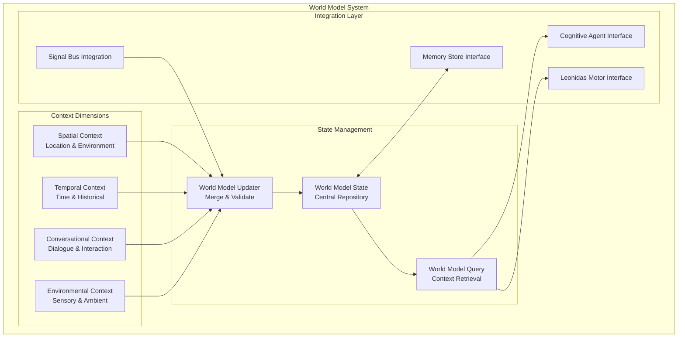

# Leonidas System - World Model Specification v1.4

## Overview

O **World Model** é o sistema de consciência contextual abrangente do Leonidas, mantendo uma representação estruturada e atualizada do estado atual do mundo, da sessão de trabalho e do contexto multidimensional. Funciona como a "memória de trabalho" central que informa todas as decisões e ações do sistema.

## World Model Architecture

### Core Components



## World Model Schema

### Complete JSON Structure

```json
{
    "timestamp_utc": "2025-07-18T14:30:45.123Z",
    "schema_version": "1.4",
    "session_id": "session_uuid_here",
    
    "location": {
        "city": "Brasília",
        "region": "Distrito Federal",
        "country": "Brasil", 
        "details": "P Sul, Ceilândia, Quadra específica",
        "coordinates": {
            "latitude": -15.7801,
            "longitude": -47.9292
        },
        "timezone": "America/Sao_Paulo",
        "last_updated": "2025-07-18T14:30:45.123Z"
    },
    
    "time_context": {
        "current_date": "2025-07-18",
        "current_time": "14:30",
        "day_of_week": "Friday",
        "week_of_year": 29,
        "season": "Winter",
        "historical_context": "Ano de 2025, período pós-pandemia COVID-19, era da IA generativa, guerra na Ucrânia em andamento, corrida global por AGI",
        "significant_dates": [
            {
                "date": "2025-07-18",
                "significance": "Current session date",
                "context": "Active development session"
            }
        ]
    },
    
    "session_summary": {
        "session_start": "2025-07-18T14:00:00.000Z",
        "session_duration_minutes": 30,
        "current_task": "Refinamento das especificações do projeto Leonidas",
        "task_progress": "75%",
        "recent_actions": [
            "Análise do design.md existente",
            "Criação da proposta de breakdown",
            "Implementação da estrutura modular"
        ],
        "user_sentiment": "focused",
        "engagement_level": "high",
        "last_agent_utterance": "Vou criar os arquivos especializados conforme solicitado",
        "interaction_count": 15,
        "successful_interactions": 14
    },
    
    "sensory_state": {
        "active_speakers": [
            {
                "id": "USER_1",
                "name": "Guilherme",
                "authentication_status": "authenticated",
                "last_interaction": "2025-07-18T14:29:30.000Z",
                "interaction_count": 12,
                "voice_profile_confidence": 0.95
            }
        ],
        "ambient_sounds": [
            {
                "event": "keyboard_typing",
                "confidence": 0.9,
                "duration_ms": 2500,
                "intensity": "moderate",
                "last_detected": "2025-07-18T14:30:40.000Z"
            },
            {
                "event": "background_music",
                "confidence": 0.6,
                "duration_ms": 180000,
                "intensity": "low",
                "last_detected": "2025-07-18T14:30:45.000Z"
            }
        ],
        "visual_focus": "VSCode editor with Leonidas specifications",
        "visual_activity": "user_editing_markdown",
        "detected_objects": [
            {
                "object": "computer_monitor",
                "location": "center",
                "confidence": 0.98,
                "last_seen": "2025-07-18T14:30:45.000Z"
            },
            {
                "object": "keyboard",
                "location": "desk_center",
                "confidence": 0.95,
                "last_seen": "2025-07-18T14:30:40.000Z"
            },
            {
                "object": "coffee_cup",
                "location": "desk_right",
                "confidence": 0.85,
                "last_seen": "2025-07-18T14:25:00.000Z"
            }
        ],
        "lighting_conditions": "artificial_indoor",
        "noise_level": "low"
    },
    
    "system_status": {
        "agent_status": {
            "Leonidas": {
                "state": "THINKING",
                "last_action": "processing_user_request",
                "performance_score": 0.92,
                "uptime_minutes": 30
            },
            "VisualPerceptionAgent": {
                "state": "ACTIVE",
                "last_signal": "visual_state",
                "processing_latency_ms": 45,
                "uptime_minutes": 30
            },
            "DialogueAnalysisAgent": {
                "state": "ACTIVE", 
                "last_signal": "user_transcription",
                "processing_latency_ms": 32,
                "uptime_minutes": 30
            },
            "SoundAnalysisAgent": {
                "state": "ACTIVE",
                "last_signal": "ambient_sound",
                "processing_latency_ms": 28,
                "uptime_minutes": 30
            },
            "CognitiveReasoningAgent": {
                "state": "PROCESSING",
                "last_signal": "world_model_summary",
                "processing_latency_ms": 150,
                "uptime_minutes": 30
            }
        },
        "active_tools": [
            {
                "tool_name": "file_operations",
                "status": "ready",
                "last_used": "2025-07-18T14:28:15.000Z"
            }
        ],
        "system_health": "optimal",
        "resource_usage": {
            "cpu_percent": 25.5,
            "memory_mb": 512,
            "network_latency_ms": 45
        },
        "error_count_last_hour": 0,
        "performance_score": 0.94
    },
    
    "conversational_context": {
        "conversation_flow": "technical_specification_discussion",
        "topic_focus": "Leonidas system architecture",
        "user_expertise_level": "expert",
        "communication_style": "technical_detailed",
        "recent_topics": [
            "Design document breakdown",
            "Signal bus architecture", 
            "World model specification",
            "Agent specialization"
        ],
        "unresolved_questions": [],
        "pending_actions": [
            "Complete design file creation",
            "Validate architecture consistency"
        ],
        "conversation_quality_score": 0.91
    },
    
    "relevant_memory_snippets": [
        {
            "memory_id": "mem_001",
            "content": "User prefers detailed technical specifications with implementation examples",
            "relevance_score": 0.95,
            "last_accessed": "2025-07-18T14:30:00.000Z",
            "memory_type": "user_preference"
        },
        {
            "memory_id": "mem_002", 
            "content": "Project Leonidas uses Gemini Live API with Portuguese Brazilian voice",
            "relevance_score": 0.88,
            "last_accessed": "2025-07-18T14:25:30.000Z",
            "memory_type": "project_context"
        },
        {
            "memory_id": "mem_003",
            "content": "User works in Ceilândia, Brasília, typically during afternoon hours",
            "relevance_score": 0.75,
            "last_accessed": "2025-07-18T14:20:00.000Z",
            "memory_type": "contextual_information"
        }
    ],
    
    "predictive_context": {
        "likely_next_actions": [
            {
                "action": "continue_file_creation",
                "probability": 0.85,
                "reasoning": "User requested complete implementation of design breakdown"
            },
            {
                "action": "ask_clarification_question",
                "probability": 0.15,
                "reasoning": "Complex specifications may require clarification"
            }
        ],
        "session_trajectory": "specification_completion",
        "estimated_session_remaining_minutes": 45,
        "user_attention_level": "high",
        "optimal_interaction_timing": "immediate"
    },
    
    "metadata": {
        "last_major_update": "2025-07-18T14:30:45.123Z",
        "update_frequency_seconds": 10,
        "total_updates_this_session": 180,
        "data_sources": [
            "VisualPerceptionAgent",
            "DialogueAnalysisAgent", 
            "SoundAnalysisAgent",
            "CognitiveReasoningAgent",
            "Leonidas",
            "MemoryStore"
        ],
        "validation_status": "valid",
        "compression_ratio": 0.85
    }
}
```

## Context Dimension Specifications

### 1. Spatial Context Tracker

```python
class SpatialContextTracker:
    """Manages spatial and location-based context awareness."""
    
    def __init__(self):
        self.current_location = {
            "city": "Brasília",
            "region": "Distrito Federal",
            "country": "Brasil",
            "details": "P Sul, Ceilândia, Quadra específica",
            "coordinates": {"latitude": -15.7801, "longitude": -47.9292},
            "timezone": "America/Sao_Paulo"
        }
        self.location_history = collections.deque(maxlen=100)
        self.environmental_context = EnvironmentalContextManager()
    
    async def get_current_location(self) -> dict:
        """Get comprehensive current spatial context."""
        return {
            **self.current_location,
            "environmental_factors": await self.environmental_context.get_factors(),
            "last_updated": datetime.utcnow().isoformat()
        }
    
    async def update_location(self, new_location: dict):
        """Update spatial context with validation."""
        # Validate location data
        if await self._validate_location_data(new_location):
            # Store previous location in history
            self.location_history.append({
                **self.current_location,
                "timestamp": datetime.utcnow().isoformat()
            })
            
            # Update current location
            self.current_location.update(new_location)
            self.current_location["last_updated"] = datetime.utcnow().isoformat()
    
    async def get_location_context_summary(self) -> str:
        """Generate natural language location context."""
        location = await self.get_current_location()
        return f"Localizado em {location['details']}, {location['city']}, {location['region']}, {location['country']}"
```

### 2. Temporal Context Tracker

```python
class TemporalContextTracker:
    """Manages temporal context with historical awareness."""
    
    def __init__(self):
        self.historical_events = HistoricalEventsDatabase()
        self.session_timeline = SessionTimeline()
        
    async def get_current_time_context(self) -> dict:
        """Get comprehensive temporal context."""
        now = datetime.now()
        
        return {
            "current_date": now.strftime("%Y-%m-%d"),
            "current_time": now.strftime("%H:%M"),
            "day_of_week": now.strftime("%A"),
            "week_of_year": now.isocalendar()[1],
            "season": self._get_season(now),
            "historical_context": await self._get_historical_context(now),
            "significant_dates": await self._get_significant_dates(now),
            "time_of_day_context": self._get_time_of_day_context(now)
        }
    
    def _get_season(self, date: datetime) -> str:
        """Determine season for Southern Hemisphere (Brazil)."""
        month = date.month
        if month in [12, 1, 2]:
            return "Summer"
        elif month in [3, 4, 5]:
            return "Autumn"
        elif month in [6, 7, 8]:
            return "Winter"
        else:
            return "Spring"
    
    async def _get_historical_context(self, date: datetime) -> str:
        """Get relevant historical context for current time period."""
        return "Ano de 2025, período pós-pandemia COVID-19, era da IA generativa, guerra na Ucrânia em andamento, corrida global por AGI"
    
    def _get_time_of_day_context(self, date: datetime) -> str:
        """Get context based on time of day."""
        hour = date.hour
        if 6 <= hour < 12:
            return "morning"
        elif 12 <= hour < 18:
            return "afternoon"
        elif 18 <= hour < 22:
            return "evening"
        else:
            return "night"
```

### 3. Conversational Context Manager

```python
class ConversationalContextManager:
    """Manages conversation flow and interaction context."""
    
    def __init__(self):
        self.conversation_history = collections.deque(maxlen=1000)
        self.topic_tracker = TopicTracker()
        self.user_profiler = UserProfiler()
        self.interaction_analyzer = InteractionAnalyzer()
    
    async def update_conversation_context(self, interaction: dict):
        """Update conversational context with new interaction."""
        # Add to conversation history
        self.conversation_history.append({
            **interaction,
            "timestamp": datetime.utcnow().isoformat()
        })
        
        # Update topic tracking
        await self.topic_tracker.process_interaction(interaction)
        
        # Update user profile
        await self.user_profiler.update_profile(interaction)
        
        # Analyze interaction quality
        await self.interaction_analyzer.analyze(interaction)
    
    async def get_conversation_summary(self) -> dict:
        """Get comprehensive conversation context summary."""
        recent_interactions = list(self.conversation_history)[-10:]
        
        return {
            "conversation_flow": await self.topic_tracker.get_current_flow(),
            "topic_focus": await self.topic_tracker.get_primary_topic(),
            "user_expertise_level": await self.user_profiler.get_expertise_level(),
            "communication_style": await self.user_profiler.get_communication_style(),
            "recent_topics": await self.topic_tracker.get_recent_topics(),
            "unresolved_questions": await self._get_unresolved_questions(),
            "pending_actions": await self._get_pending_actions(),
            "conversation_quality_score": await self.interaction_analyzer.get_quality_score()
        }
```

### 4. Environmental Context Manager

```python
class EnvironmentalContextManager:
    """Manages environmental and sensory context."""
    
    def __init__(self):
        self.sensory_state = SensoryStateTracker()
        self.ambient_monitor = AmbientMonitor()
        self.object_tracker = ObjectTracker()
    
    async def get_environmental_context(self) -> dict:
        """Get comprehensive environmental context."""
        return {
            "active_speakers": await self.sensory_state.get_active_speakers(),
            "ambient_sounds": await self.ambient_monitor.get_current_sounds(),
            "visual_focus": await self.sensory_state.get_visual_focus(),
            "visual_activity": await self.sensory_state.get_visual_activity(),
            "detected_objects": await self.object_tracker.get_detected_objects(),
            "lighting_conditions": await self.ambient_monitor.get_lighting(),
            "noise_level": await self.ambient_monitor.get_noise_level()
        }
```

## World Model Management

### World Model Manager Implementation

```python
class WorldModelManager:
    """Central manager for world model state and updates."""
    
    def __init__(self):
        self.current_state = self._initialize_world_model()
        self.update_lock = asyncio.Lock()
        self.subscribers = []
        self.update_history = collections.deque(maxlen=1000)
        
        # Context managers
        self.spatial_context = SpatialContextTracker()
        self.temporal_context = TemporalContextTracker()
        self.conversational_context = ConversationalContextManager()
        self.environmental_context = EnvironmentalContextManager()
        
        # Performance monitoring
        self.performance_metrics = WorldModelMetrics()
        
    def _initialize_world_model(self) -> dict:
        """Initialize world model with default structure."""
        return {
            "timestamp_utc": datetime.utcnow().isoformat(),
            "schema_version": "1.4",
            "session_id": str(uuid.uuid4()),
            "location": {},
            "time_context": {},
            "session_summary": {},
            "sensory_state": {},
            "system_status": {},
            "conversational_context": {},
            "relevant_memory_snippets": [],
            "predictive_context": {},
            "metadata": {}
        }
    
    async def update_world_model(self, updates: dict, source: str = "unknown"):
        """Thread-safe world model updates with validation."""
        update_start = time.time()
        
        async with self.update_lock:
            try:
                # Validate updates
                validation_result = await self._validate_updates(updates)
                if not validation_result.is_valid:
                    await self._handle_invalid_updates(updates, validation_result.errors)
                    return False
                
                # Apply updates
                previous_state = copy.deepcopy(self.current_state)
                self._deep_merge(self.current_state, updates)
                
                # Update metadata
                self.current_state["timestamp_utc"] = datetime.utcnow().isoformat()
                self.current_state["metadata"]["last_major_update"] = datetime.utcnow().isoformat()
                self.current_state["metadata"]["total_updates_this_session"] = (
                    self.current_state["metadata"].get("total_updates_this_session", 0) + 1
                )
                
                # Record update in history
                update_record = {
                    "timestamp": datetime.utcnow().isoformat(),
                    "source": source,
                    "updates": updates,
                    "processing_time_ms": (time.time() - update_start) * 1000
                }
                self.update_history.append(update_record)
                
                # Notify subscribers
                await self._notify_subscribers(self.current_state.copy(), previous_state)
                
                # Update performance metrics
                await self.performance_metrics.record_update(update_record)
                
                return True
                
            except Exception as e:
                await self._handle_update_error(updates, source, e)
                return False
    
    async def get_world_model(self, include_predictions: bool = True) -> dict:
        """Get current world model state."""
        async with self.update_lock:
            model = self.current_state.copy()
            
            if include_predictions:
                # Add predictive context
                model["predictive_context"] = await self._generate_predictive_context()
            
            return model
    
    async def get_context_summary(self) -> str:
        """Get natural language summary of current context."""
        model = await self.get_world_model()
        
        # Generate integrated context summary
        spatial_summary = await self.spatial_context.get_location_context_summary()
        temporal_summary = await self._get_temporal_summary(model["time_context"])
        session_summary = await self._get_session_summary(model["session_summary"])
        
        return f"{spatial_summary}. {temporal_summary}. {session_summary}"
    
    def _deep_merge(self, target: dict, source: dict):
        """Deep merge source into target dictionary."""
        for key, value in source.items():
            if key in target and isinstance(target[key], dict) and isinstance(value, dict):
                self._deep_merge(target[key], value)
            else:
                target[key] = value
    
    async def _generate_predictive_context(self) -> dict:
        """Generate predictive context based on current state."""
        return {
            "likely_next_actions": await self._predict_next_actions(),
            "session_trajectory": await self._predict_session_trajectory(),
            "estimated_session_remaining_minutes": await self._estimate_session_duration(),
            "user_attention_level": await self._assess_user_attention(),
            "optimal_interaction_timing": await self._determine_optimal_timing()
        }
```

## Performance Optimization

### Context Compression Strategy

```python
class WorldModelCompressor:
    """Compress world model data while preserving important information."""
    
    def __init__(self):
        self.importance_classifier = ImportanceClassifier()
        self.compression_rules = CompressionRules()
    
    async def compress_world_model(self, model: dict, target_size_ratio: float = 0.7) -> dict:
        """Compress world model to target size while preserving important data."""
        compressed = model.copy()
        
        # Compress conversation history
        if "conversational_context" in compressed:
            compressed["conversational_context"] = await self._compress_conversation_context(
                compressed["conversational_context"], target_size_ratio
            )
        
        # Compress sensory state
        if "sensory_state" in compressed:
            compressed["sensory_state"] = await self._compress_sensory_state(
                compressed["sensory_state"], target_size_ratio
            )
        
        # Compress memory snippets
        if "relevant_memory_snippets" in compressed:
            compressed["relevant_memory_snippets"] = await self._compress_memory_snippets(
                compressed["relevant_memory_snippets"], target_size_ratio
            )
        
        # Update compression metadata
        original_size = len(str(model))
        compressed_size = len(str(compressed))
        compression_ratio = compressed_size / original_size
        
        compressed["metadata"]["compression_ratio"] = compression_ratio
        compressed["metadata"]["last_compression"] = datetime.utcnow().isoformat()
        
        return compressed
```

## Integration Interfaces

### Signal Bus Integration

```python
class WorldModelSignalIntegration:
    """Integration layer between world model and signal bus."""
    
    def __init__(self, world_model_manager: WorldModelManager):
        self.world_model = world_model_manager
        self.signal_processors = {
            "visual_state": self._process_visual_signal,
            "user_transcription": self._process_dialogue_signal,
            "ambient_sound": self._process_sound_signal,
            "agent_utterance": self._process_agent_signal,
            "tool_output": self._process_tool_signal
        }
    
    async def process_signal(self, signal: dict):
        """Process incoming signal and update world model."""
        signal_type = signal.get("type")
        
        if signal_type in self.signal_processors:
            updates = await self.signal_processors[signal_type](signal)
            if updates:
                await self.world_model.update_world_model(
                    updates, 
                    source=signal.get("source", "unknown")
                )
    
    async def _process_visual_signal(self, signal: dict) -> dict:
        """Process visual perception signal into world model updates."""
        data = signal.get("data", {})
        
        return {
            "sensory_state": {
                "visual_focus": data.get("window_focus", "unknown"),
                "visual_activity": data.get("activity", "unknown"),
                "detected_objects": self._extract_objects(data)
            }
        }
```

This comprehensive World Model specification provides the structured foundation for Leonidas's contextual awareness and intelligent decision-making capabilities.